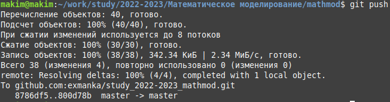

---
## Front matter
lang: ru-RU
title: Лабораторная работа №1
subtitle: Работа с Git, GitHub, а также Markdown
author:
  - Ким М. А.
institute:
  - Российский университет дружбы народов, Москва, Россия
date: 11 февраля 2023

## i18n babel
babel-lang: russian
babel-otherlangs: english

## Fonts
mainfont: PT Serif
romanfont: PT Serif
sansfont: PT Sans
monofont: PT Mono
mainfontoptions: Ligatures=TeX
romanfontoptions: Ligatures=TeX
sansfontoptions: Ligatures=TeX,Scale=MatchLowercase
monofontoptions: Scale=MatchLowercase,Scale=0.9

## Formatting pdf
toc: false
toc-title: Содержание
slide_level: 2
aspectratio: 169
section-titles: true
theme: metropolis
header-includes:
 - \metroset{progressbar=frametitle,sectionpage=progressbar,numbering=fraction}
 - '\makeatletter'
 - '\beamer@ignorenonframefalse'
 - '\makeatother'
---

# Информация

## Докладчик

:::::::::::::: {.columns align=center}
::: {.column width="70%"}

  * Ким Михаил Алексеевич
  * студент уч. группы НФИбд-01-20
  * Российский университет дружбы народов
  * [1032201664@pfur.ru](mailto:1032201664@pfur.ru)
  * <https://github.com/exmanka>

:::
::: {.column width="30%"}

:::
::::::::::::::

# Вводная часть

## Актуальность

- Важно уметь работать с Git'ом
- Научная презентация --- рабочий инструмент исследователя, создаваемый с помощью Markdown
- Необходимо создавать текстовые работы быстро
- Желательна минимизация усилий для создания презентации

## Объект и предмет исследования

- Git: работа с репозиториями
- GitHub: использование в качестве центрального сервера
- Markdown: написание текстовых работ

## Цели и задачи

- Создать репозиторий курса по шаблону, осуществить коммиты
- Написать отчет, используя язык Markdown

## Материалы и методы

- Распределенная система управления версиями [Git](https://git-scm.com/)
- Процессор `pandoc` для входного формата Markdown
- Результирующие форматы
	- `pdf`
	- `html`
  - `docx`
- Автоматизация процесса создания: `Makefile`

# Процесс выполнения работы

# Работа с Git и GitHub

## Создание директории

## Генерирация пары SSH-ключей

## Добавленние ключей на GitHub

## Устанавливка пакета gh

:::::::::::::: {.columns align=center}
::: {.column width="50%"}

:::
::: {.column width="50%"}

:::
::::::::::::::

## Копирование шаблонного репозитория

:::::::::::::: {.columns align=center}
::: {.column width="50%"}

:::
::: {.column width="50%"}

:::
::::::::::::::

## Просмотр всех доступных целей make и списка доступных курсов

## Удаление package.json, создание необходимых каталогов

## Первый коммит и загрузка на GitHub

:::::::::::::: {.columns align=center}
::: {.column width="33%"}

:::
::: {.column width="33%"}

:::
::: {.column width="33%"}

:::
::::::::::::::

# Настройка конвертации файлов .md в .pdf, .docx, .html

## Установка необходимых пакетов

:::::::::::::: {.columns align=center}
::: {.column width="35%"}

:::
::: {.column width="65%"}

:::
::::::::::::::

## Устранение ошибки конвертации. Способ 1

:::::::::::::: {.columns align=center}
::: {.column width="50%"}

:::
::: {.column width="50%"}

:::
::::::::::::::

## Устранение ошибки конвертации. Способ 2 — лучший

:::::::::::::: {.columns align=center}
::: {.column width="50%"}

:::
::: {.column width="40%"}

:::
::::::::::::::

# Работа с Markdown

## Составление отчета в Markdown

:::::::::::::: {.columns align=center}
::: {.column width="45%"}

:::
::: {.column width="40%"}

:::
::::::::::::::

# Результаты

- Создан и настроен репозиторий курса
- Написан отчет на языке разметки Markdown
- Успешно установлены дополнительные пакеты для дальнейшей работы

## Вывод

Вспомнил основы взаимодействия с Git и GitHub, а также Markdown. Создал репозиторий для выполнения лабораторных работ из шаблона. Добавил первые коммиты. Создал данный отчет.