---
## Front matter
title: "Отчет по лабораторной работе №1"
subtitle: "по дисциплине: Математическое моделирование"
author: "Ким Михаил Алексеевич"

## Generic otions
lang: ru-RU
toc-title: "Содержание"

## Bibliography
bibliography: bib/cite.bib
csl: pandoc/csl/gost-r-7-0-5-2008-numeric.csl

## Pdf output format
toc: true # Table of contents
toc-depth: 2
lof: true # List of figures
lot: true # List of tables
fontsize: 12pt
linestretch: 1.5
papersize: a4
documentclass: scrreprt
## I18n polyglossia
polyglossia-lang:
  name: russian
  options:
	- spelling=modern
	- babelshorthands=true
polyglossia-otherlangs:
  name: english
## I18n babel
babel-lang: russian
babel-otherlangs: english
## Fonts
mainfont: PT Serif
romanfont: PT Serif
sansfont: PT Sans
monofont: PT Mono
mainfontoptions: Ligatures=TeX
romanfontoptions: Ligatures=TeX
sansfontoptions: Ligatures=TeX,Scale=MatchLowercase
monofontoptions: Scale=MatchLowercase,Scale=0.9
## Biblatex
biblatex: true
biblio-style: "gost-numeric"
biblatexoptions:
  - parentracker=true
  - backend=biber
  - hyperref=auto
  - language=auto
  - autolang=other*
  - citestyle=gost-numeric
## Pandoc-crossref LaTeX customization
figureTitle: "Рис."
tableTitle: "Таблица"
listingTitle: "Листинг"
lofTitle: "Список иллюстраций"
lotTitle: "Список таблиц"
lolTitle: "Листинги"
## Misc options
indent: true
header-includes:
  - \usepackage{indentfirst}
  - \usepackage{float} # keep figures where there are in the text
  - \floatplacement{figure}{H} # keep figures where there are in the text
---

# Цель работы

Вспомнить основы взаимодействия с распределенной системой управления версиями Git, а также с сервером GitHub. Повторить принципы написания документов на языке разметки Markdown.

# Задание

Создать репозиторий на GitHub на основе шаблонного репозитория путем копирования через SSH, либо напрямую на сайте. Добавить первый коммит. Создать отчет, используя язык разметки Markdown. Сконвертировать отчет в файлы с расширением .docx и .pdf с использованием Makefile. Создать презентацию, ипользуя язык разметки Markdown. Сконвертировать презентацию в файлы с расширением .html и .pdf с исспользованием Makefile.

# Теоретическое введение

Git — это бесплатная распределенная система контроля версий с открытым исходным кодом, предназначенная для быстрой и эффективной обработки любых проектов, от небольших до очень крупных [@git-scm:com][@git-rudn].

GitHub является сервером, часто используемым в качестве центрального сервера при взаимодействии с Git. GitHub предоставляет возможность выгружать репозитории на удаленные сервера GitHub'а. Также GitHub может использоваться для обсуждения загруженных репозиториев и их коммитов [@kinsta:com].

Markdown — это облегченный язык разметки, который вы можете использовать для добавления элементов форматирования в текстовые документы открытого текста. Созданный Джоном Грубером в 2004 году, Markdown в настоящее время является одним из самых популярных языков разметки в мире [@markdownguide:org].

: Описание некоторых базовых сведений языка Markdown [@md-rudn] {#tbl:markdown}.

| Спец. символ | Описание действия                                                                                                          |
|--------------|----------------------------------------------------------------------------------------------------------------------------|
| `#`          | Заголовок 1                                                                                                                |
| `##`         | Заголовок 2                                                                                                                |
| `###`        | Заголовок 3                                                                                                                |
| `####`       | Заголовок 4                                                                                                                |
| `**bold**`   | **Полужирный текст**                                                                                                       |
| `*italic*`   | *Курсив*                                                                                                                   |


# Выполнение лабораторной работы
## Работа с Git и GitHub

1. Создаем директорию согласно требованиям выполнения лабораторных работ и переходим в нее (рис. @fig:01).

    ```
    mkdir -p ~/work/study/2022-2023/"Математическое моделирование"
    cd ~/work/study/2022-2023/"Математическое моделирование"
    ```

    {#fig:01 width=86%}


1. Генерируем пару SSH-ключей, копируем приватный ключ, проверяем подключение по SecureShell (рис. @fig:02).

    ```
    ssh-keygen -C "Michail Kim 1032201664@pfur.ru"
    cat ~/.ssh/id_rsa.pub | xclip -sel clip
    ssh -T git@github.com
    ```

    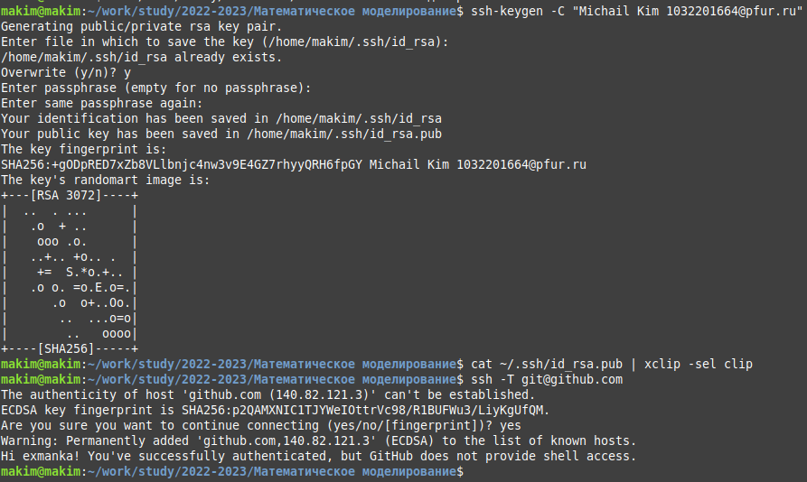{#fig:02 width=86%}
    

1. Добавляем SSH-ключи на сайте https://github.com/ (рис. @fig:03).

    {#fig:03 width=86%}


1. Устанавливаем пакет gh и обновляем apt (рис. @fig:04).

    ```
    type -p curl >/dev/null || sudo apt install curl -y
    curl -fsSL https://cli.github.com/packages/githubcli-archive-keyring.gpg | sudo dd of=/usr/share/keyrings/githubcli-archive-keyring.gpg \
    && sudo chmod go+r /usr/share/keyrings/githubcli-archive-keyring.gpg \
    && echo "deb [arch=$(dpkg --print-architecture) signed-by=/usr/share/keyrings/githubcli-archive-keyring.gpg] https://cli.github.com/packages stable main" | sudo tee /etc/apt/sources.list.d/github-cli.list > /dev/null \
    && sudo apt update \
    && sudo apt install gh -y
    sudo apt update
    ```

    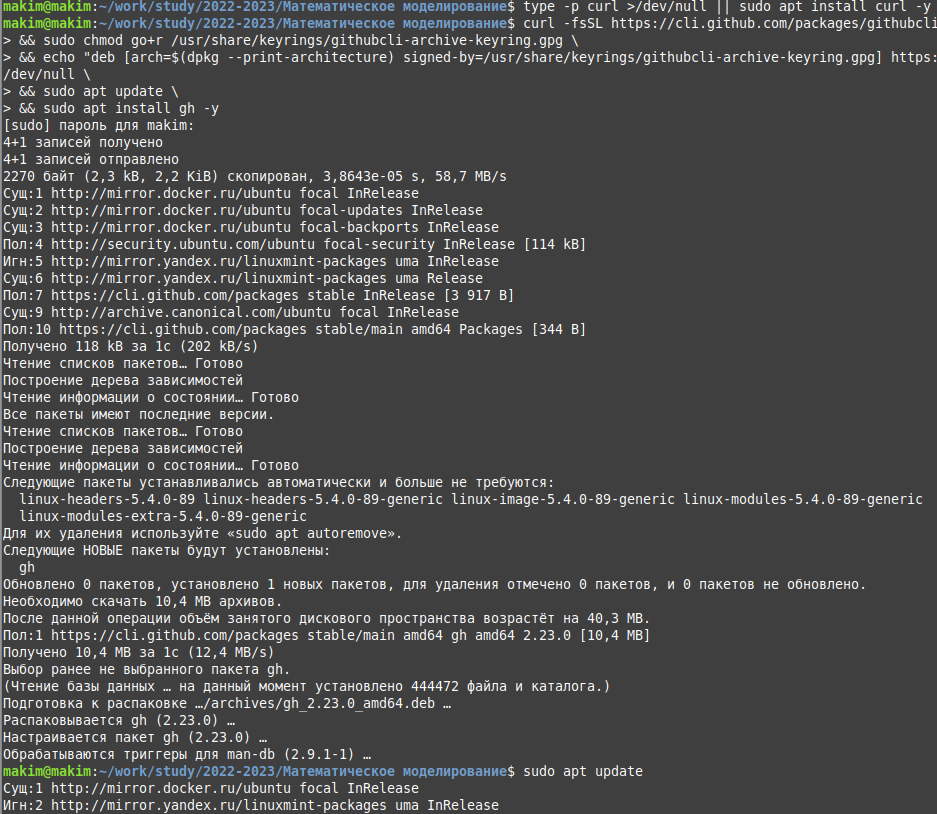{#fig:04 width=86%}

1. На всякай случай обновляем gh, а также авторизируемся (рис. @fig:05).

    ```
    sudo apt install gh
    gh auth login
    ```

    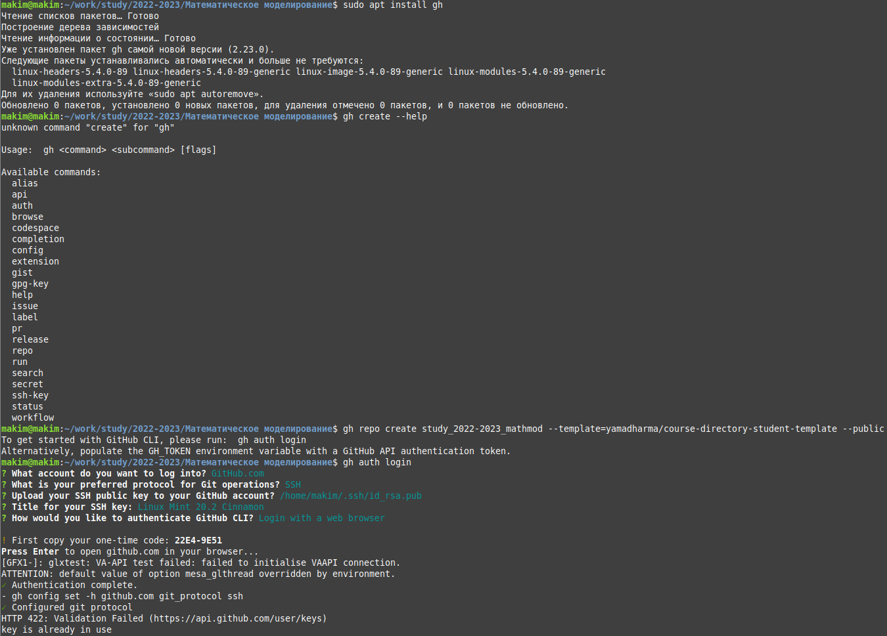{#fig:05 width=86%}

1. Копируем шаблонный репозиторий (рис. @fig:06).

    ```
    gh repo create study_2022-2023_mathmod --template=yamadharma/course-directory-student-template --public
    git clone --recursive git@github.com:<owner>/study_2022-2023_mathmod.git mathmod
    ```

    {#fig:06 width=86%}

1. Убеждаемся, что репозиторий создался и скопировался (рис. @fig:07).

    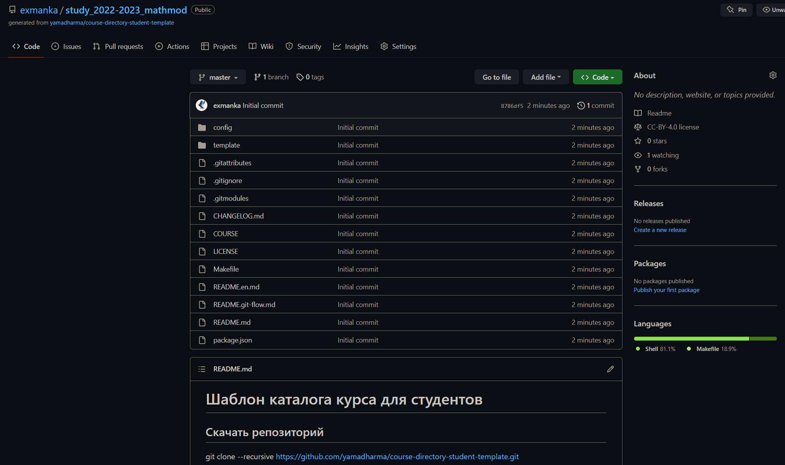{#fig:07 width=86%}

1. Просматриваем все доступные цели make и список доступных курсов (рис. @fig:08).

    ```
    make help
    make list
    ```

    {#fig:08 width=86%}

1. Удаляем ненужный файл package.json, записываем в файл COURSE слово "mathmod", создаем необходимые каталоги при помощи Makefile (рис. @fig:09).

    ```
    rm package.json
    echo mathmod > COURSE
    make
    ```

    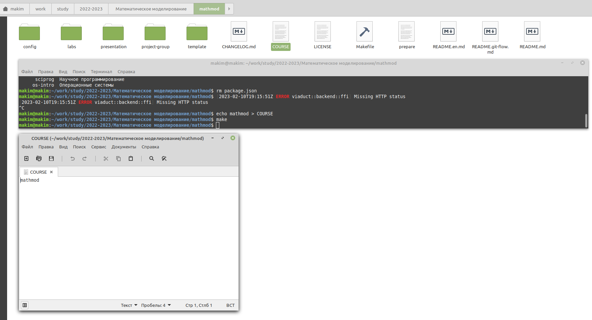{#fig:09 width=86%}

1. Индексируем все файлы директории проекта, делаем первый коммит, при этом изменяем поля конфига на уровне пользователя. Загружаем на GitHub (рис. @fig:10, @fig:11).

    ```
    git add .
    git config --global user.email "1032201664@pfur.ru"
    git config --global user.name "Michael Kim"
    git commit -am 'feat(main): make course structure'
    ```

    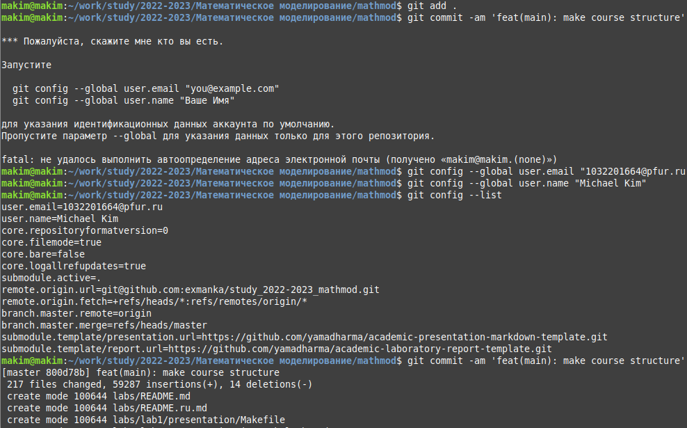{#fig:10 width=86%}

    {#fig:11 width=86%}

1. Проверяем наличие коммита (рис. @fig:12).

    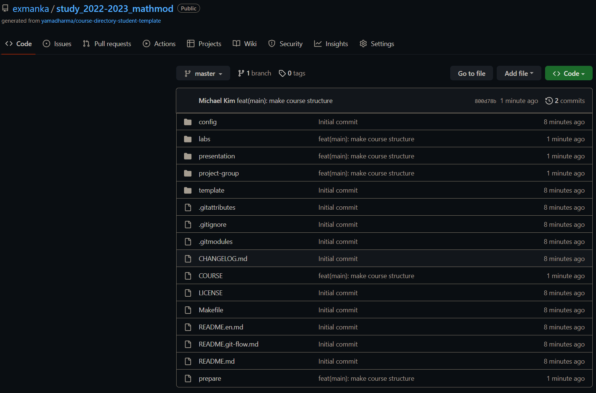{#fig:12 width=86%}


## Настройка возможности конвертации файлов .md в .pdf, .docx, .html

1. Установливаем необходимые пакеты для конвертации файлов из .md в .docx, .html (рис. @fig:13, @fig:14).

    ```
    sudo apt install python-is-python3
    sudo apt install python3-pip
    pip install pandocfilters
    ```

    {#fig:13 width=86%}

    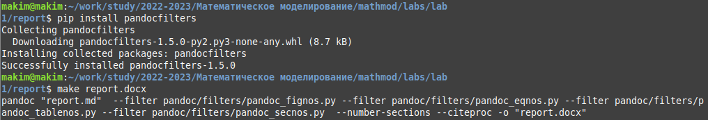{#fig:14 width=86%}

1. Устраняем ошибки конвертации файла .pdf:
    1. Способ, от которого в будущем я отказался: изменение Makefile (рис. @fig:15, @fig:16, @fig:17).

        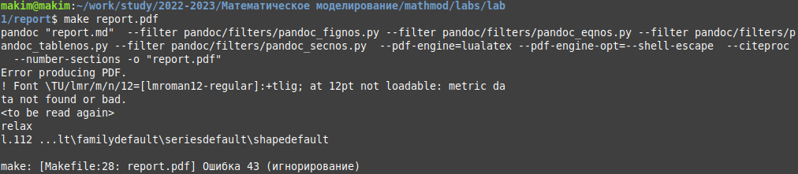{#fig:15 width=86%}

        {#fig:16 width=86%}

        {#fig:17 width=86%}

    1. Оптимальный способ — очередная установка необходимых пакетов (рис. @fig:19, @fig:20, @fig:21, @fig:22, @fig:23).

        ```
        sudo apt install texlive-luatex
        sudo apt install texlive-latex-base
        sudo apt install texlive-lang-cyrillic
        ```

        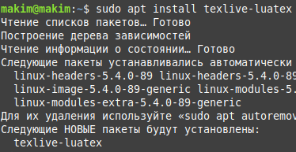{#fig:19 width=86%}

        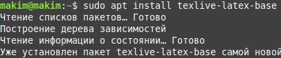{#fig:20 width=86%}

        {#fig:21 width=86%}

        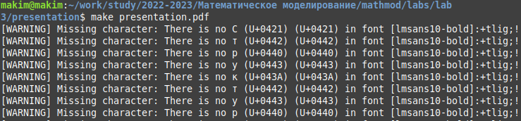{#fig:22 width=86%}

        {#fig:23 width=86%}
    
## Составление отчета в Markdown
1. Для составления отчета используем Visual Studio Code вместе с расширением Markdown All in One для мгновенного отображения выходного файла (рис. @fig:24).

    {#fig:24 width=86%}

1. Интерфейс и синтаксис во время работы (рис. @fig:25).

    {#fig:25 width=86%}

1. Изменеяем файл cite.bib для добавления литературы (рис. @fig:26).

    {#fig:26 width=86%}

1. В данный момент пишу вывод (рис. @fig:27).

    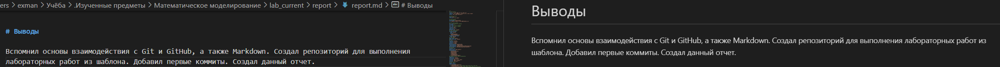{#fig:27 width=86%}
    

# Выводы

Вспомнил основы взаимодействия с Git и GitHub, а также Markdown. Создал репозиторий для выполнения лабораторных работ из шаблона. Добавил первые коммиты. Создал данный отчет.

# Список литературы{.unnumbered}

::: {#refs}
:::
