---
## Front matter
lang: ru-RU
title: Лабораторная работа №2
subtitle: Частный случай задачи о погоне
author:
  - Ким М. А.
institute:
  - Российский университет дружбы народов, Москва, Россия
date: 18 февраля 2023

## i18n babel
babel-lang: russian
babel-otherlangs: english

## Fonts
mainfont: PT Serif
romanfont: PT Serif
sansfont: PT Sans
monofont: PT Mono
mainfontoptions: Ligatures=TeX
romanfontoptions: Ligatures=TeX
sansfontoptions: Ligatures=TeX,Scale=MatchLowercase
monofontoptions: Scale=MatchLowercase,Scale=0.9

## Formatting pdf
toc: false
toc-title: Содержание
slide_level: 2
aspectratio: 169
section-titles: true
theme: metropolis
header-includes:
 - \metroset{progressbar=frametitle,sectionpage=progressbar,numbering=fraction}
 - '\makeatletter'
 - '\beamer@ignorenonframefalse'
 - '\makeatother'
---

# Информация

## Докладчик

:::::::::::::: {.columns align=center}
::: {.column width="70%"}

  * Ким Михаил Алексеевич
  * студент уч. группы НФИбд-01-20
  * Российский университет дружбы народов
  * [1032201664@pfur.ru](mailto:1032201664@pfur.ru)
  * <https://github.com/exmanka>

:::
::: {.column width="30%"}

:::
::::::::::::::

# Вводная часть

## Актуальность

- Необходимость навыков моделирования реальных математических задач, построение графиков.

## Объект и предмет исследования

- Язык программирования Julia
- Язык моделирования Modelica
- Задача о погоне. Заяц-волк.

## Цели и задачи

- Ознакомиться с базовым функционалом языков Julia и OpenModelica.
- Смоделировать математическую задачу о погоне с помощью данных языков.

## Материалы и методы

- Языки программирования:
  - Julia
  - OpenModelica

# Процесс выполнения работы

# Подготовка системы для работы

## Установка Julia, REPL, дополнительных библиотек

:::::::::::::: {.columns align=center}
::: {.column width="65%"}

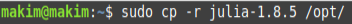
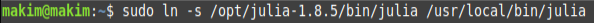
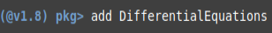
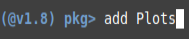

:::
::: {.column width="35%"}

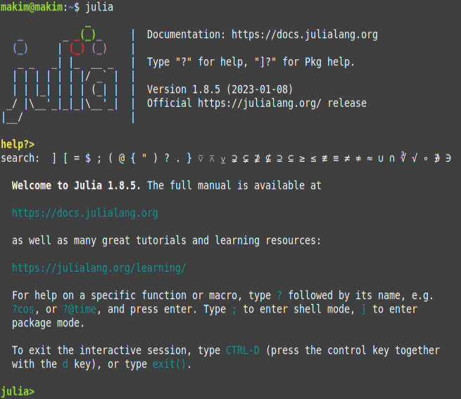
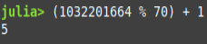

:::
::::::::::::::

## Установка Visual Studio Code

:::::::::::::: {.columns align=center}
::: {.column width="50%"}

:::
::: {.column width="50%"}

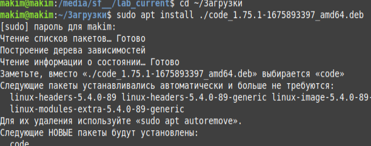
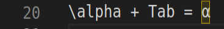

:::
::::::::::::::

## Установка Modelica, OpenModelica, дополнительных библиотек

:::::::::::::: {.columns align=center}
::: {.column width="50%"}

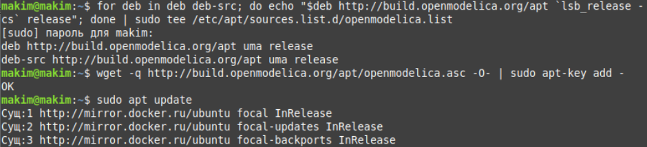
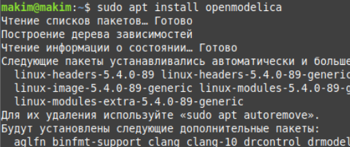
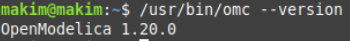

:::
::: {.column width="50%"}

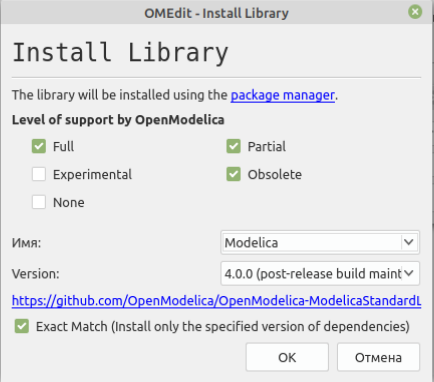

:::
::::::::::::::

# Формулировка задания

*На море в тумане катер береговой охраны преследует лодку браконьеров.
Через определенный промежуток времени туман рассеивается, и лодка
обнаруживается на расстоянии 6,4 км от катера. Затем лодка снова скрывается в
тумане и уходит прямолинейно в неизвестном направлении. Известно, что скорость
катера в 2,5 раза больше скорости браконьерской лодки: $V_O=2.5V_B$.*

Браконьеры и охотники видят друг друга на расстоянии $a=6.2$ до наступления тумана.

Браконьеры двигаются по прямой в то время, как охотники движутся по спирали, чтобы нагнать браконьеров в любом случае, поскольку вторые движутся в неизвестном направлении.

# Математические вычисления

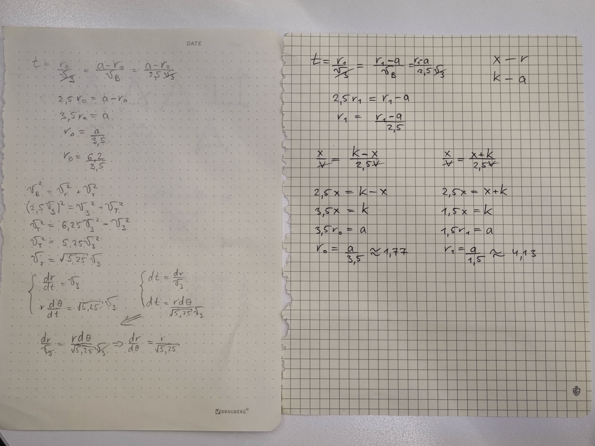

# Написание программ

## Код на Julia

:::::::::::::: {.columns align=center}
::: {.column width="50%"}

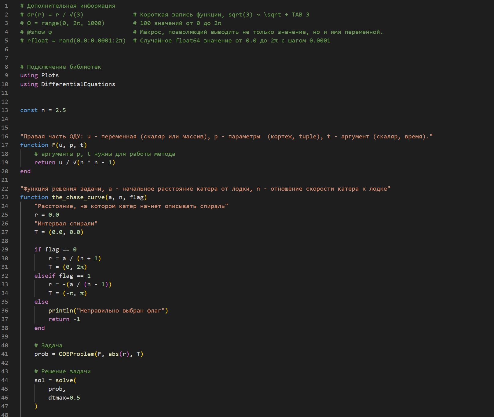

:::
::: {.column width="50%"}

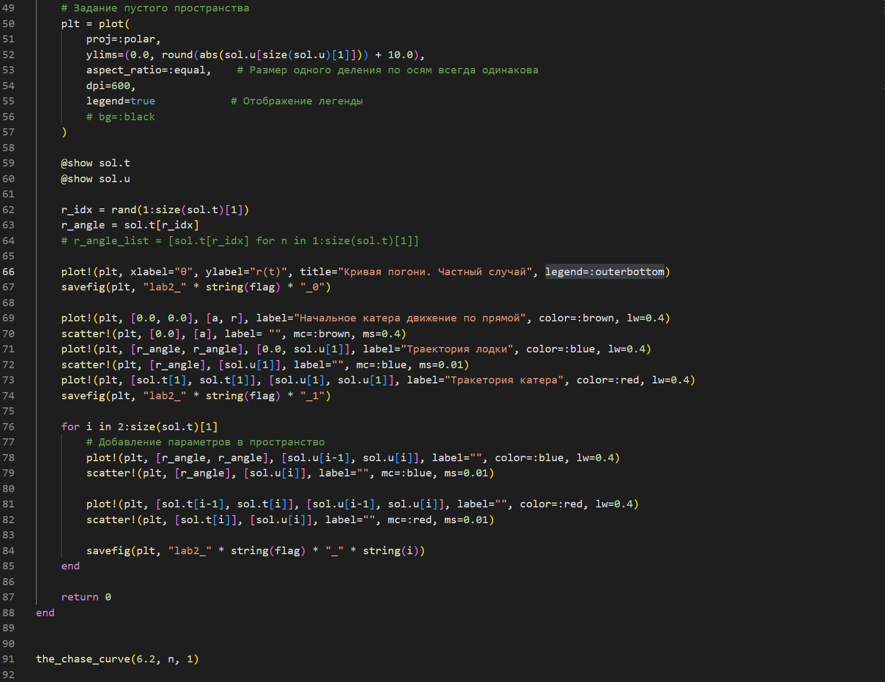

:::
::::::::::::::

## Результаты выполнения программы на Julia

:::::::::::::: {.columns align=center}
::: {.column width="50%"}

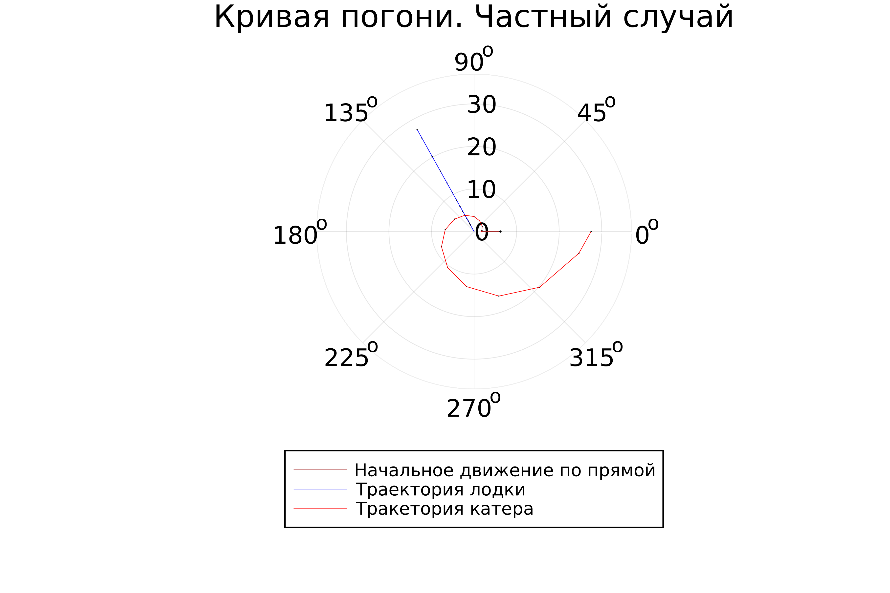

:::
::: {.column width="50%"}

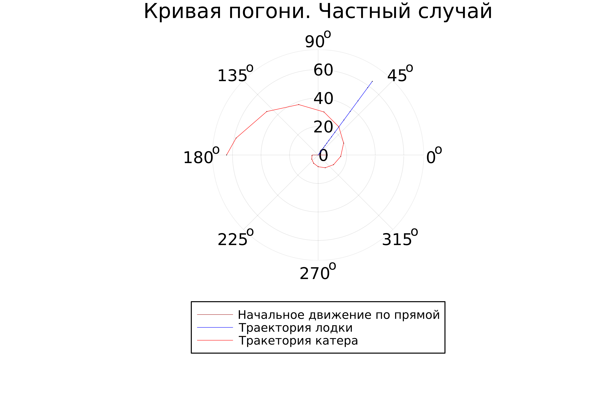

:::
::::::::::::::

## Код на Modelica

:::::::::::::: {.columns align=center}
::: {.column width="50%"}

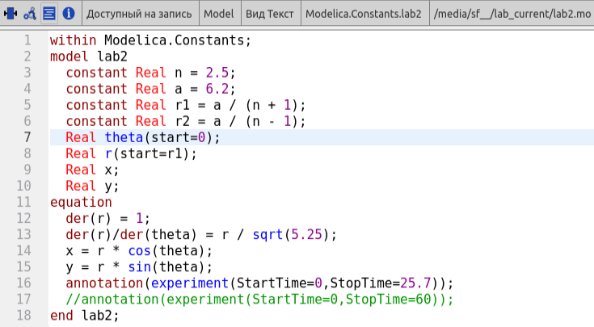

:::
::: {.column width="50%"}

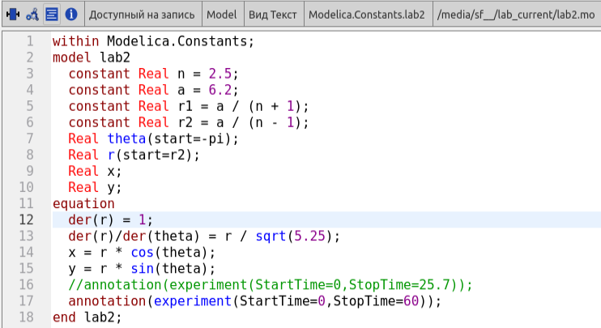

:::
::::::::::::::

## Результаты выполнения программы на Modelica

:::::::::::::: {.columns align=center}
::: {.column width="50%"}

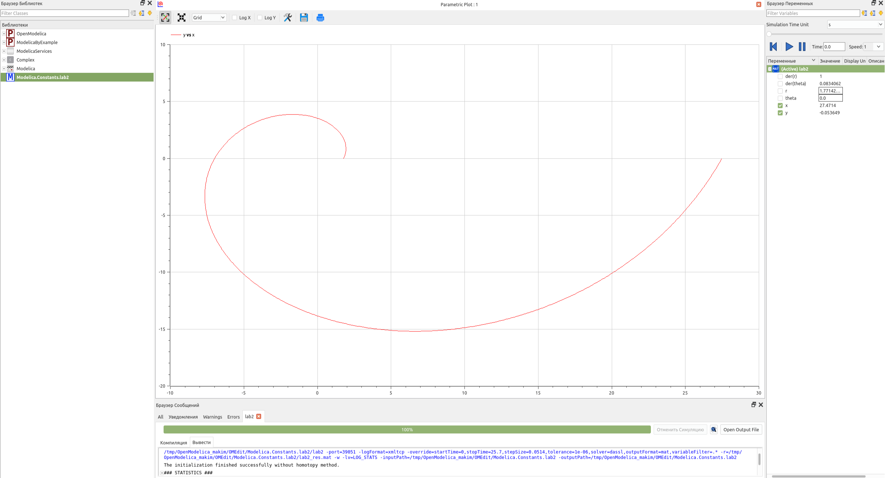

:::
::: {.column width="50%"}

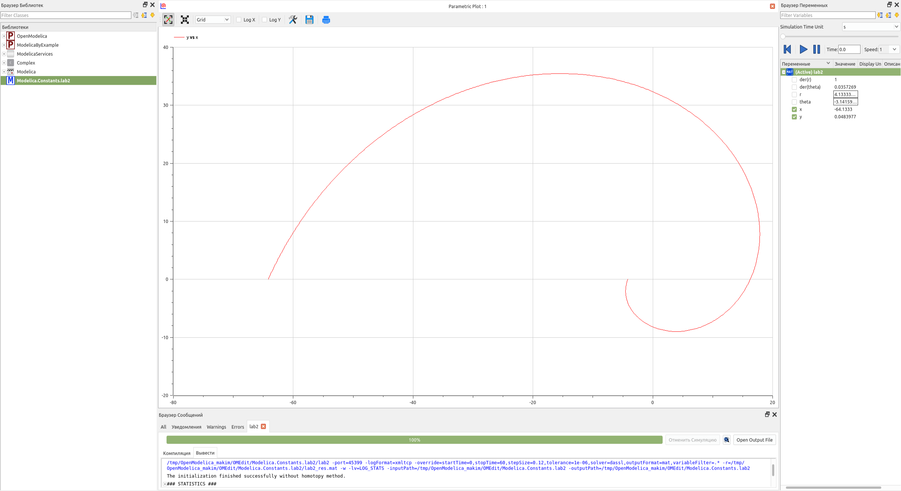

:::
::::::::::::::

# Результаты

- Написаны программы на языках Julia и Modelica, моделирующие задачу о погоне Заяц-Волк в двух вариантах
- Построены графики движения в соответствии с поставленными задачами

## Вывод

Ознакомился с базовым функционалом языка программирования Julia и языка моделирования Modelica, а также с функционалом программного обеспечениея OpenModelica. Используя эти средства, построил математическую модель, представляющую собой частный случай задачи о погоне.
