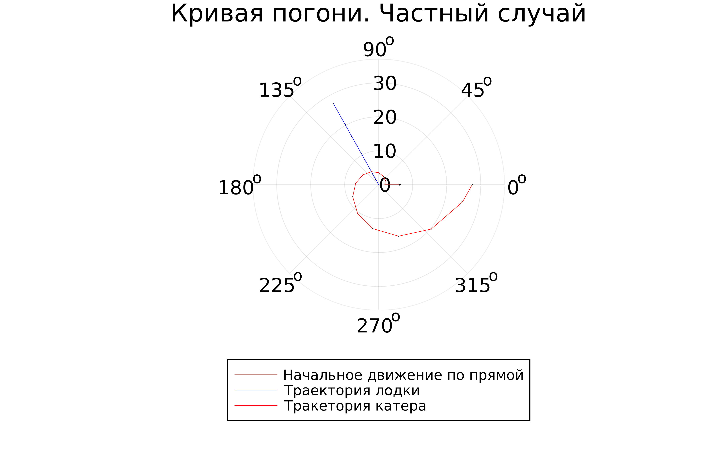

---
## Front matter
title: "Отчет по лабораторной работе №2"
subtitle: "по дисциплине: Математическое моделирование"
author: "Ким Михаил Алексеевич"

## Generic otions
lang: ru-RU
toc-title: "Содержание"

## Bibliography
bibliography: bib/cite.bib
csl: pandoc/csl/gost-r-7-0-5-2008-numeric.csl

## Pdf output format
toc: true # Table of contents
toc-depth: 2
lof: true # List of figures
lot: false # List of tables
fontsize: 12pt
linestretch: 1.5
papersize: a4
documentclass: scrreprt
## I18n polyglossia
polyglossia-lang:
  name: russian
  options:
	- spelling=modern
	- babelshorthands=true
polyglossia-otherlangs:
  name: english
## I18n babel
babel-lang: russian
babel-otherlangs: english
## Fonts
mainfont: PT Serif
romanfont: PT Serif
sansfont: PT Sans
monofont: PT Mono
mainfontoptions: Ligatures=TeX
romanfontoptions: Ligatures=TeX
sansfontoptions: Ligatures=TeX,Scale=MatchLowercase
monofontoptions: Scale=MatchLowercase,Scale=0.9
## Biblatex
biblatex: true
biblio-style: "gost-numeric"
biblatexoptions:
  - parentracker=true
  - backend=biber
  - hyperref=auto
  - language=auto
  - autolang=other*
  - citestyle=gost-numeric
## Pandoc-crossref LaTeX customization
figureTitle: "Рис."
tableTitle: "Таблица"
listingTitle: "Листинг"
lofTitle: "Список иллюстраций"
lotTitle: "Список таблиц"
lolTitle: "Листинги"
## Misc options
indent: true
header-includes:
  - \usepackage{indentfirst}
  - \usepackage{float} # keep figures where there are in the text
  - \floatplacement{figure}{H} # keep figures where there are in the text
---

# Цель работы

Ознакомиться с базовым функционалом языка программирования Julia, а также интерактивной командной строкой REPL. Ознакомиться с базовым функционалом языка моделирования Modelica и программным обеспечением OpenModelica. Используя эти средства, пострить математическую модель, представляющую собой частный случай задачи о погоне.

# Задание

1. Записать уравнение, описывающее движение катера, с начальными
условиями для двух случаев (в зависимости от расположения катера
относительно лодки в начальный момент времени).
1. Построить траекторию движения катера и лодки для двух случаев.
1. Найти точку пересечения траектории катера и лодки 

# Теоретическое введение
## Julia

Julia является высокоуровневым языком программирования, разработанным с целью создания высокоэффективного и легкого для использования языка программирования. Он объединяет лучшие аспекты других языков программирования, таких как Python, R и Matlab [@bib_1]. 

Julia может использоваться в любой области применения, включая инженерные вычисления, анализ данных, машинное обучение и научные вычисления. Она также поддерживает многопоточность и масштабируемость, позволяя программистам писать более эффективные программы, способные обрабатывать большие данные [@bib_2].

В целом, Julia является мощным и гибким языком программирования, который может использоваться для решения различных задач. Он предоставляет программистам широкий диапазон возможностей для создания более мощных и высокопроизводительных приложений [@bib_3].

## OpenModelica

OpenModelica – это свободно распространяемый открытый исходный инструментальный комплекс для моделирования, анализа и разработки систем и проектирования. Он был основан в 1999 году на базе проекта Modelica [@bib_4].

OpenModelica является бесплатным программным обеспечением, поддерживает интеграцию с различными языками программирования и позволяет пользовательским приложениям и инструментам работать в единой среде. Области применения OpenModelica включают системное моделирование и проектирование, моделирование сложных автоматизированных систем и многое другое. Он также используется в целях обучения [@bib_5].


# Выполнение лабораторной работы
## Подготовка системы для работы
### Установка Julia

1. Устанавливаем язык программирования Julia вместе с интерактивной командной строкой REPL при помощи команд (рис. @fig:01, @fig:02, @fig:03, @fig:04).

    ```
    wget https://julialang-s3.julialang.org/bin/linux/x64/1.8/julia-1.8.5-linux-x86_64.tar.gz
    tar zxvf julia-1.8.5-linux-x86_64.tar.gz
    sudo cp -r julia-1.8.5 /opt/
    sudo ln -s /opt/julia-1.8.5/bin/julia /usr/local/bin/julia
    ```

    {#fig:01 width=86%}

    {#fig:02 width=86%}

    {#fig:03 width=86%}

    {#fig:04 width=86%}

    {#fig:05 width=86%}

1. Устанавливаем дополнительные библиотеки (рис. @fig:06, @fig:07, @fig:08, @fig:09, @fig:10).

    ```
    add DifferentialEquations
    add Plots
    ```

    ![Ввод символа «\]» инициализирует менеджер пакетов](image/Screenshot_6.png){#fig:06 width=86%}

    {#fig:07 width=86%}

    {#fig:08 width=86%}

    {#fig:09 width=86%}
    
    {#fig:10 width=86%}

1. Проверим правильность установки языка (рис. @fig:11, @fig:12).

    {#fig:11 width=86%}

    {#fig:12 width=86%}


### Установка Visual Studio Code

1. Скачиваем файл .deb с официального сайта (рис. @fig:13, @fig:14, @fig:15).

    ```
    sudo apt install ./code_1.75.1-1675893397_amd64.deb
    ```

    {#fig:13 width=86%}

    {#fig:14 width=86%}

1. Использование UTF-символов в коде Julia в VSC (рис. @fig:15).

    {#fig:15 width=86%}


### Установка OpenModelica

1. Устанавливаем программное обеспечение OpenModelica при помощи команд (рис. @fig:16, @fig:17).

    ```
    for deb in deb deb-src; do echo "$deb http://build.openmodelica.org/apt `lsb_release -cs` release"; done | sudo tee /etc/apt/sources.list.d/openmodelica.list
    wget -q http://build.openmodelica.org/apt/openmodelica.asc -O- | sudo apt-key add -
    sudo apt update
    sudo apt install openmodelica
    ```

    {#fig:16 width=86%}

    {#fig:17 width=86%}

1. Проверяем правильность установки (рис. @fig:18).

    ```
    /usr/bin/omc --version
    ```

    {#fig:18 width=86%}
    
1. Устанавливаем дополнительные библиотеки (рис. @fig:19, @fig:20, @fig:21).

    {#fig:19 width=86%}
    
    {#fig:20 width=86%}

    {#fig:21 width=86%}


## Выполнение лабораторной работы
### Julia

1. Пишем программу, воспроизводящую модель на языке программирования Julia (рис. @fig:22, @fig:23).

    ```
    # Дополнительная информация
    # dr(r) = r / √(3)              # Короткая запись функции, sqrt(3) ~ \sqrt + TAB 3
    # Φ = range(0, 2π, 1000)        # 100 значений от 0 до 2π
    # @show ϕ                       # Макрос, позволяющий выводить не только значение, но и имя переменной.
    # rfloat = rand(0.0:0.0001:2π)  # Случайное float64 значение от 0.0 до 2π с шагом 0.0001


    # Подключение библиотек
    using Plots
    using DifferentialEquations


    const n = 2.5


    "Правая часть ОДУ: u - переменная (скаляр или массив), p - параметры  (кортеж, tuple), t - аргумент (скаляр, время)."
    function F(u, p, t)
        # аргументы p, t нужны для работы метода
        return u / √(n * n - 1)
    end

    "Функция решения задачи, a - начальное расстояние катера от лодки, n - отношение скорости катера к лодке"
    function the_chase_curve(a, n, flag)
        "Расстояние, на котором катер начнет описывать спираль"
        r = 0.0
        "Интервал спирали"
        T = (0.0, 0.0)

        if flag == 0
            r = a / (n + 1)
            T = (0, 2π)
        elseif flag == 1
            r = -(a / (n - 1))
            T = (-π, π)
        else
            println("Неправильно выбран флаг")
            return -1
        end

        # Задача
        prob = ODEProblem(F, abs(r), T)

        # Решение задачи
        sol = solve(
            prob,
            dtmax=0.5
        )

        # Задание пустого пространства
        plt = plot(       
            proj=:polar,
            ylims=(0.0, round(abs(sol.u[size(sol.u)[1]])) + 10.0),
            aspect_ratio=:equal,    # Размер одного деления по осям всегда одинакова
            dpi=600,
            legend=true            # Отображение легенды
            # bg=:black
        )

        @show sol.t
        @show sol.u

        r_idx = rand(1:size(sol.t)[1])
        r_angle = sol.t[r_idx]
        # r_angle_list = [sol.t[r_idx] for n in 1:size(sol.t)[1]]

        plot!(plt, xlabel="θ", ylabel="r(t)", title="Кривая погони. Частный случай", legend=:outerbottom)
        savefig(plt, "lab2_" * string(flag) * "_0")

        plot!(plt, [0.0, 0.0], [a, r], label="Начальное катера движение по прямой", color=:brown, lw=0.4)
        scatter!(plt, [0.0], [a], label= "", mc=:brown, ms=0.4)
        plot!(plt, [r_angle, r_angle], [0.0, sol.u[1]], label="Траектория лодки", color=:blue, lw=0.4)
        scatter!(plt, [r_angle], [sol.u[1]], label="", mc=:blue, ms=0.01)
        plot!(plt, [sol.t[1], sol.t[1]], [sol.u[1], sol.u[1]], label="Тракетория катера", color=:red, lw=0.4)
        savefig(plt, "lab2_" * string(flag) * "_1")

        for i in 2:size(sol.t)[1]
            # Добавление параметров в пространство
            plot!(plt, [r_angle, r_angle], [sol.u[i-1], sol.u[i]], label="", color=:blue, lw=0.4)
            scatter!(plt, [r_angle], [sol.u[i]], label="", mc=:blue, ms=0.01)

            plot!(plt, [sol.t[i-1], sol.t[i]], [sol.u[i-1], sol.u[i]], label="", color=:red, lw=0.4)
            scatter!(plt, [sol.t[i]], [sol.u[i]], label="", mc=:red, ms=0.01)

            savefig(plt, "lab2_" * string(flag) * "_" * string(i))
        end

        return 0
    end


    the_chase_curve(6.2, n, 1)

    ```

    {#fig:22 width=86%}

    {#fig:23 width=86%}

1. Любуемся результатом (рис. @fig:24, @fig:25).

    {#fig:24 width=86%}

    {#fig:25 width=86%}


### OpenModelica

1. Пробуем написать программу, воспроизводящую модель на языке моделирования Modelica (рис. @fig:26, @fig:27).

    ```
    within Modelica.Constants;
    model lab2
      constant Real n = 2.5;
      constant Real a = 6.2;
      constant Real r1 = a / (n + 1);
      constant Real r2 = a / (n - 1);
      Real theta(start=-pi);
      Real r(start=r2);
      Real x;
      Real y;
    equation
      der(r) = 1;
      der(r)/der(theta) = r / sqrt(5.25);
      x = r * cos(theta);
      y = r * sin(theta);
      //annotation(experiment(StartTime=0,StopTime=25.7));
      annotation(experiment(StartTime=0,StopTime=60));
    end lab2;
    ```

    {#fig:26 width=86%}
    
    {#fig:27 width=86%}

1. Смотрим на результат (рис. @fig:28, @fig:29).

    {#fig:28 width=86%}

    {#fig:29 width=86%}

### Математические вычисления

1. Используемые вычисления (рис. @fig:30).

    {#fig:30 width=86%}
    

# Выводы

Ознакомился с базовым функционалом языка программирования Julia, а также интерактивной командной строкой REPL. Ознакомился с базовым функционалом языка моделирования Modelica и программным обеспечением OpenModelica. Используя эти средства, пострил математическую модель, представляющую собой частный случай задачи о погоне.

**Сделал для себя вывод, что для решения данной задачи подходит язык программирования Julia и почти полностью не подходит язык моделирования Modelica.**

# Список литературы{.unnumbered}

::: {#refs}
:::
