---
## Front matter
lang: ru-RU
title: Лабораторная работа №3
subtitle: Модель боевых действий Ланчестера
author:
  - Ким М. А.
institute:
  - Российский университет дружбы народов, Москва, Россия
date: 25 февраля 2023

## i18n babel
babel-lang: russian
babel-otherlangs: english

## Fonts
mainfont: PT Serif
romanfont: PT Serif
sansfont: PT Sans
monofont: PT Mono
mainfontoptions: Ligatures=TeX
romanfontoptions: Ligatures=TeX
sansfontoptions: Ligatures=TeX,Scale=MatchLowercase
monofontoptions: Scale=MatchLowercase,Scale=0.9

## Formatting pdf
toc: false
toc-title: Содержание
slide_level: 2
aspectratio: 169
section-titles: true
theme: metropolis
header-includes:
 - \metroset{progressbar=frametitle,sectionpage=progressbar,numbering=fraction}
 - '\makeatletter'
 - '\beamer@ignorenonframefalse'
 - '\makeatother'
---

# Информация

## Докладчик

:::::::::::::: {.columns align=center}
::: {.column width="70%"}

  * Ким Михаил Алексеевич
  * студент уч. группы НФИбд-01-20
  * Российский университет дружбы народов
  * [1032201664@pfur.ru](mailto:1032201664@pfur.ru)
  * <https://github.com/exmanka>

:::
::: {.column width="30%"}

:::
::::::::::::::

# Вводная часть

## Актуальность

- Необходимость навыков моделирования реальных математических задач, построение графиков. 

## Объект и предмет исследования

- Язык программирования Julia
- Язык моделирования Modelica
- Модель Ланчестера

## Цели и задачи

- Начать знакомство с интерактивным блокнотом Pluto.jl.
- Продолжить знакомство с функционалом языков Julia и OpenModelica.
- Создать математическую модель боевых действий Ланчестера с помощью данных языков.

## Материалы и методы

- Языки:
  - Julia
  - Modelica

# Процесс выполнения работы

# Подготовка системы для работы

## Установка интерактивного блокнота Pluto.jl

:::::::::::::: {.columns align=center}
::: {.column width="65%"}

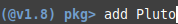
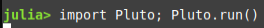

:::
::: {.column width="35%"}

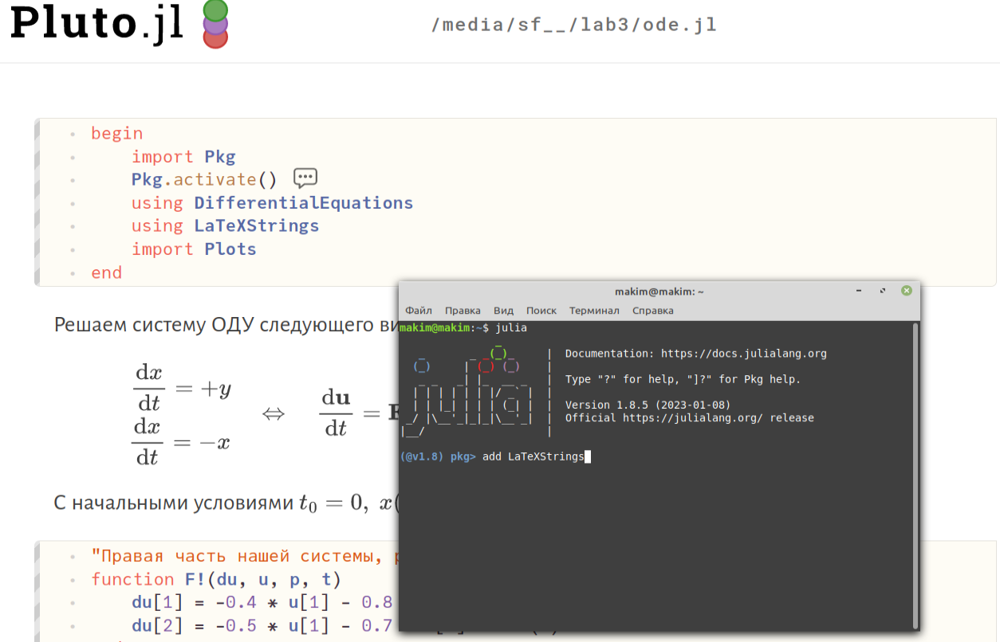

:::
::::::::::::::

# Формулировка задания
## Формулировка задания 1

Между страной Х и страной У идет война. Численность состава войск исчисляется от начала войны, и являются временными функциями $x(t)$ и $y(t)$. В начальный момент времени страна $Х$ имеет армию численностью __10000__ человек, а в распоряжении страны $У$ армия численностью в __29000__ человек. Для упрощения модели считаем, что коэффициенты $a,\ b,\ c,\ h$ постоянны. Также считаем $P(t)$ и $Q(t)$ непрерывные функции.

## Формулировка задания 2

Постройте графики изменения численности войск армии $Х$ и армии $У$ для следующих случаев:

1. Модель боевых действий между регулярными войсками
   
  $$
  \left\{
  \begin{array}{c}
  \frac{dx}{dt} = -0.333x(t) - 0.77y(t) + 1.6\sin(t)\\
   \\
  \frac{dy}{dt} = -0.5x(t) - 0.65y(t) + 1.7\cos(t + 2)
  \end{array}
  \right.
  $$

## Формулировка задания 3

2. Модель ведение боевых действий с участием регулярных войск и партизанских отрядов
   
  $$
  \left\{
  \begin{array}{c}
  \frac{dx}{dt} = -0.343x(t) - 0.815y(t) + \sin(2t) + 1\\
   \\
  \frac{dy}{dt} = -0.227x(t)y(t) - 0.815y(t) + \cos(10t) + 1
  \end{array}
  \right.
  $$

# Написание программ

## Код на Pluto.jl первой модели (1)

:::::::::::::: {.columns align=center}
::: {.column width="47%"}

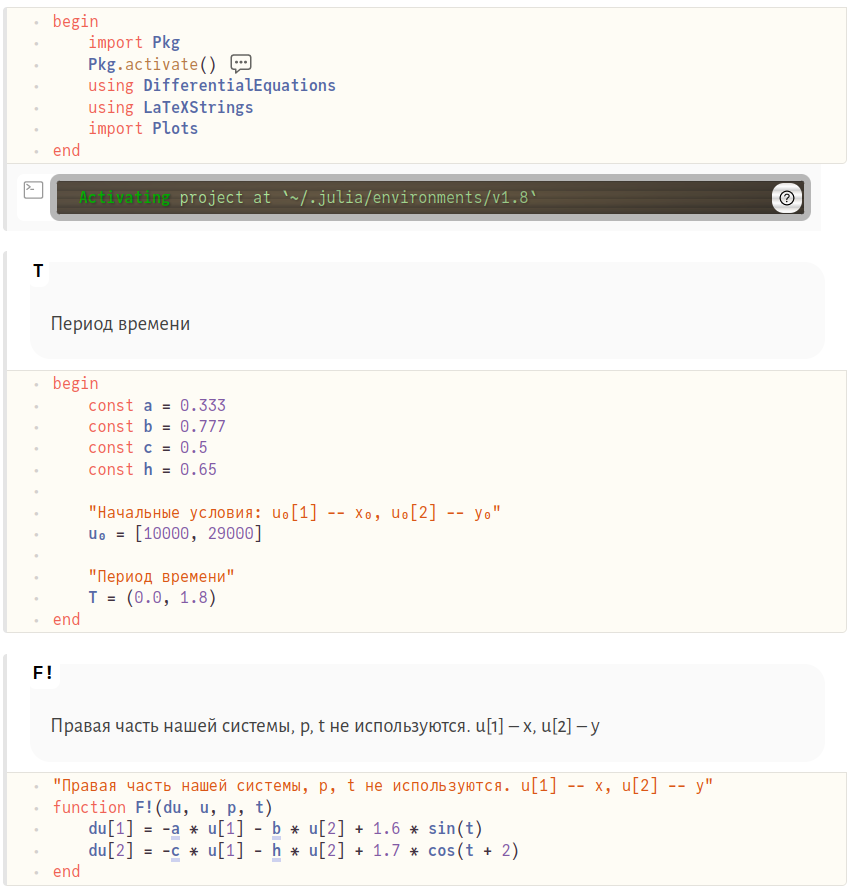

:::
::: {.column width="53%"}

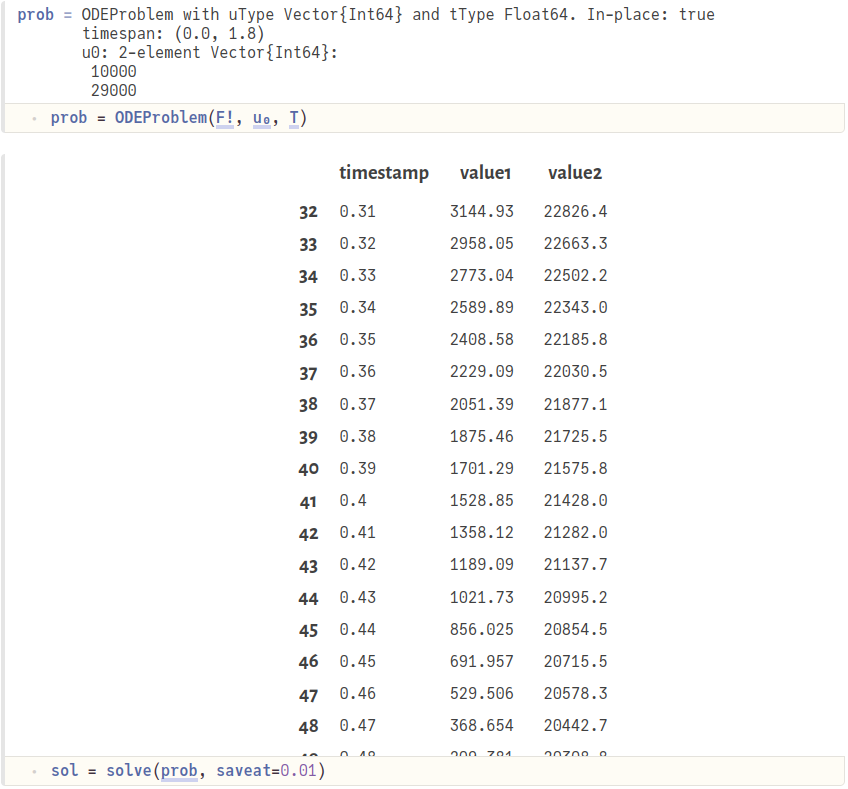

:::
::::::::::::::

## Код на Pluto.jl первой модели (2)

:::::::::::::: {.columns align=center}
::: {.column width="45%"}

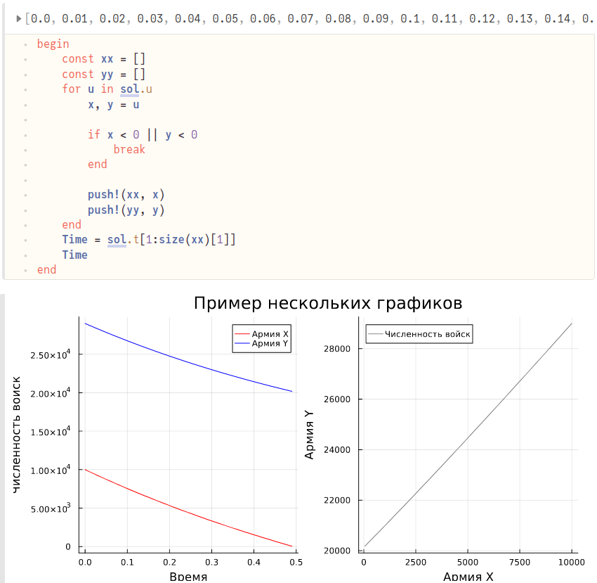

:::
::: {.column width="55%"}

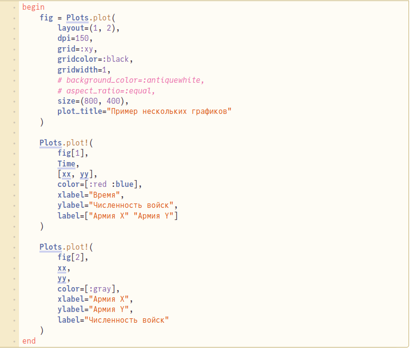

:::
::::::::::::::

## Код на Pluto.jl второй модели (изменения)

:::::::::::::: {.columns align=center}
::: {.column width="50%"}

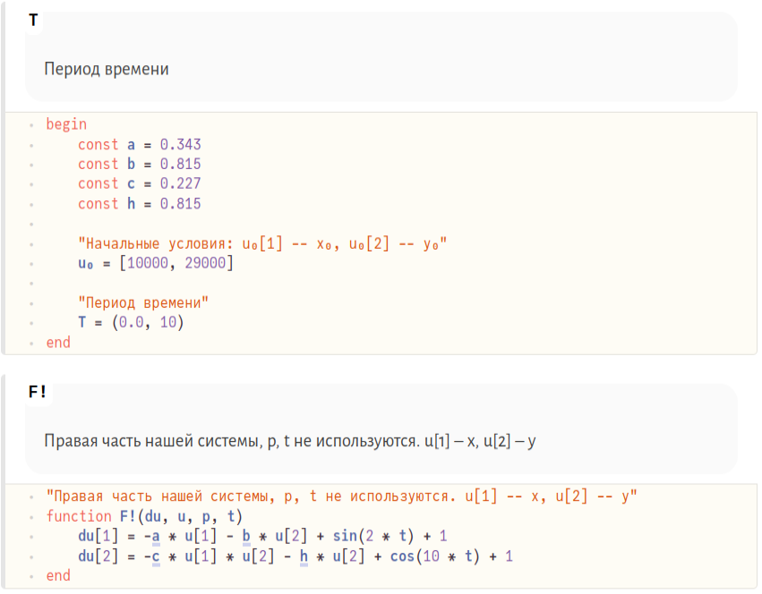

:::
::: {.column width="50%"}

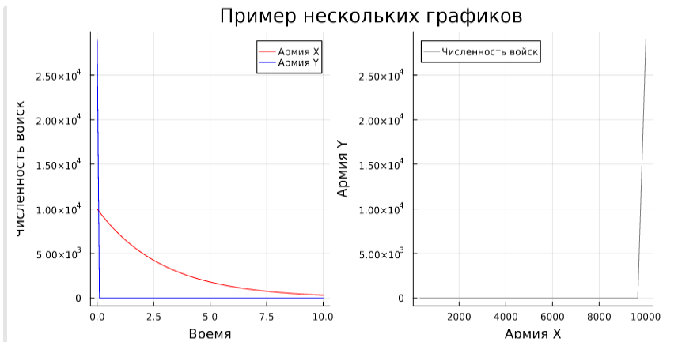

:::
::::::::::::::

## Код на Julia первой модели и результат выполнения

:::::::::::::: {.columns align=center}
::: {.column width="50%"}

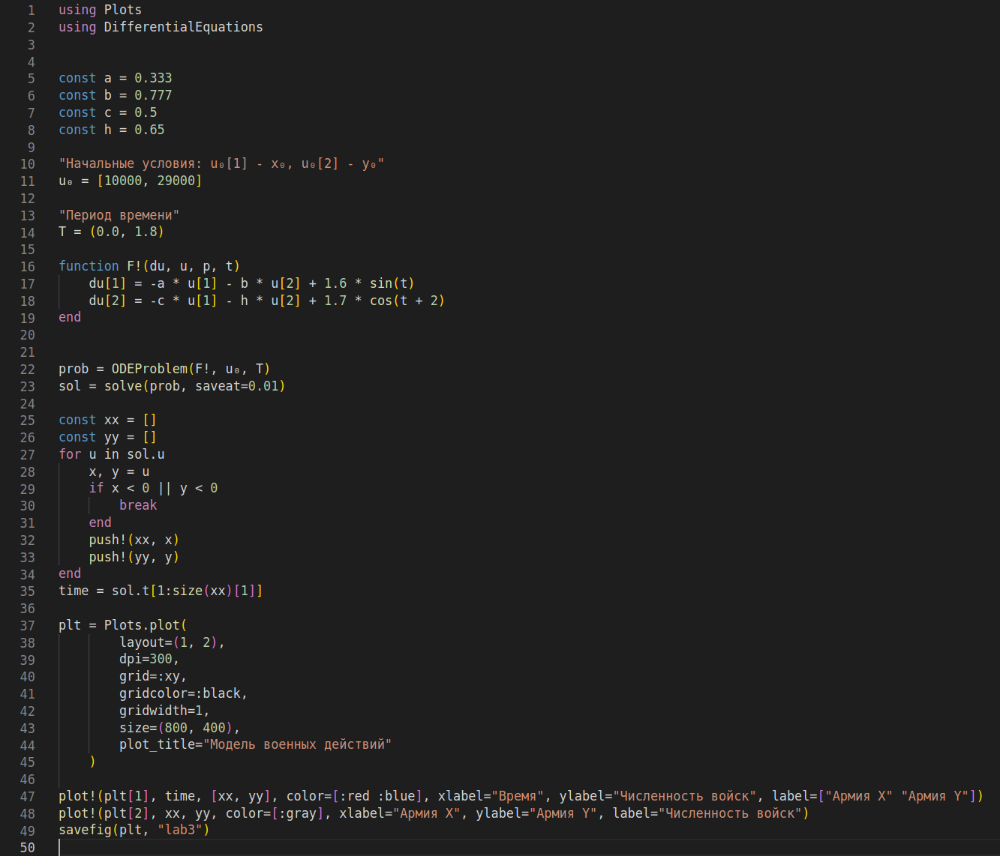

:::
::: {.column width="50%"}

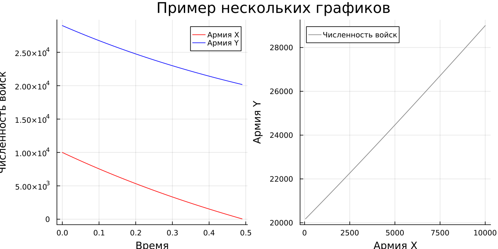

:::
::::::::::::::

## Код на Julia второй модели (изменения) и результат выполнения

:::::::::::::: {.columns align=center}
::: {.column width="50%"}

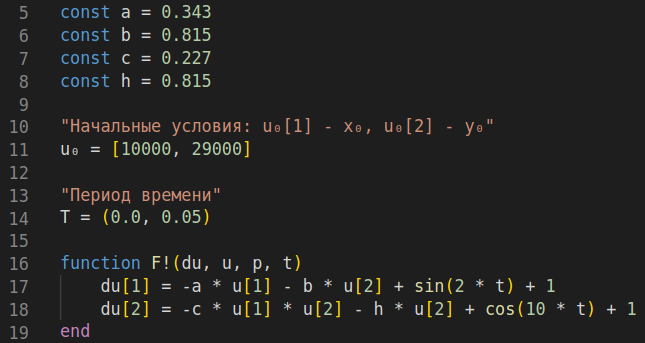

:::
::: {.column width="50%"}

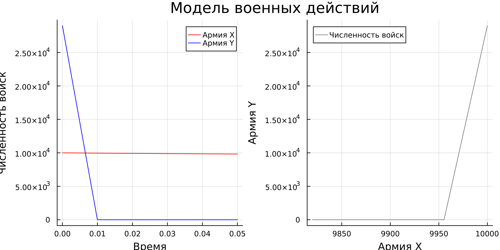

:::
::::::::::::::

## Код на Modelica первой модели и результат выполнения (1)

:::::::::::::: {.columns align=center}
::: {.column width="50%"}

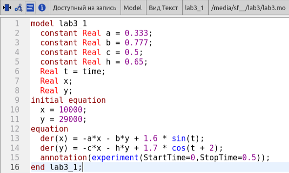

:::
::: {.column width="50%"}

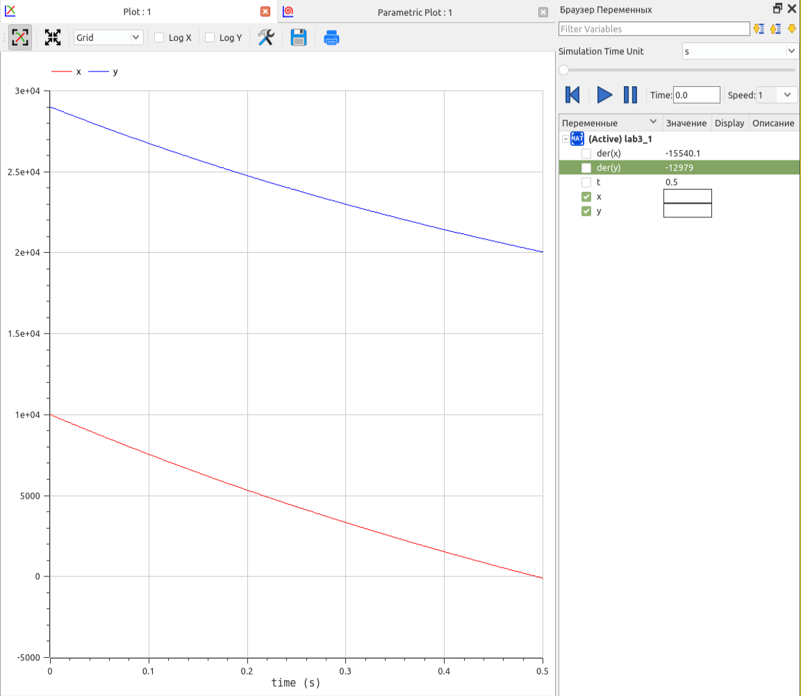

:::
::::::::::::::

## Результат выполнения (2)

:::::::::::::: {.columns align=center}
::: {.column width="50%"}

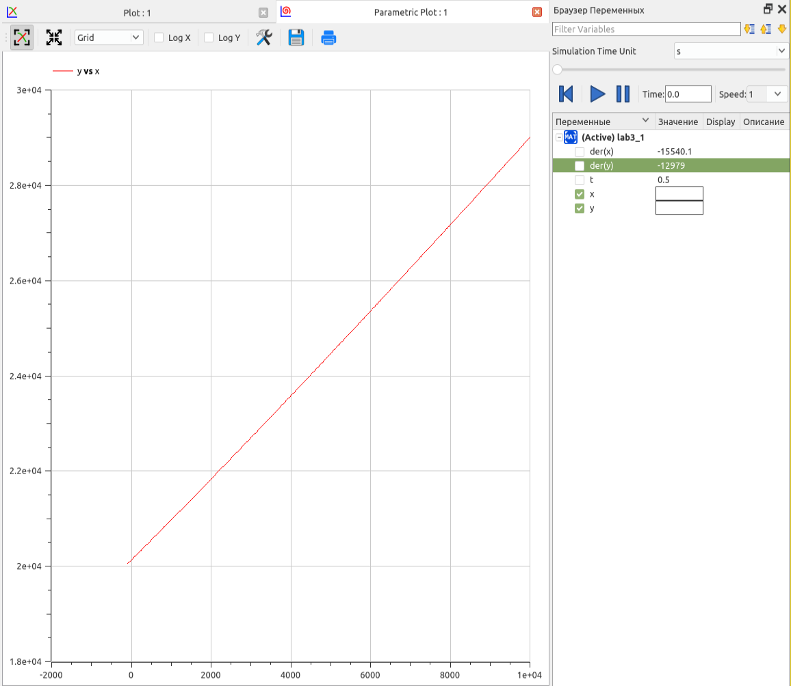

:::
::::::::::::::

## Код на Modelica второй модели и результат выполнения (1)

:::::::::::::: {.columns align=center}
::: {.column width="50%"}

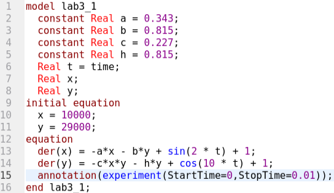

:::
::: {.column width="50%"}

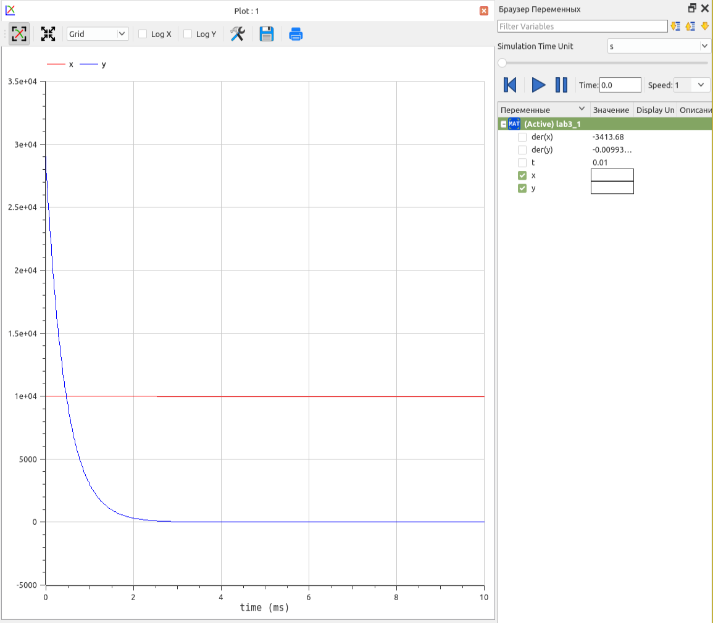

:::
::::::::::::::

## Результат выполнения (2)

:::::::::::::: {.columns align=center}
::: {.column width="50%"}

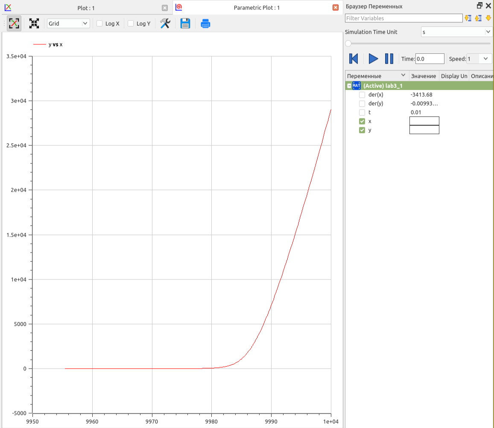

:::
::::::::::::::

# Результаты

- Написаны программы на языках Julia и Modelica, описывающих модель боевых действий Ланчестера.
- Построены графики изменения численности армий в соответствии с поставленными задачами.

## Вывод

Начал знакомство с интерактивным блокнотом Pluto.jl. Продолжил знакомство с функционалом языка программирования Julia и языка моделирования Modelica. Используя эти средства, построил математическую модель, представляющую собой модель боевых действий Ланчестера.
