---
## Front matter
title: "Отчет по лабораторной работе №2"
subtitle: "по дисциплине: Математическое моделирование"
author: "Ким Михаил Алексеевич"

## Generic otions
lang: ru-RU
toc-title: "Содержание"

## Bibliography
bibliography: bib/cite.bib
csl: pandoc/csl/gost-r-7-0-5-2008-numeric.csl

## Pdf output format
toc: true # Table of contents
toc-depth: 2
lof: true # List of figures
lot: false # List of tables
fontsize: 12pt
linestretch: 1.5
papersize: a4
documentclass: scrreprt
## I18n polyglossia
polyglossia-lang:
  name: russian
  options:
	- spelling=modern
	- babelshorthands=true
polyglossia-otherlangs:
  name: english
## I18n babel
babel-lang: russian
babel-otherlangs: english
## Fonts
mainfont: PT Serif
romanfont: PT Serif
sansfont: PT Sans
monofont: PT Mono
mainfontoptions: Ligatures=TeX
romanfontoptions: Ligatures=TeX
sansfontoptions: Ligatures=TeX,Scale=MatchLowercase
monofontoptions: Scale=MatchLowercase,Scale=0.9
## Biblatex
biblatex: true
biblio-style: "gost-numeric"
biblatexoptions:
  - parentracker=true
  - backend=biber
  - hyperref=auto
  - language=auto
  - autolang=other*
  - citestyle=gost-numeric
## Pandoc-crossref LaTeX customization
figureTitle: "Рис."
tableTitle: "Таблица"
listingTitle: "Листинг"
lofTitle: "Список иллюстраций"
lotTitle: "Список таблиц"
lolTitle: "Листинги"
## Misc options
indent: true
header-includes:
  - \usepackage{indentfirst}
  - \usepackage{float} # keep figures where there are in the text
  - \floatplacement{figure}{H} # keep figures where there are in the text
---

# Цель работы

Ознакомиться с базовым функционалом интерактивного блокнота Pluto. Рассмотреть простейшую модель боевых действий — модель Ланчестера. Построить данную математическую модель при помощи языка программирования Julia, интерактивного блокнота Pluto, языка моделирования Modelica и программного обеспечения OpenModelica.

# Задание

1. Записать модель ведения боевых действий между регулярными войсками при помощи системы ОДУ.
1. Записать модель ведения боевых действий с участием регулярных войск и партизанских отрядов при помощи системы ОДУ.
1. Задать начальные условия задачи.
1. Постройте графики изменения численности войск армий.

# Теоретическое введение
## Pluto Notebook

Pluto Notebook - это интерактивный Jupyter Notebook-подобный инструмент для языка программирования Julia. Pluto Notebook позволяет выполнять вычисления, создавать графики и диаграммы, а также описывать отчеты, объединяя код, результаты вычислений и текст в одном документе [@bib_1].

Одним из главных преимуществ Pluto Notebook является возможность просматривать результаты вычислений в режиме реального времени, что упрощает отладку и улучшает итеративный процесс написания кода. Кроме того, Pluto Notebook имеет простой и интуитивно понятный пользовательский интерфейс [@bib_2].

Pluto Notebook также обладает рядом других преимуществ, включая возможность автоматического обновления результатов вычислений при изменении входных данных, поддержку встроенных виджетов и возможность экспорта документов в различные форматы, включая HTML и PDF [@bib_3].

В целом, Pluto Notebook представляет собой мощный и удобный инструмент для проведения вычислений и написания отчетов на языке программирования Julia.

## Модель Ланчестера

Модель боевых действий Ланчестера - это математическая модель, которая используется для описания боевых действий на ранних стадиях войны. Она была разработана Фредериком Ланчестером в начале 20-го века и с тех пор была широко применена в военном делопроизводстве.

Суть модели заключается в том, что она позволяет определить относительную эффективность двух воюющих сторон в зависимости от количества сил каждой стороны. При этом модель предполагает, что вооруженные силы каждой стороны действуют независимо друг от друга и стремятся уничтожить противника [@bib_4].

Ключевым понятием в модели является коэффициент Ланчестера, который определяет относительную мощность каждой стороны. Он рассчитывается на основе количества единиц техники и личного состава каждой стороны. Чем больше коэффициент Ланчестера у одной стороны, тем больше вероятность ее победы в бою.

Модель Ланчестера может быть применена для анализа различных сценариев боевых действий, таких как атака/оборона, маневренная война и т.д. Она также может быть использована для принятия решений по размещению и использованию вооруженных сил в различных ситуациях.

Хотя модель Ланчестера имеет свои ограничения и не учитывает многие факторы, такие как ландшафт, погодные условия и тактику противника, она все еще является полезным инструментом для анализа и планирования военных действий на ранних стадиях войны [@bib_5].


# Выполнение лабораторной работы
## Подготовка системы для работы
### Установка Pluto

1. В интерактивной командной строке REPL языка программирования Julia переходим в менеджер пакетов и устанавливаем пакет __PLuto__ (рис. @fig:01).

    ```
    julia
    ]
    add Pluto
    ```

    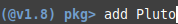{#fig:01 width=86%}

1. Запускаем интерактивный блокнот Pluto (рис. @fig:02).

    ```
    import Pluto; Pluto.run()
    ```

    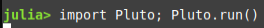{#fig:02 width=86%}

1. Устанавливаем дополнительно пакет __LaTeXStrings__ для корректной отрисовки графиков внутри Pluto (рис. @fig:03).

    ```
    julia
    ]
    add LaTeXStrings
    ```

    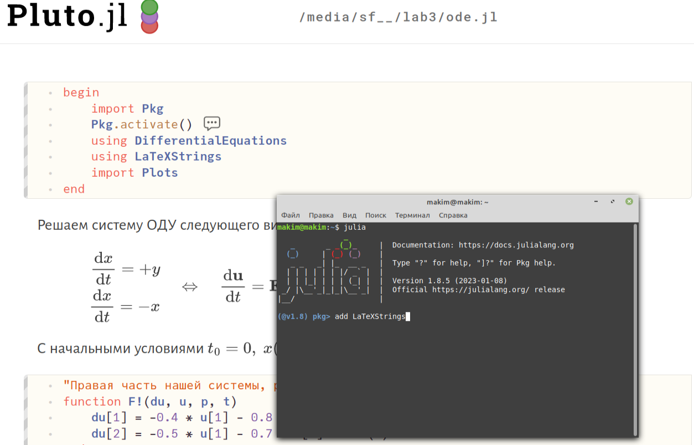{#fig:03 width=86%}


## Выполнение лабораторной работы
### Pluto.jl

1. Пишем программу, описывающую модель боевых действий между регулярными войсками (рис. @fig:04, @fig:05, @fig:06, @fig:07).

    ```Julia
    begin
	    import Pkg
	    Pkg.activate()
	    using DifferentialEquations
	    using LaTeXStrings
	    import Plots
    end
    ```

    ```Julia
    begin
	    const a = 0.333
	    const b = 0.777
	    const c = 0.5
	    const h = 0.65
    
	    "Начальные условия: u₀[1] -- x₀, u₀[2] -- y₀"
	    u₀ = [10000, 29000]

	    "Период времени"
	    T = (0.0, 1.8)
    end
    ```

    ```Julia
    "Правая часть нашей системы, p, t не используются. u[1] -- x, u[2] -- y"
    function F!(du, u, p, t)
    	du[1] = -a * u[1] - b * u[2] + 1.6 * sin(t)
    	du[2] = -c * u[1] - h * u[2] + 1.7 * cos(t + 2)
    end
    ```

    ```Julia
    prob = ODEProblem(F!, u₀, T)
    ```

    ```Julia
    sol = solve(prob, saveat=0.01)
    ```

    ```Julia
    begin
	    const xx = []
	    const yy = []
	    for u in sol.u
	    	x, y = u
    
	    	if x < 0 || y < 0
	    		break
	    	end
    
	    	push!(xx, x)
	    	push!(yy, y)
	    end
	    Time = sol.t[1:size(xx)[1]]
	    Time
    end
    ```

    ```Julia
    begin
        fig = Plots.plot(
            layout=(1, 2),
            dpi=150,
            grid=:xy,
            gridcolor=:black,
            gridwidth=1,
            # background_color=:antiquewhite,
            # aspect_ratio=:equal,
            size=(800, 400),
            plot_title="Пример нескольких графиков"
        )

        Plots.plot!(
            fig[1],
            Time,
            [xx, yy],
            color=[:red :blue],
            xlabel="Время",
            ylabel="Численность войск",
            label=["Армия X" "Армия Y"]
        )

        Plots.plot!(
            fig[2],
            xx,
            yy,
            color=[:gray],
            xlabel="Армия X",
            ylabel="Армия Y",
            label="Численность войск"
        )
    end
    ```

    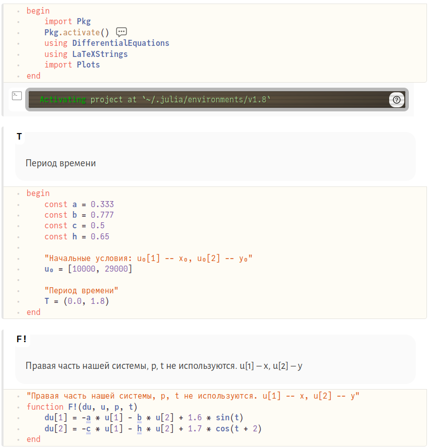{#fig:04 width=86%}

    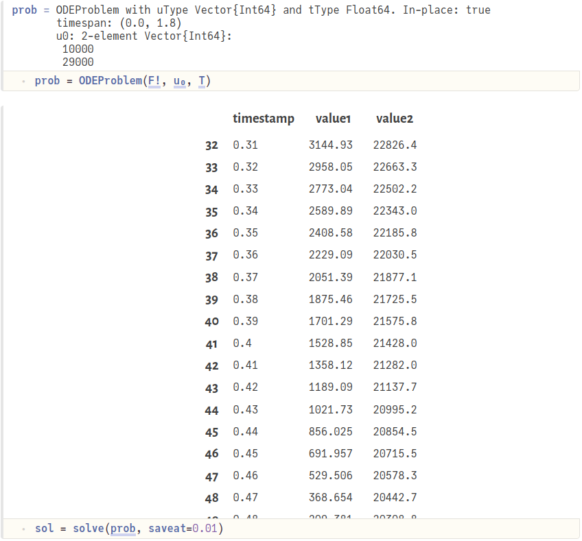{#fig:05 width=86%}

    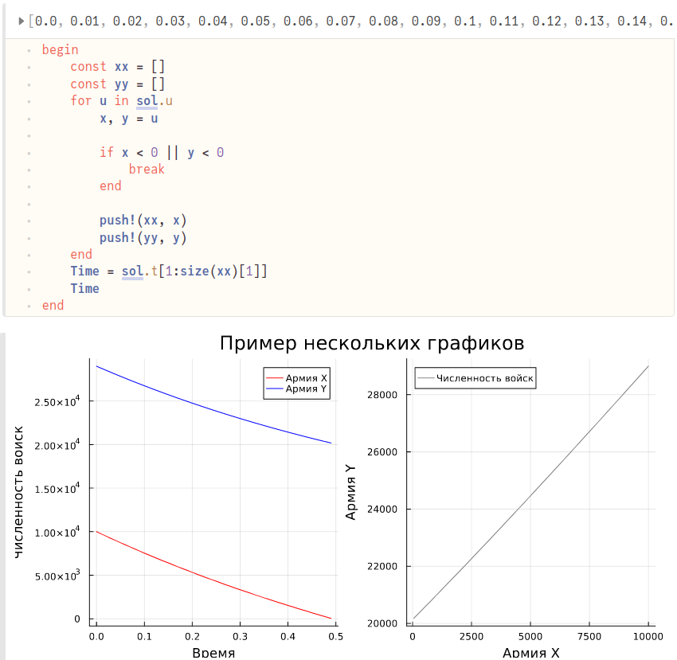{#fig:06 width=86%}

    {#fig:07 width=86%}

1. Пишем программу, описывающую модель боевых действий с участием регулярных войск и партизанских отрядов. Берем большой период времени для отрисовки графиков, чтобы показать, что на бОльшем промежутке времени численность армии Y будет принимать значения, очень близкие к нулю (рис. @fig:08, @fig:09).

    ```Julia
    begin
	    import Pkg
	    Pkg.activate()
	    using DifferentialEquations
	    using LaTeXStrings
	    import Plots
    end
    ```

    ```Julia
    begin
	    const a = 0.343
	    const b = 0.815
	    const c = 0.227
	    const h = 0.815
    
	    "Начальные условия: u₀[1] -- x₀, u₀[2] -- y₀"
	    u₀ = [10000, 29000]

	    "Период времени"
	    T = (0.0, 10)
    end
    ```

    ```Julia
    "Правая часть нашей системы, p, t не используются. u[1] -- x, u[2] -- y"
    function F!(du, u, p, t)
	    du[1] = -a * u[1] - b * u[2] + sin(2 * t) + 1
	    du[2] = -c * u[1] * u[2] - h * u[2] + cos(10 * t) + 1
    end
    ```

    ```Julia
    prob = ODEProblem(F!, u₀, T)
    ```

    ```Julia
    sol = solve(prob, saveat=0.01)
    ```

    ```Julia
    begin
	    const xx = []
	    const yy = []
	    for u in sol.u
	    	x, y = u
    
	    	if x < 0 || y < 0
	    		break
	    	end
    
	    	push!(xx, x)
	    	push!(yy, y)
	    end
	    Time = sol.t[1:size(xx)[1]]
	    Time
    end
    ```

    ```Julia
    begin
        fig = Plots.plot(
            layout=(1, 2),
            dpi=150,
            grid=:xy,
            gridcolor=:black,
            gridwidth=1,
            # background_color=:antiquewhite,
            # aspect_ratio=:equal,
            size=(800, 400),
            plot_title="Пример нескольких графиков"
        )

        Plots.plot!(
            fig[1],
            Time,
            [xx, yy],
            color=[:red :blue],
            xlabel="Время",
            ylabel="Численность войск",
            label=["Армия X" "Армия Y"]
        )

        Plots.plot!(
            fig[2],
            xx,
            yy,
            color=[:gray],
            xlabel="Армия X",
            ylabel="Армия Y",
            label="Численность войск"
        )
    end
    ```

    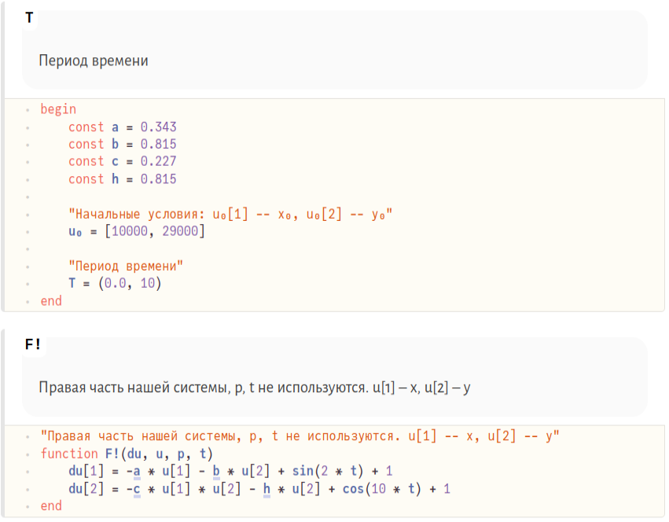{#fig:08 width=86%}

    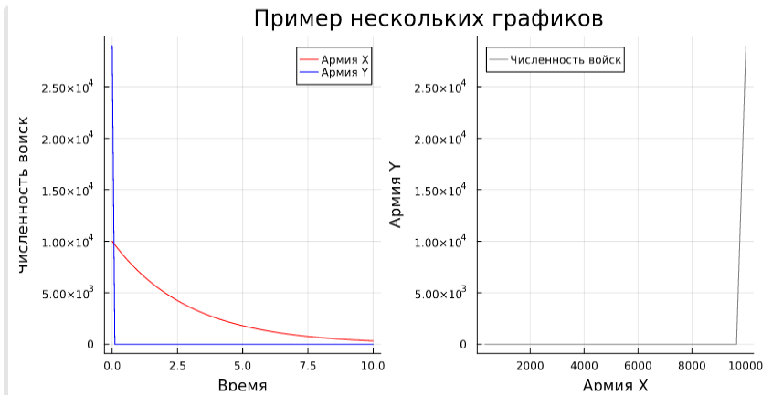{#fig:09 width=86%}


### Julia

1. Пишем программу, описывающую модель боевых действий между регулярными войсками (рис. @fig:10).


    ```
    using Plots
    using DifferentialEquations
    
    
    const a = 0.333
    const b = 0.777
    const c = 0.5
    const h = 0.65
    
    "Начальные условия: u₀[1] - x₀, u₀[2] - y₀"
    u₀ = [10000, 29000]
    
    "Период времени"
    T = (0.0, 1.8)
    
    function F!(du, u, p, t)
    	du[1] = -a * u[1] - b * u[2] + 1.6 * sin(t)
    	du[2] = -c * u[1] - h * u[2] + 1.7 * cos(t + 2)
    end
    
    
    prob = ODEProblem(F!, u₀, T)
    sol = solve(prob, saveat=0.01)
    
    const xx = []
    const yy = []
    for u in sol.u
        x, y = u
        if x < 0 || y < 0
            break
        end
        push!(xx, x)
        push!(yy, y)
    end
    time = sol.t[1:size(xx)[1]]
    
    plt = Plots.plot(
    		layout=(1, 2),
    		dpi=300,
    		grid=:xy,
    		gridcolor=:black,
    		gridwidth=1,
    		size=(800, 400),
    		plot_title="Модель военных действий"
    	)
    
    plot!(plt[1], time, [xx, yy], color=[:red :blue], xlabel="Время", ylabel="Численность   войск", label=["Армия X" "Армия Y"])
    plot!(plt[2], xx, yy, color=[:gray], xlabel="Армия X", ylabel="Армия Y",    label="Численность войск")
    savefig(plt, "lab3_1")
    ```

    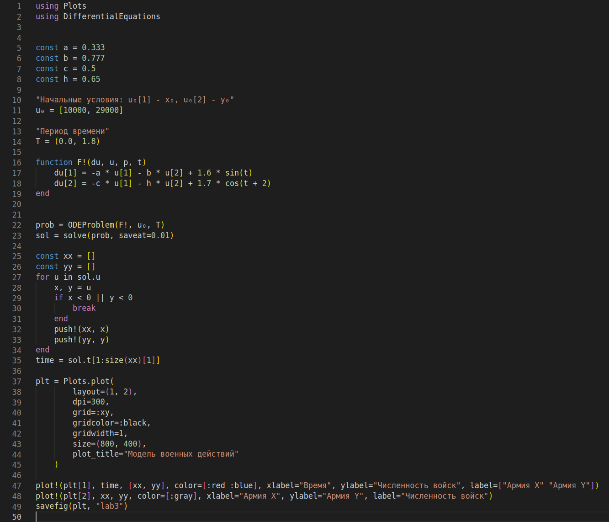{#fig:10 width=86%}

1. Получаем данные графики (рис. @fig:11).

    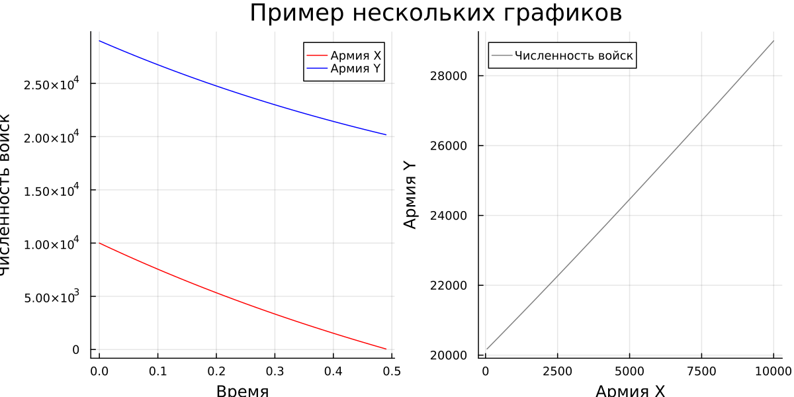{#fig:11 width=86%}

1. Пишем программу, описывающую модель боевых действий с участием регулярных войск и партизанских отрядов (рис. @fig:12).

    ```
    using Plots
    using DifferentialEquations


    const a = 0.343
    const b = 0.815
    const c = 0.227
    const h = 0.815

    "Начальные условия: u₀[1] - x₀, u₀[2] - y₀"
    u₀ = [10000, 29000]

    "Период времени"
    T = (0.0, 0.3)

    function F!(du, u, p, t)
    	du[1] = -a * u[1] - b * u[2] + sin(2 * t) + 1
    	du[2] = -c * u[1] * u[2] - h * u[2] + cos(10 * t) + 1
    end


    prob = ODEProblem(F!, u₀, T)
    sol = solve(prob, saveat=0.01)

    const xx = []
    const yy = []
    for u in sol.u
        x, y = u
        if x < 0 || y < 0
            break
        end
        push!(xx, x)
        push!(yy, y)
    end
    time = sol.t[1:size(xx)[1]]

    plt = Plots.plot(
    		layout=(1, 2),
    		dpi=300,
    		grid=:xy,
    		gridcolor=:black,
    		gridwidth=1,
    		size=(800, 400),
    		plot_title="Модель военных действий"
    	)

    plot!(plt[1], time, [xx, yy], color=[:red :blue], xlabel="Время", ylabel="Численность   войск", label=["Армия X" "Армия Y"])
    plot!(plt[2], xx, yy, color=[:gray], xlabel="Армия X", ylabel="Армия Y",    label="Численность войск")
    savefig(plt, "lab3_2")
    ```

    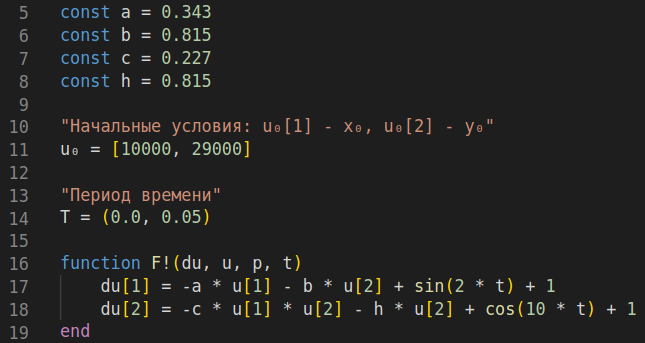{#fig:12 width=86%}
    
1. Получаем данные графики (рис. @fig:13).

    {#fig:13 width=86%}


### OpenModelica

1. Пишем программу, описывающую модель боевых действий между регулярными войсками (рис. @fig:14).

    ```
    model lab3_1
      constant Real a = 0.333;
      constant Real b = 0.777;
      constant Real c = 0.5;
      constant Real h = 0.65;
      Real t = time;
      Real x;
      Real y;
    initial equation
      x = 10000;
      y = 29000;
    equation
      der(x) = -a*x - b*y + 1.6 * sin(t);
      der(y) = -c*x - h*y + 1.7 * cos(t + 2);
      annotation(experiment(StartTime=0,StopTime=0.5));
    end lab3_1;
    ```

    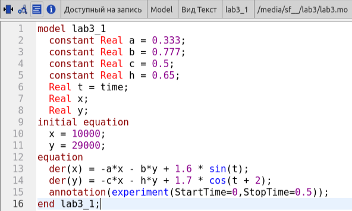{#fig:14 width=86%}
    
1. Получаем данные графики (рис. @fig:15, @fig:16).

    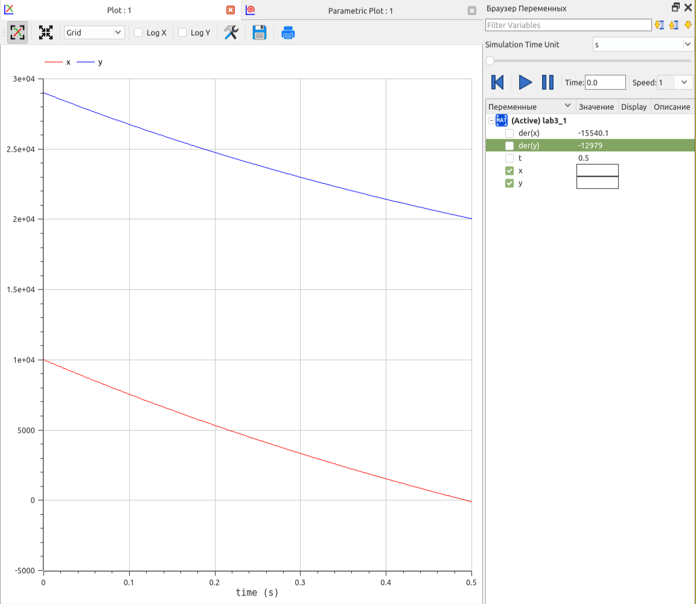{#fig:15 width=86%}

    {#fig:16 width=86%}


1. Пишем программу, описывающую модель боевых действий с участием регулярных войск и партизанских отрядов (рис. @fig:17).

    ```
    model lab3_1
      constant Real a = 0.343;
      constant Real b = 0.815;
      constant Real c = 0.227;
      constant Real h = 0.815;
      Real t = time;
      Real x;
      Real y;
    initial equation
      x = 10000;
      y = 29000;
    equation
      der(x) = -a*x - b*y + sin(2 * t) + 1;
      der(y) = -c*x*y - h*y + cos(10 * t) + 1;
      annotation(experiment(StartTime=0,StopTime=0.01));
    end lab3_1;
    ```

    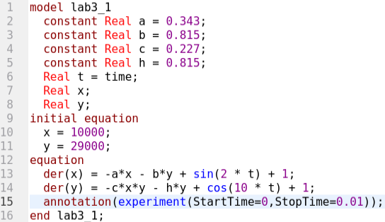{#fig:17 width=86%}
    
1. Получаем данные графики (рис. @fig:18, @fig:19).

    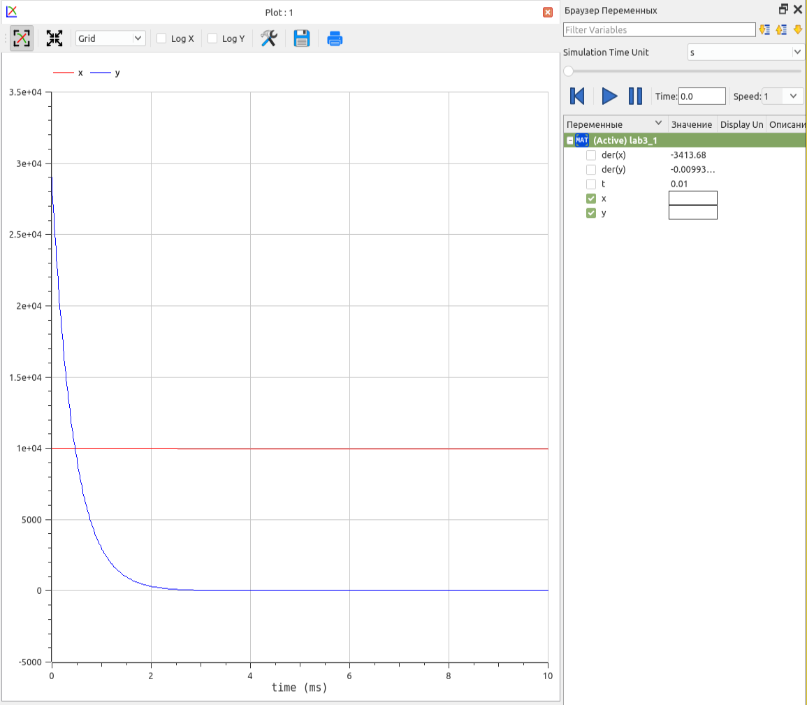{#fig:18 width=86%}

    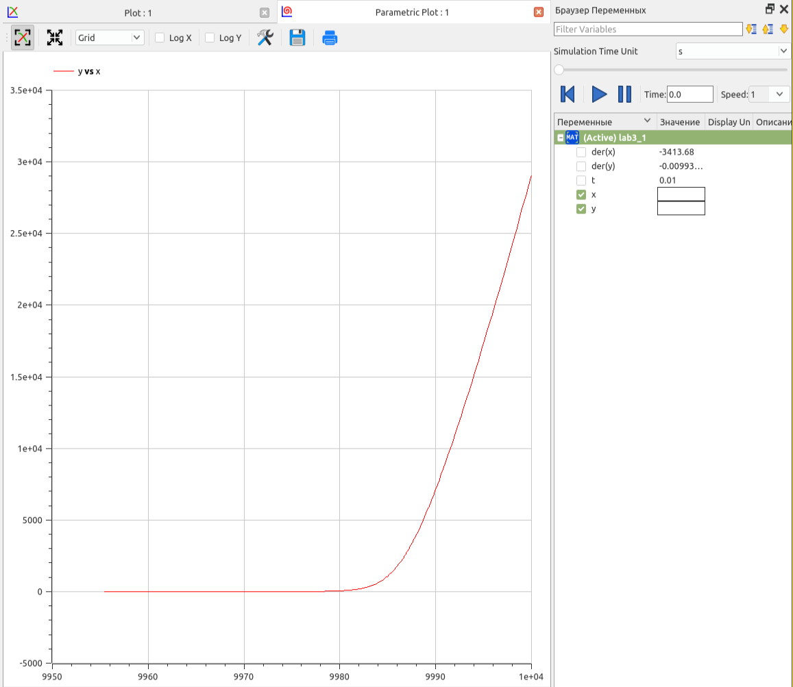{#fig:19 width=86%}

# Анализ результатов

На примере построения математической модели ведения боевых действий по принципу модели Ланчестера мы можем проанализировать различия языка программирования Julia и языка моделирования Modelica. Безусловно, при построении математических моделей других задач, полученный опыт может различаться. Однако, приминительно к данной конкретной задаче было замечено, что суммарная длина кода на языке моделирование Modelica в разы меньше, чем длина такового на языке программирования Julia. Читабельность кода также лучше в Modelica. Скорость моделирования и возможность гибкой настройки графиков тоже выше у языка моделирования Modelica. Скорость отрисовки графиков встроенными средствами OpenModelica также выше (имеется в виду редактор OMEdit), однако при использовании Pluto.jl в дополнении к языку программирования Julia достигается соизмеримо быстрая скорость отрисовки.

С другой стороны, Julia является более простым языком в освоении на начальных этапах, т.к. синтаксис данного языка очень похож на таковой у популярного в данный момент языка программирования Python, что делает Julia более простым для «скорого» освоения программистом, знакомым с интерпетируемым языков Python.

# Выводы

Ознакомился с базовым функционалом интерактивного блокнота Pluto. Рассмотрел простейшую модель боевых действий — модель Ланчестера. Построил данную математическую модель при помощи языка программирования Julia, интерактивного блокнота Pluto, языка моделирования Modelica и программного обеспечения OpenModelica.

# Список литературы{.unnumbered}

::: {#refs}
:::
