---
## Front matter
title: "Отчет по лабораторной работе №4"
subtitle: "по дисциплине: Математическое моделирование"
author: "Ким Михаил Алексеевич"

## Generic otions
lang: ru-RU
toc-title: "Содержание"

## Bibliography
bibliography: bib/cite.bib
csl: pandoc/csl/gost-r-7-0-5-2008-numeric.csl

## Pdf output format
toc: true # Table of contents
toc-depth: 2
lof: true # List of figures
lot: false # List of tables
fontsize: 12pt
linestretch: 1.5
papersize: a4
documentclass: scrreprt
## I18n polyglossia
polyglossia-lang:
  name: russian
  options:
	- spelling=modern
	- babelshorthands=true
polyglossia-otherlangs:
  name: english
## I18n babel
babel-lang: russian
babel-otherlangs: english
## Fonts
mainfont: PT Serif
romanfont: PT Serif
sansfont: PT Sans
monofont: PT Mono
mainfontoptions: Ligatures=TeX
romanfontoptions: Ligatures=TeX
sansfontoptions: Ligatures=TeX,Scale=MatchLowercase
monofontoptions: Scale=MatchLowercase,Scale=0.9
## Biblatex
biblatex: true
biblio-style: "gost-numeric"
biblatexoptions:
  - parentracker=true
  - backend=biber
  - hyperref=auto
  - language=auto
  - autolang=other*
  - citestyle=gost-numeric
## Pandoc-crossref LaTeX customization
figureTitle: "Рис."
tableTitle: "Таблица"
listingTitle: "Листинг"
lofTitle: "Список иллюстраций"
lotTitle: "Список таблиц"
lolTitle: "Листинги"
## Misc options
indent: true
header-includes:
  - \usepackage{indentfirst}
  - \usepackage{float} # keep figures where there are in the text
  - \floatplacement{figure}{H} # keep figures where there are in the text
---

# Цель работы

Продолжить знакомство с функционалом языка программирования Julia, дополнительных библиотек (DifferentialEquations, Plots), интерактивного блокнота Pluto, а также интерактивной командной строкой REPL. Продолжить ознакомление с языком моделирования Modelica и программным обеспечением OpenModelica. Используя эти средства, описать математическую модель гармонических колебаний.

# Задание

Постройте фазовый портрет гармонического осциллятора и решение уравнения гармонического осциллятора для следующих случаев:

1. Колебания гармонического осциллятора без затуханий и без действий внешней силы $\ddot x + 2.5x = 0$.
1. Колебания гармонического осциллятора c затуханием и без действий внешней силы $\ddot x + 10\dot x + 11x = 0$.
1. Колебания гармонического осциллятора c затуханием и под действием внешней силы $\ddot x + \dot x + x = 3 \sin(t)$.

На интервале $t \in [0; \ 65]$ (шаг $0.05$) с начальными условиями $x_0=-1, \ y_0=2$.

# Теоретическое введение
## Модель гармонических колебаний

Модель гармонических колебаний является одной из фундаментальных моделей в физике. Она описывает поведение объекта, который движется с постоянной частотой и амплитудой.

Представим, что у нас есть объект, который движется вокруг своей равновесной позиции. Это может быть, к примеру, маятник часов или колебательный контур в электрической цепи. Если мы будем наблюдать за движением объекта с течением времени, то заметим, что движение повторяется с постоянной частотой и амплитудой. Эти повторения и называются гармоническими колебаниями [@bib_1].

Модель гармонических колебаний находит применение во многих областях, включая физику, математику, инженерию, акустику и другие.

Гармонические колебания широко используются в радиофизике и телекоммуникациях для передачи информации. В этом случае частота колебаний используется для кодирования информации, которая затем может быть передана по радиоволнам или кабельным линиям.

Также гармонические колебания используются при изучении механики и электромагнетизма. Они позволяют предсказывать поведение системы в зависимости от начальных условий и параметров [@bib_2].

Система, способная совершать гармонические колебания, называется линейным гармоническим осциллятором. 

Линейный гармонический осциллятор может быть использован для моделирования многих процессов, включая электрические контуры, оптические системы и колебания молекул.

Также линейный гармонический осциллятор является базовым элементом в физике твердого тела и квантовой механике [@bib_3].

В квантовой механике линейный гармонический осциллятор является важнейшей моделью для изучения колебаний атомов в молекулах и фотонах внутри оптических резонаторов.

Помимо этого, линейный гармонический осциллятор может быть использован для изучения резонанса и демпфирования, а также для моделирования волновых процессов в физике и инженерии [@bib_4].

Уравнение свободных колебаний гармонического осциллятора имеет следующий вид:

$$ \ddot x + 2 \gamma \dot x + \omega_0^2 x = 0 $$

где $x$ — переменная, описывающая состояние системы (смещение грузика, заряд конденсатора и т.д.), $\gamma$ — параметр, характеризующий потери энергии (трение в механической системе, сопротивление в контуре), $\omega_0$ — собственная частота колебаний, $t$ — время.

Для однозначной разрешимости ОДУ второго порядка необходимо задать два начальных условия вида:

$$
\left\{
\begin{array}{c}
x(t_0) = x_0 \\
 \\
\dot x(t_0) = y_0
\end{array}
\right.
$$

Уравнение ОДУ второго порядка можно переписать в следующем виде как систему:

$$
\left\{
\begin{array}{c}
\dot x = y\\
 \\
\dot y = - 2 \gamma y - \omega_0^2 x
\end{array}
\right.
$$

Начальные условия для такой системы примут вид:

$$
\left\{
\begin{array}{c}
x(t_0) = x_0 \\
 \\
y(t_0) = y_0
\end{array}
\right.
$$

Также в наше уравнение ОДУ второго порядка можно добавить правую часть. Тогда система примет вид:

$$
\left\{
\begin{array}{c}
\dot x = y\\
 \\
\dot y = - 2 \gamma y - \omega_0^2 x + f(t)
\end{array}
\right.
$$

Заметим, что ОДУ может иметь нулевой коэффицент $\gamma$ — тогда система будет являться консервативной, и слагаемое из системы просто убирается.

При отображении зависимости координаты $y$ от координаты $x$ мы получим фазовый портрет, который также нужно отрисовать при выполнении лабораторной работы [@bib_5].


# Выполнение лабораторной работы
## Pluto.jl
### Задание №1

1. Пишем программу, воспроизводящую модель на языке программирования Julia с использованием интерактивного блокнота Pluto (рис. @fig:01, @fig:02, @fig:03, @fig:04, @fig:05).

    ```Julia
    begin
    	import Pkg
    	Pkg.activate()
    	using DifferentialEquations
    	using LaTeXStrings
    	import Plots
    end
    ```

    ```Julia
    begin
    	const ω₀² = 2.5
    
    	"Начальные условия: u₀[1] -- x₀, u₀[2] --   y₀"
    	u₀ = [-1, 2]

    	"Период времени"
    	T = (0.0, 65.0)
    end
    ```

    ```Julia
    "Правая часть нашей системы, p, t не    используются. u[1] -- x, u[2] -- y"
    function F!(du, u, p, t)
    	du[1] = u[2]
    	du[2] = - ω₀² * u[1]
    end
    ```

    ```Julia
    prob = ODEProblem(F!, u₀, T)
    ```

    ```Julia
    sol = solve(prob, saveat=0.05, abstol=1e-8, reltol=1e-8)
    ```

    ```Julia
    begin
    	const xx = []
    	const yy = []
    	for u in sol.u
    		x, y = u
    		push!(xx, x)
    		push!(yy, y)
    	end
    	Time = sol.t
    	Time
    end
    ```

    ```Julia
        begin
    	fig = Plots.plot(
    		layout=(1, 2),
    		dpi=150,
    		grid=:xy,
    		gridcolor=:black,
    		gridwidth=1,
    		# aspect_ratio=:equal,
    		size=(800, 400),
    		plot_title="Модель гармонических    колебаний"
    	)

    	Plots.plot!(
    		fig[1],
    		Time,
    		[xx, yy],
    		color=[:red :blue],
    		xlabel="t",
    		ylabel="x(t), y(t)=x'(t)",
    		label=["x(t)" "y(t)=x'(t)"]
    	)

    	Plots.plot!(
    		fig[2],
    		xx,
    		yy,
    		color=[:gray],
    		xlabel="x(t)",
    		ylabel="y(t)=x'(t)",
    		label="Фазовый портрет"
    	)
    end
    ```

    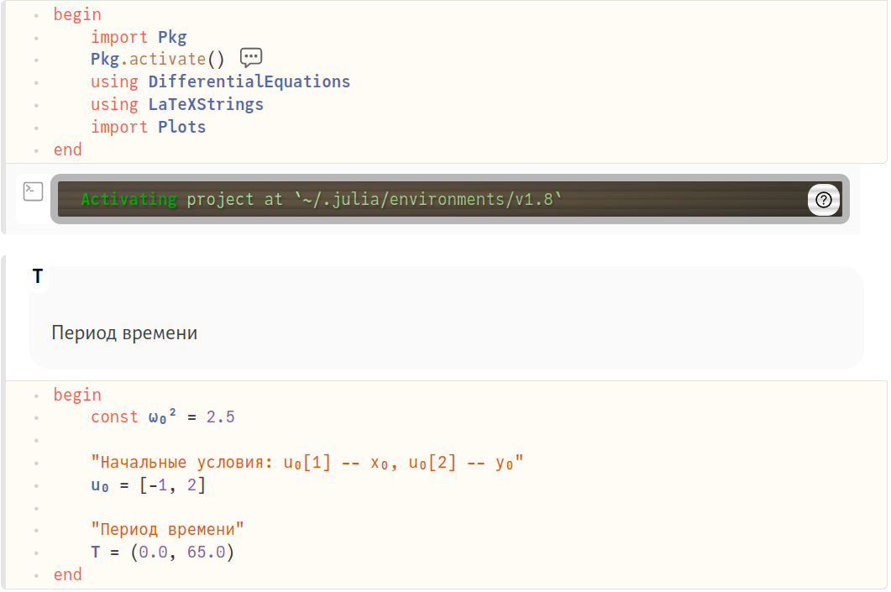{#fig:01 width=86%}

    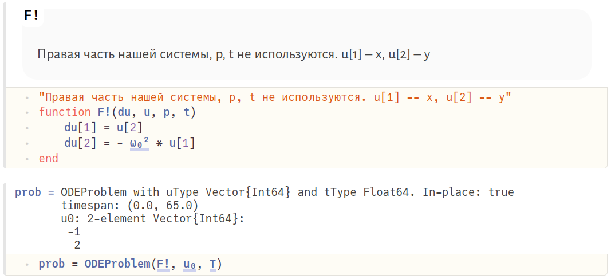{#fig:02 width=86%}

    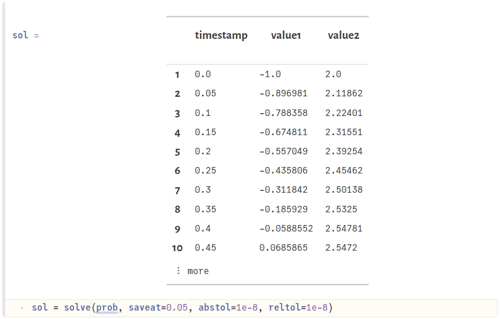{#fig:03 width=86%}

    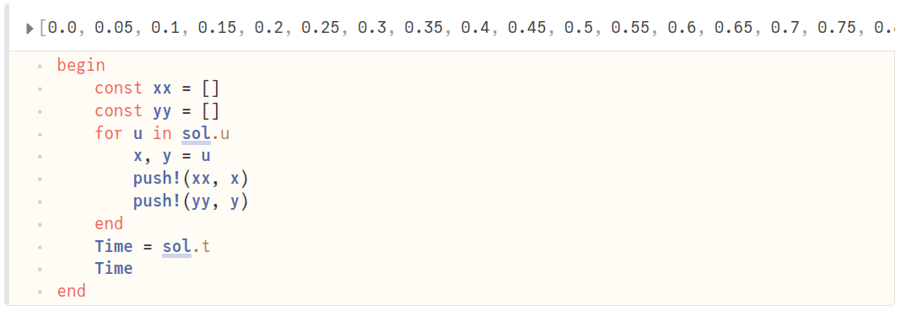{#fig:04 width=86%}

    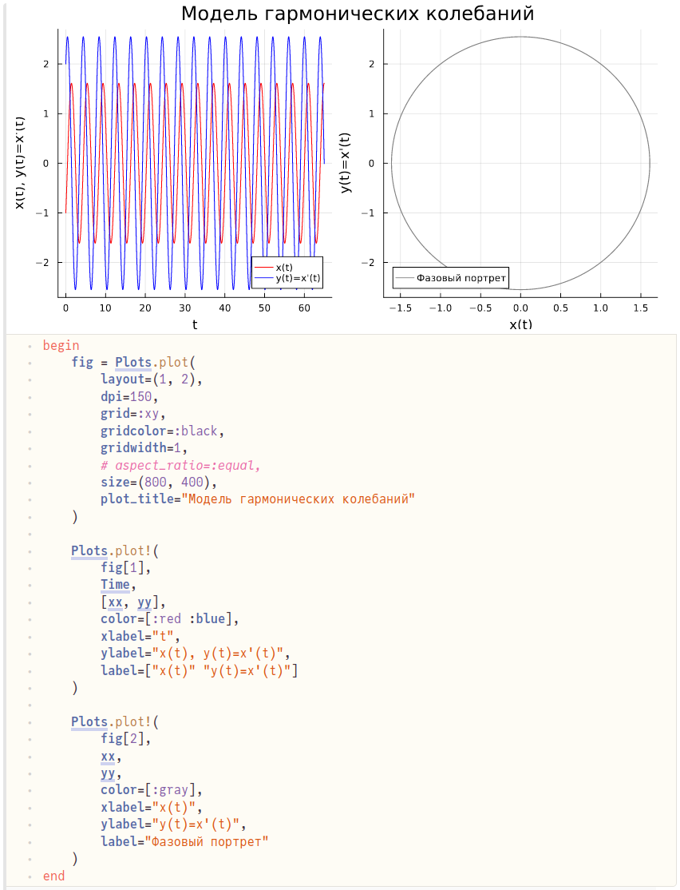{#fig:05 width=86%}


### Задание №2

1. Помимо коэффициента, представляющего собой квадрат собственной частоты колебаний ($\omega_0^2$), добавляем коэффициент, представляющий собой потерю энергии в системе, умноженную на два ($2\gamma$). Остальные блоки кода оставляем без изменений. Любуемся результатом (рис. @fig:06, @fig:07).

    ```Julia
    begin
    	const ω₀² = 11.0
    	const 𝛄⬝2 = 10.0
    
    	"Начальные условия: u₀[1] -- x₀, u₀[2] -- y₀"
    	u₀ = [-1, 2]

    	"Период времени"
    	T = (0.0, 65.0)
    end
    ```

    ```Julia
    "Правая часть нашей системы, p, t не используются. u[1] -- x, u[2] -- y"
    function F!(du, u, p, t)
    	du[1] = u[2]
    	du[2] = - 𝛄⬝2 * u[2] - ω₀² * u[1]
    end
    ```

    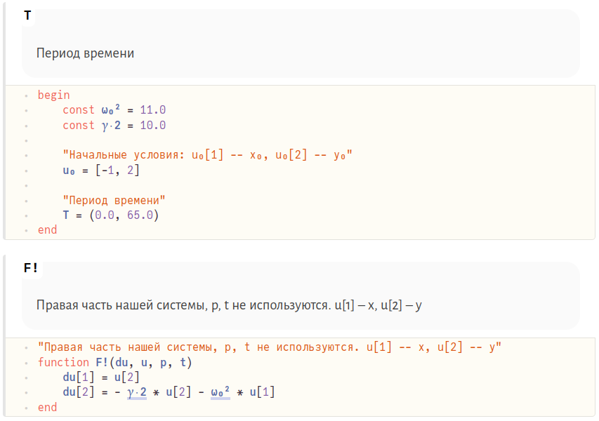{#fig:06 width=86%}

    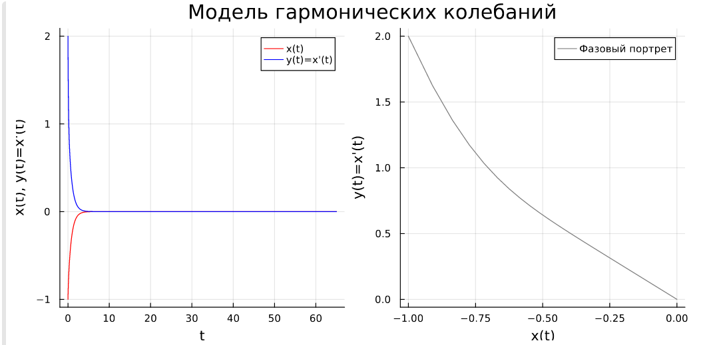{#fig:07 width=86%}


### Задание №3

1. Добавляем правую часть ОДУ ($f(t) = 3\sin(t)$) в систему. Остальные блоки кода оставляем без изменений. Любуемся результатом (рис. @fig:08, @fig:09).

    ```Julia
    begin
    	const ω₀² = 1.0
    	const 𝛄⬝2 = 1.0
    
    	function f(t)
    		return 3 * sin(t)
    	end
    
    	"Начальные условия: u₀[1] -- x₀, u₀[2] -- y₀"
    	u₀ = [-1, 2]

    	"Период времени"
    	T = (0.0, 65.0)
    end
    ```

    ```Julia
    "Правая часть нашей системы, p, t не используются. u[1] -- x, u[2] -- y"
    function F!(du, u, p, t)
    	du[1] = u[2]
    	du[2] = - 𝛄⬝2* u[2] - ω₀² * u[1] + f(t)
    end
    ```

    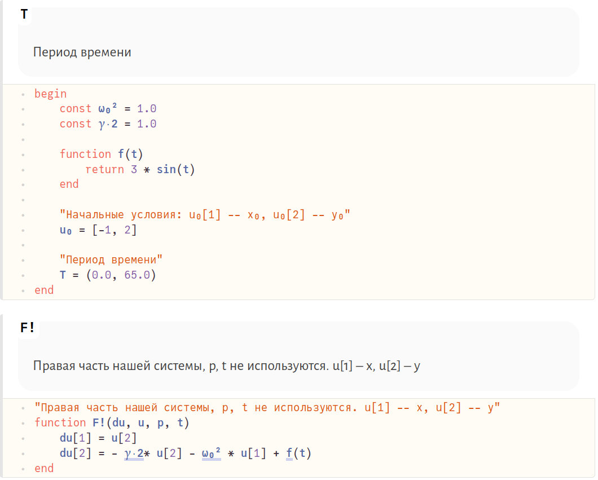{#fig:08 width=86%}

    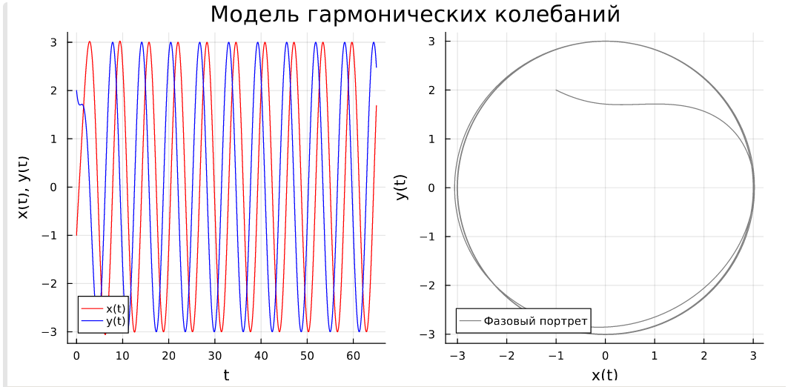{#fig:09 width=86%}


## Julia
### Задание №1

1. Код на Julia в файле аналогичен тому же, написанному с использованием Pluto. Единственные различия: блоки перенесены в файл в виде построчного алгоритма без повторяющихся 'begin' и 'end', отличающийся синтаксис подключения библиотек, выгрузка графиков в виде изображений при помощи метода в последней строчке кода (рис. @fig:10, @fig:001).

    ```Julia
    using DifferentialEquations
    using Plots

    const ω₀² = 2.5
    
    "Начальные условия: u₀[1] -- x₀, u₀[2] -- y₀"
    u₀ = [-1, 2]

    "Период времени"
    T = (0.0, 65.0)

    "Правая часть нашей системы, p, t не используются. u[1] -- x, u[2] -- y"
    function F!(du, u, p, t)
    	du[1] = u[2]
    	du[2] = - ω₀² * u[1]
    end


    prob = ODEProblem(F!, u₀, T)
    sol = solve(prob, saveat=0.05, abstol=1e-8, reltol=1e-8)

    const xx = []
    const yy = []
    for u in sol.u
        x, y = u
        push!(xx, x)
        push!(yy, y)
    end
    Time = sol.t

    fig = Plots.plot(
    		layout=(1, 2),
    		dpi=150,
    		grid=:xy,
    		gridcolor=:black,
    		gridwidth=1,
    		# aspect_ratio=:equal,
    		size=(800, 400),
    		plot_title="Модель гармонических колебаний"
    	)

    Plots.plot!(
    	fig[1],
    	Time,
    	[xx, yy],
    	color=[:red :blue],
    	xlabel="t",
    	ylabel="x(t), y(t)=x'(t)",
    	label=["x(t)" "y(t)=x'(t)"]
    )

    Plots.plot!(
    	fig[2],
    	xx,
    	yy,
    	color=[:gray],
    	xlabel="x(t)",
    	ylabel="y(t)=x'(t)",
    	label="Фазовый портрет"
    )


    savefig(fig, "../lab4_1")
    ```


    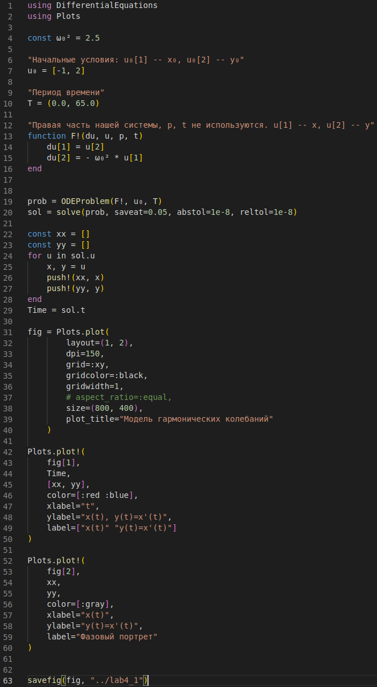{#fig:10 width=86%}

    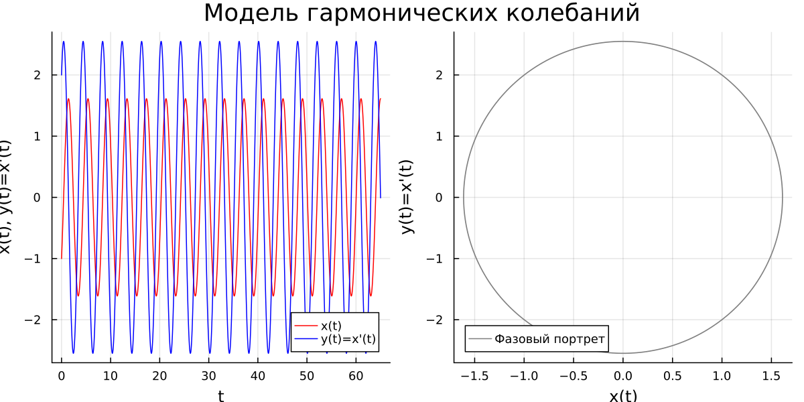{#fig:001 width=86%}


### Задание №2

1. Изменяем необходимые строчки и любуемся результатом (подробное объяснение давалось в предыдущей главе) (рис. @fig:11, @fig:002).

    ```Julia
    const ω₀² = 11.0
    const 𝛄⬝2 = 10.0

    function F!(du, u, p, t)
    	du[1] = u[2]
    	du[2] = - 𝛄⬝2 * u[2] - ω₀² * u[1]
    end
    ```

    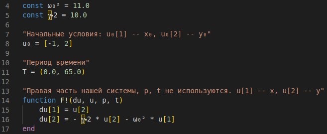{#fig:11 width=86%}

    {#fig:002 width=86%}


### Задание №3

1. Изменяем необходимые строчки и любуемся результатом (подробное объяснение давалось в предыдущей главе) (рис. @fig:12, @fig:003).

    ```Julia
    const ω₀² = 1.0
    const 𝛄⬝2 = 1.0
    function f(t)
    	return 3 * sin(t)
    end

    function F!(du, u, p, t)
    	du[1] = u[2]
    	du[2] = - 𝛄⬝2* u[2] - ω₀² * u[1] + f(t)
    end
    ```

    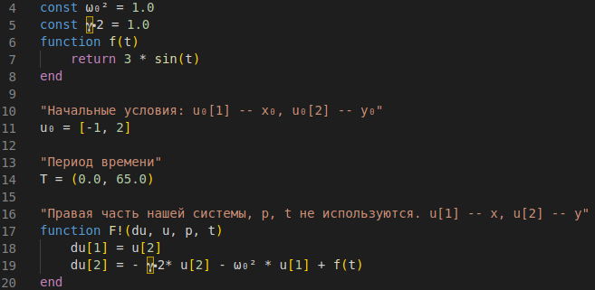{#fig:12 width=86%}

    {#fig:003 width=86%}


## Modelica
### Задание №1

1. По аналогии с Julia пишем программу, воспроизводящую модель гармонических колебаний на языке моделирования Modelica с использованием ПО OpenModelica. Любуемся результатами (рис. @fig:13, @fig:14, @fig:15).
    
    ```
    model lab4_1
      constant Real omega_0_square = 2.5;
      Real t = time;
      Real x;
      Real y;
    initial equation
      x = -1;
      y = 2;
    equation
      der(x) = y;
      der(y) = - omega_0_square * x;
      annotation(experiment(StartTime=0, StopTime=65, Interval = 0.05));
    end lab4_1;
    ```

    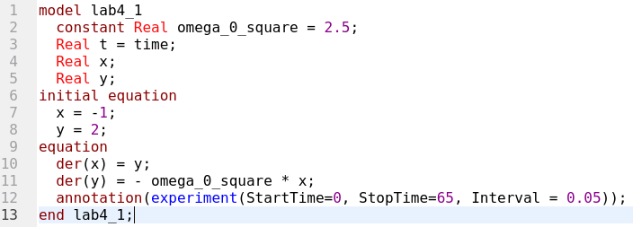{#fig:13 width=86%}

    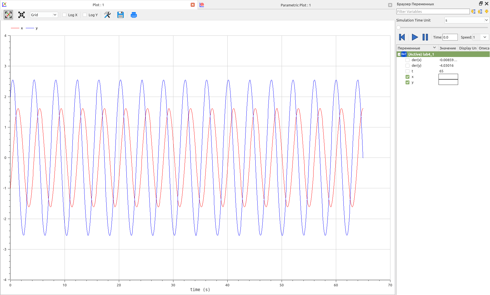{#fig:14 width=86%}

    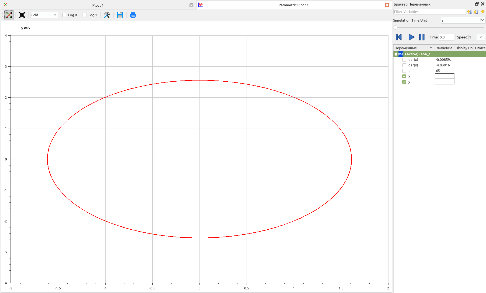{#fig:15 width=86%}


### Задание №2

1. По аналогии с Julia пишем программу для второго случая. Любуемся результатами (рис. @fig:16, @fig:17, @fig:18).

    ```
    model lab4_2
      constant Real omega_0_square = 11.0;
      constant Real gamma_2 = 10.0;
      Real t = time;
      Real x;
      Real y;
    initial equation
      x = -1;
      y = 2;
    equation
      der(x) = y;
      der(y) = - gamma_2*y - omega_0_square*x;
      annotation(experiment(StartTime=0, StopTime=65, Interval = 0.05));
    end lab4_2;
    ```

    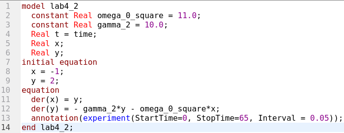{#fig:16 width=86%}

    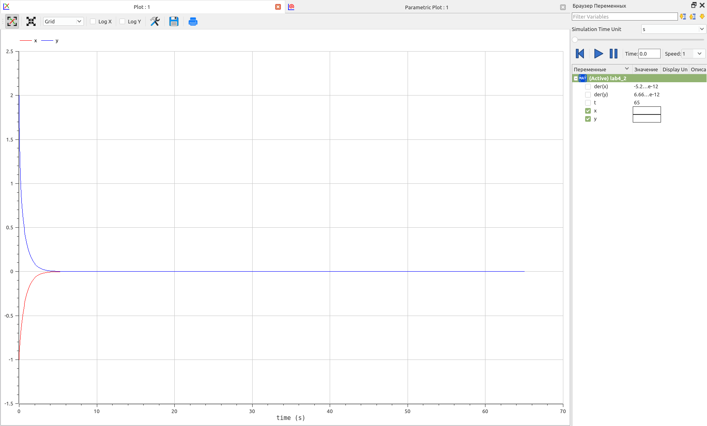{#fig:17 width=86%}

    {#fig:18 width=86%}


### Задание №3

1. По аналогии с Julia пишем программу для третьего случая. Любуемся результатами (рис. @fig:19, @fig:20, @fig:21).

    ```
    model lab4_3
      constant Real omega_0_square = 1.0;
      constant Real gamma_2 = 1.0;
      Real t = time;
      Real x;
      Real y;
    initial equation
      x = -1;
      y = 2;
    equation
      der(x) = y;
      der(y) = - gamma_2 * y - omega_0_square * x + 3 * sin(t);
      annotation(experiment(StartTime=0, StopTime=65, Interval = 0.05));
    end lab4_3;
    ```

    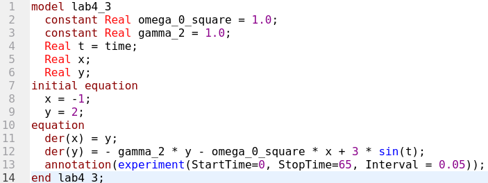{#fig:19 width=86%}

    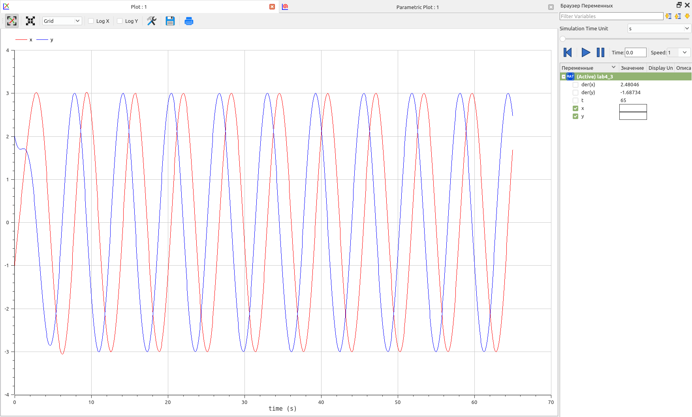{#fig:20 width=86%}

    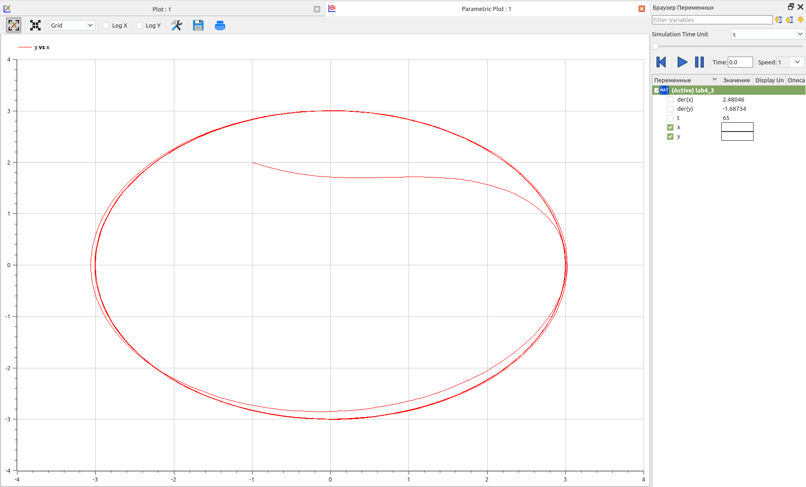{#fig:21 width=86%}


# Анализ результатов

На текущем примере построения математической модели гармонических колебаний мы можем продолжить сравнивать язык программирования Julia и язык моделирования Modelica. По сравнению с анализом результатов предыдущей лабораторной работы хотелось бы отметить, что определенные недостатки Julia по сравнению с Modelica (медленная скорость выполнения, объем и читабельность кода) лично для меня сглаживаются, т.к. в первую очередь, я теперь использую Pluto. Скорость отрисовки графиков после изменения кода в интерактивном блокноте в разы быстрее по сравнению с со скоростью сохранения графиков в файл при запуске *.jl. Также частая работа с библиотекой DifferentialEquations ведет к более легкому пониманию кода, пусть и более объемного, нежели на Modelica. Также гибкость настройки точности численного метода решения ОДУ в данный момент на стороне Julia.

Однако, с другой стороны, OpenModelica все еще предоставлят больше возможностей для настройки отображения графиков.


# Выводы

Продолжил знакомство с функционалом языка программирования Julia, дополнительных библиотек (DifferentialEquations, Plots), интерактивного блокнота Pluto, а также интерактивной командной строкой REPL. Продолжил ознакомление с языком моделирования Modelica и программным обеспечением OpenModelica. Используя эти средства, описал математическую модель гармонических колебаний.


# Список литературы{.unnumbered}

::: {#refs}
:::
