---
## Front matter
lang: ru-RU
title: Лабораторная работа №5
subtitle: Математическая модель «хищник-жертва» (модель Лотки-Вольтерры)
author:
  - Ким М. А.
institute:
  - Российский университет дружбы народов, Москва, Россия
date: 07 марта 2023

## i18n babel
babel-lang: russian
babel-otherlangs: english

## Fonts
mainfont: PT Serif
romanfont: PT Serif
sansfont: PT Sans
monofont: PT Mono
mainfontoptions: Ligatures=TeX
romanfontoptions: Ligatures=TeX
sansfontoptions: Ligatures=TeX,Scale=MatchLowercase
monofontoptions: Scale=MatchLowercase,Scale=0.9

## Formatting pdf
toc: false
toc-title: Содержание
slide_level: 2
aspectratio: 169
section-titles: true
theme: metropolis
header-includes:
 - \metroset{progressbar=frametitle,sectionpage=progressbar,numbering=fraction}
 - '\makeatletter'
 - '\beamer@ignorenonframefalse'
 - '\makeatother'
---

# Информация

## Докладчик

:::::::::::::: {.columns align=center}
::: {.column width="70%"}

  * Ким Михаил Алексеевич
  * студент уч. группы НФИбд-01-20
  * Российский университет дружбы народов
  * [1032201664@pfur.ru](mailto:1032201664@pfur.ru)
  * <https://github.com/exmanka>

:::
::: {.column width="30%"}

:::
::::::::::::::

# Вводная часть

## Актуальность

- Необходимость навыков моделирования реальных математических задач, построение графиков.

## Объект и предмет исследования

- Язык программирования Julia
- Язык моделирования Modelica
- Математическая модель «хищник-жертва» (модель Лотки-Вольтерры)

## Цели и задачи

- Продолжить знакомство с функционалом языков Julia и Modelica.
- Создать математическую модель Лотки-Вольтерры с помощью данных языков.
- Построить графики состояния систем в соответствии с поставленными задачами.

## Материалы и методы

- Языки:
  - язык программирования Julia
  - язык моделирования Modelica
- Дополнительный комплекс программ:
  - Программное обеспечение OpenModelica
  - Интерактивный блокнот Pluto.jl

# Процесс выполнения работы

# Формулировка задания

Для модели «хищник-жертва»:

$$
\left\{
\begin{array}{c}
\frac{dx}{dt} = -0.16x(t) + 0.045x(t)y(t)\\
 \\
\frac{dy}{dt} = 0.36y(t) - 0.033x(t)y(t)
\end{array}
\right.
$$

Построить график зависимости численности хищников от численности жертв, а также графики изменения численности хищников и численности жертв при следующих начальных условиях: $x_0 = 10$, $y_0 = 15$. Найти стационарное состояние системы.

# Pluto.jl
## Код задания №1

:::::::::::::: {.columns align=top}
::: {.column width="45%"}

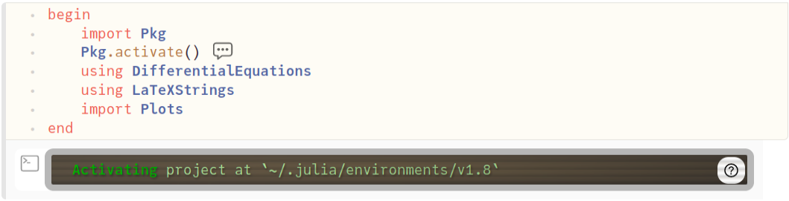

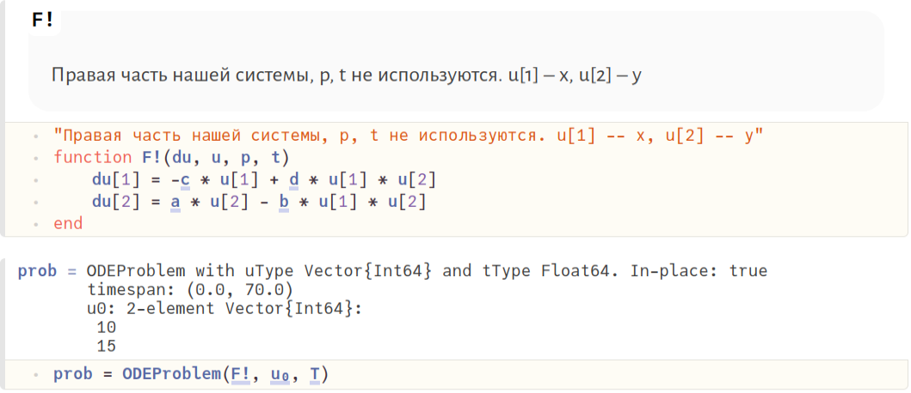

:::
::: {.column width="55%"}

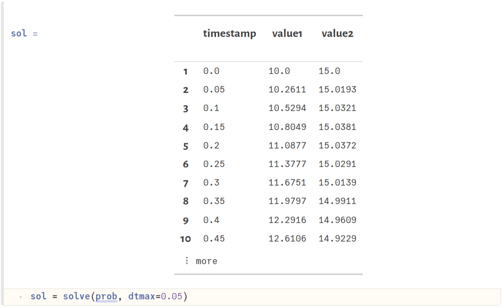
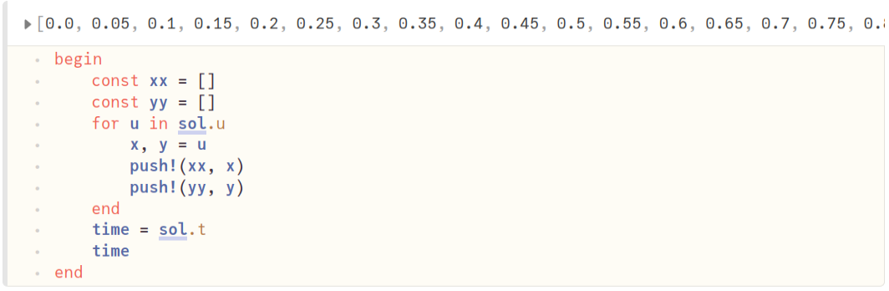

:::
::::::::::::::

## Графики задания №1

:::::::::::::: {.columns align=top}
::: {.column}

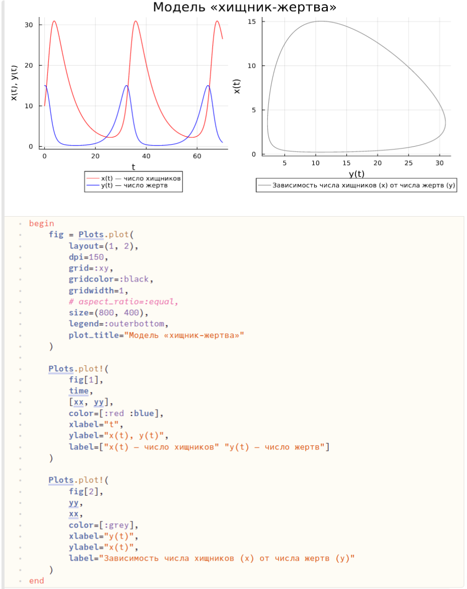

:::
::::::::::::::

## Измененный блок кода для задания №2. Получившиеся графики

:::::::::::::: {.columns align=center}
::: {.column}

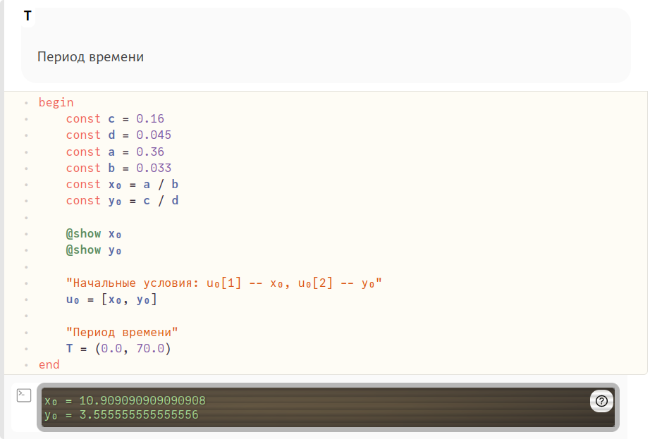

:::
::: {.column}

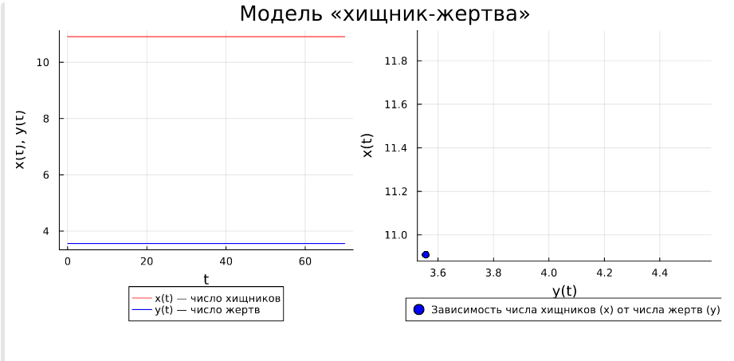

:::
::::::::::::::

# Julia
## Код задания №1. Получившиеся графики

:::::::::::::: {.columns align=top}
::: {.column width="30%"}

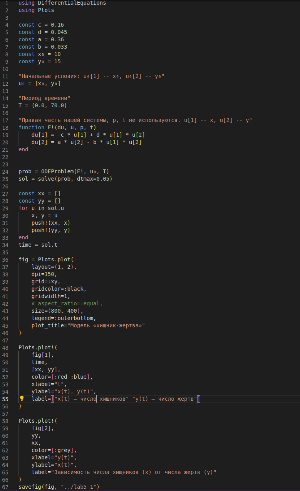

:::
::: {.column width="70%"}

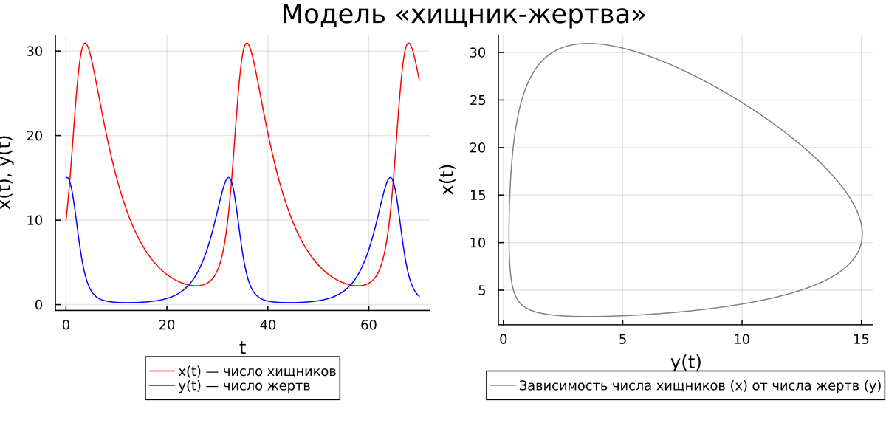

:::
::::::::::::::

## Измененный блок кода для задания №2. Получившиеся графики

:::::::::::::: {.columns align=center}
::: {.column width="50%"}

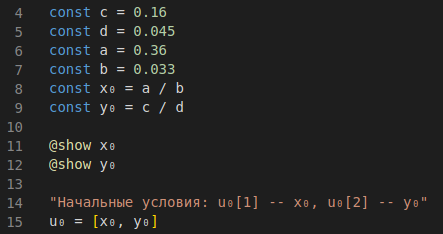

:::
::: {.column width="50%"}

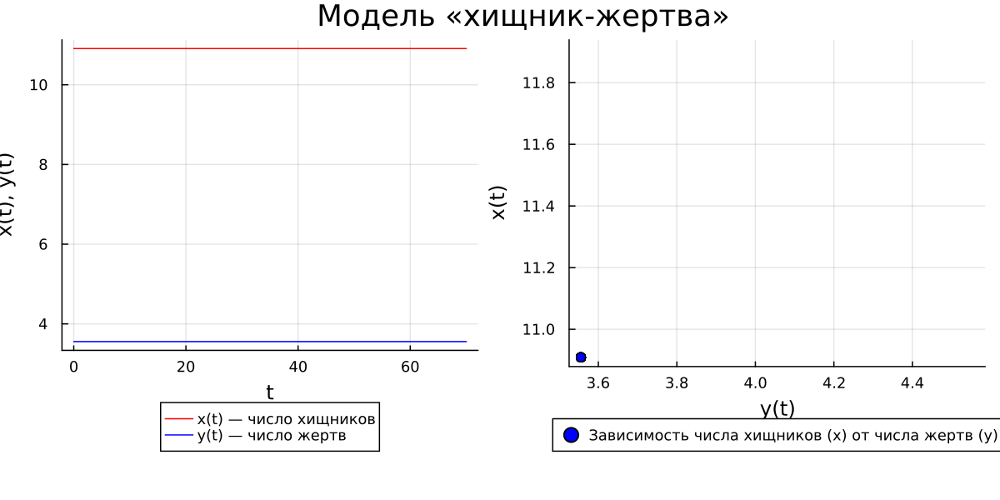

:::
::::::::::::::

# OpenModelica
## Код задания №1. Получившиеся графики

:::::::::::::: {.columns align=center}
::: {.column width="60%"}

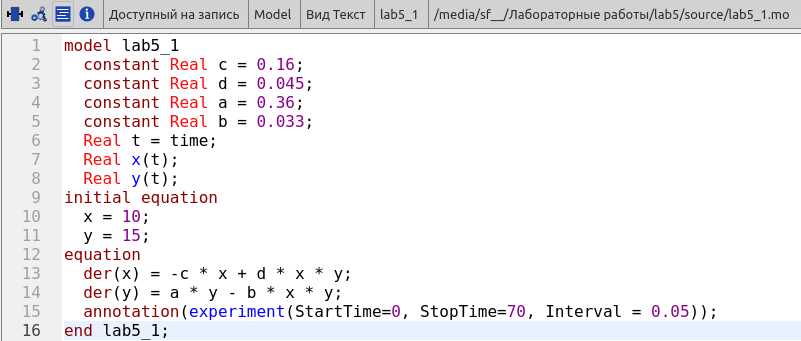

:::
::: {.column width="40%"}

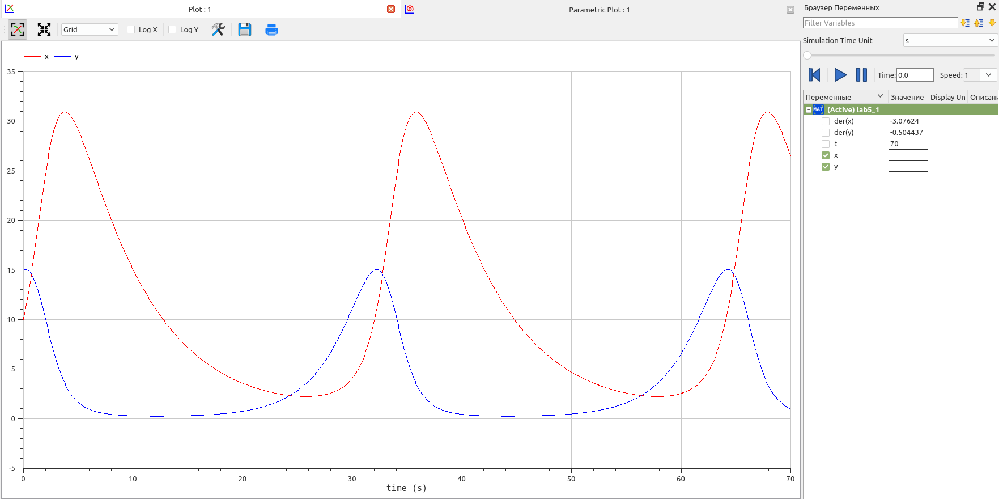
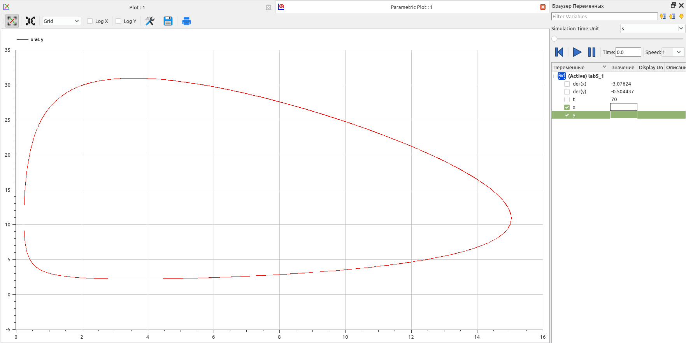

:::
::::::::::::::

## Код задания №2. Получившиеся графики

:::::::::::::: {.columns align=center}
::: {.column width="60%"}

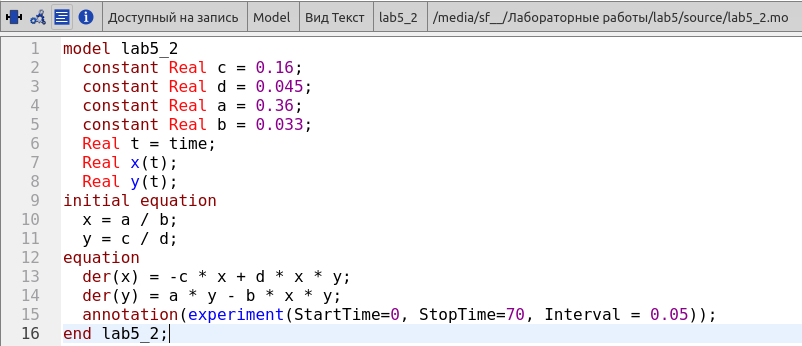

:::
::: {.column width="40%"}

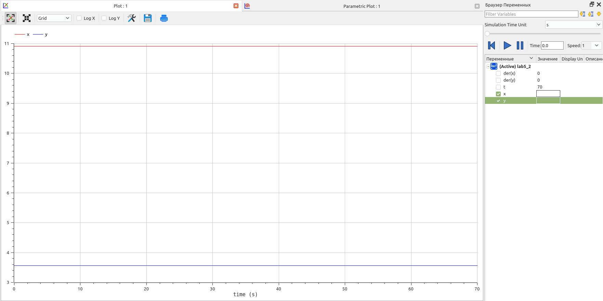
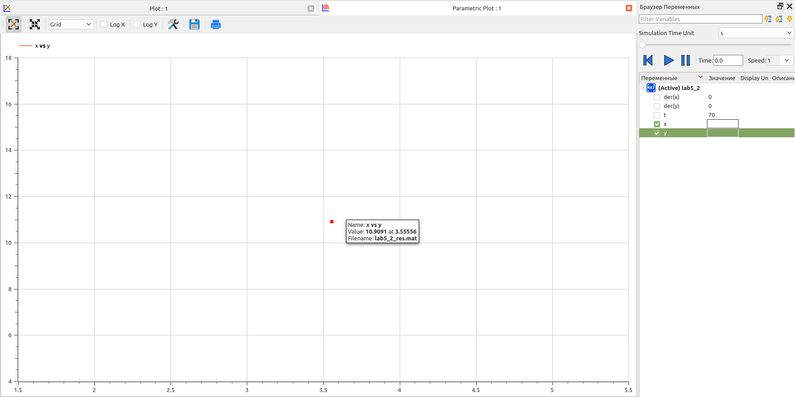

:::
::::::::::::::

# Результаты

- Созданы математические модели Лотки-Вольтерры с помощью данных языков.
- Построены графики состояния систем в соответствии с поставленными задачами.

## Вывод

Продолжил знакомство с функционалом языка программирования Julia и языка моделирования Modelica, а также с функционалом программного обеспечения OpenModelica и интерактивного блокнота Pluto. Используя эти средства, построил математические модели «хищник-жертва» (модели Лотки-Вольтерры).
