---
## Front matter
title: "Отчет по лабораторной работе №5"
subtitle: "по дисциплине: Математическое моделирование"
author: "Ким Михаил Алексеевич"

## Generic otions
lang: ru-RU
toc-title: "Содержание"

## Bibliography
bibliography: bib/cite.bib
csl: pandoc/csl/gost-r-7-0-5-2008-numeric.csl

## Pdf output format
toc: true # Table of contents
toc-depth: 2
lof: true # List of figures
lot: false # List of tables
fontsize: 12pt
linestretch: 1.5
papersize: a4
documentclass: scrreprt
## I18n polyglossia
polyglossia-lang:
  name: russian
  options:
	- spelling=modern
	- babelshorthands=true
polyglossia-otherlangs:
  name: english
## I18n babel
babel-lang: russian
babel-otherlangs: english
## Fonts
mainfont: PT Serif
romanfont: PT Serif
sansfont: PT Sans
monofont: PT Mono
mainfontoptions: Ligatures=TeX
romanfontoptions: Ligatures=TeX
sansfontoptions: Ligatures=TeX,Scale=MatchLowercase
monofontoptions: Scale=MatchLowercase,Scale=0.9
## Biblatex
biblatex: true
biblio-style: "gost-numeric"
biblatexoptions:
  - parentracker=true
  - backend=biber
  - hyperref=auto
  - language=auto
  - autolang=other*
  - citestyle=gost-numeric
## Pandoc-crossref LaTeX customization
figureTitle: "Рис."
tableTitle: "Таблица"
listingTitle: "Листинг"
lofTitle: "Список иллюстраций"
lotTitle: "Список таблиц"
lolTitle: "Листинги"
## Misc options
indent: true
header-includes:
  - \usepackage{indentfirst}
  - \usepackage{float} # keep figures where there are in the text
  - \floatplacement{figure}{H} # keep figures where there are in the text
---

# Цель работы

Продолжить знакомство с функционалом языка программирования Julia, дополнительных библиотек (DifferentialEquations, Plots), интерактивного блокнота Pluto, а также интерактивной командной строкой REPL. Продолжить ознакомление с языком моделирования Modelica и программным обеспечением OpenModelica. Используя эти средства, описать математическую модель Лотки-Вольтерры.

# Задание

Для модели «хищник-жертва»:

$$
\left\{
\begin{array}{c}
\frac{dx}{dt} = -0.16x(t) + 0.045x(t)y(t)\\
 \\
\frac{dy}{dt} = 0.36y(t) - 0.033x(t)y(t)
\end{array}
\right.
$$

Построить график зависимости численности хищников от численности жертв, а также графики изменения численности хищников и численности жертв при следующих начальных условиях: $x_0 = 10$, $y_0 = 15$. Найти стационарное состояние системы.


# Теоретическое введение
## Модель «хищник-жертва» (модель Лотки-Вольтерры)

__Модель «хищник-жертва» (модель Лотки-Вольтерры)__ — это математическая модель, описывающая динамику популяций двух видов, где один вид является хищником, а другой - жертвой.

В модели предполагается, что популяции хищников и жертв изменяются в зависимости от времени. Модель основывается на следующих предположениях:

1. Численность популяции жертв $x$ и хищников $y$ зависят только от времени (модель не учитывает пространственное распределение популяции на занимаемой территории).
1. В отсутствии взаимодействия численность видов изменяется по модели Мальтуса, при этом число жертв увеличивается, а число хищников падает.
1. Естественная смертность жертвы и естественная рождаемость хищника считаются несущественными.
1. Эффект насыщения численности обеих популяций не учитывается.
1. Скорость роста численности жертв уменьшается пропорционально численности хищников.

Модель Лотки-Вольтерры состоит из двух дифференциальных уравнений:

$$
\left\{
\begin{array}{c}
\frac{dx}{dt} = ax(t) - bx(t)y(t)\\
 \\
\frac{dy}{dt} = -cy(t) + dx(t)y(t),
\end{array}
\right.
$$

где $x$ – число жертв, $y$ - число хищников. Коэффициент $a$ описывает скорость естественного прироста числа жертв в отсутствие хищников, $с$ - естественное вымирание хищников, лишенных пищи в виде жертв. Вероятность взаимодействия жертвы и хищника считается пропорциональной как количеству жертв, так и числу самих хищников ($xy$). Каждый акт взаимодействия уменьшает популяцию жертв, но способствует увеличению популяции хищников (члены $-bxy$ и $dxy$ в правой части уравнения) [@bib_1].

Модель Лотки-Вольтерры позволяет предсказать изменение численности популяций в зависимости от коэффициентов, заданных в уравнениях, и начальных условий.

Модель была разработана в 1925 году и до сих пор является одной из самых известных моделей в экологии. Она может быть применена в различных областях, таких как контроль популяции рыб, насекомых и многих других видов.

Кроме того, модель «хищник-жертва» часто используется в учебных целях для объяснения основ экологии и динамики популяций.

Важно отметить, что модель является упрощенной и не учитывает многие реальные факторы, которые влияют на динамику популяций в природе.

Однако, модель Лотки-Вольтерры имеет множество расширений и модификаций, что позволяет применять ее в более сложных ситуациях [@bib_2].


## Стационарное состояние системы

__Стационарное состояние системы__ — это состояние, при котором популяции хищников и жертв остаются почти постоянными с течением времени. В этом состоянии количество жертв и хищников остается примерно на одном уровне, так как скорости уменьшения и увеличиния популяций сбалансированы. Система может достичь стационарного состояния только в определенных условиях: при наличии достаточно большого количества жертв и хищников, а также при определенных значений коэффициентов в уравнениях модели.

Стационарное состояние системы является важным концептом в модели «хищник-жертва», так как оно позволяет предсказать устойчивость популяций в долгосрочной перспективе. Однако, в реальности популяции животных и растений часто находятся в нестационарном состоянии, поскольку в природе действуют множество факторов, которые могут влиять на их численность.

Нестационарность популяций может быть вызвана изменением климатических условий, естественными бедствиями, наличием новых хищников или болезней, действиями человека и т.д.

Поэтому в реальности модель «хищник-жертва» может быть использована только для грубой оценки тенденций изменения численности популяций в определенных условиях, в то время как реальная динамика популяций в природе может быть гораздо более сложной и нелинейной [@bib_3].


## Малые изменения параметров в модели «хищник-жертва»

Малое изменение в модели «хищник-жертва» может привести к значительным изменениям в динамике популяций. Например, если в модель добавить еще один вид, который конкурирует за ресурсы с жертвами, это может привести к сильному снижению численности хищников и жертв.

Также изменение коэффициентов в уравнениях модели может привести к изменению динамики популяций. Например, увеличение коэффициента убийства жертв хищниками может привести к быстрому снижению численности жертв и, в конечном итоге, к снижению численности хищников.

Модель Лотки-Вольтерры может быть модифицирована для учета различных факторов, таких как миграция, конкуренция за ресурсы, изменение климатических условий и т.д. Такие дополнения позволяют более точно описывать динамику популяций в различных экологических условиях [@bib_4].

Благодаря таким модификациям, модель «хищник-жертва» может быть использована для прогнозирования динамики популяций в различных условиях, что необходимо для планирования использования биологических ресурсов и сохранения биоразнообразия.

Например, модель может быть использована для прогнозирования того, как изменения климата могут повлиять на популяции животных и растений в определенном регионе. Это может помочь при разработке стратегий адаптации объектов к изменненым условиям и стратегий охраны биоразнообразия видов. Также модель «хищник-жертва» может быть использована для определения оптимального уровня охоты на животных для сохранения их популяции. 

В целом, модель Лотки-Вольтерры остается важным инструментом для изучения динамики популяций в экологии. Однако, для более точного описания динамики популяций необходимо учитывать множество факторов, не входящих в изначальную систему ОДУ, которые могут влиять на популяции в реальных условиях [@bib_5].


# Выполнение лабораторной работы
## Pluto.jl
### Задание №1

1. Пишем программу, воспроизводящую модель на языке программирования Julia с использованием интерактивного блокнота Pluto (рис. @fig:01, @fig:02, @fig:03, @fig:04, @fig:05, @fig:06).

    ```Julia
    begin
    	import Pkg
    	Pkg.activate()
    	using DifferentialEquations
    	using LaTeXStrings
    	import Plots
    end
    ```

    ```Julia
    begin
    	const c = 0.16
    	const d = 0.045
    	const a = 0.36
    	const b = 0.033
    	const x₀ = 10
    	const y₀ = 15

    	"Начальные условия: u₀[1] -- x₀, u₀[2] -- y₀"
    	u₀ = [x₀, y₀]

    	"Период времени"
    	T = (0.0, 70.0)
    end
    ```

    ```Julia
    "Правая часть нашей системы, p, t не используются. u[1] -- x, u[2] -- y"
    function F!(du, u, p, t)
    	du[1] = -c * u[1] + d * u[1] * u[2]
    	du[2] = a * u[2] - b * u[1] * u[2]
    end
    ```

    ```Julia
    prob = ODEProblem(F!, u₀, T)
    ```

    ```Julia
    sol = solve(prob, dtmax=0.05)
    ```

    ```Julia
    begin
    	const xx = []
    	const yy = []
    	for u in sol.u
    		x, y = u
    		push!(xx, x)
    		push!(yy, y)
    	end
    	time = sol.t
    	time
    end
    ```

    ```Julia
    begin
    	fig = Plots.plot(
    		layout=(1, 2),
    		dpi=150,
    		grid=:xy,
    		gridcolor=:black,
    		gridwidth=1,
    		# aspect_ratio=:equal,
    		size=(800, 400),
    		legend=:outerbottom,
    		plot_title="Модель «хищник-жертва»"
    	)

    	Plots.plot!(
    		fig[1],
    		time,
    		[xx, yy],
    		color=[:red :blue],
    		xlabel="t",
    		ylabel="x(t), y(t)",
    		label=["x(t) — число хищников" "y(t) — число жертв"]
    	)

    	Plots.plot!(
    		fig[2],
    		yy,
    		xx,
    		color=[:grey],
    		xlabel="y(t)",
    		ylabel="x(t)",
    		label="Зависимость числа хищников (x) от числа жертв (y)"
    	)
    end
    ```

    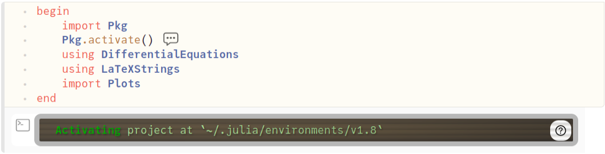{#fig:01 width=86%}

    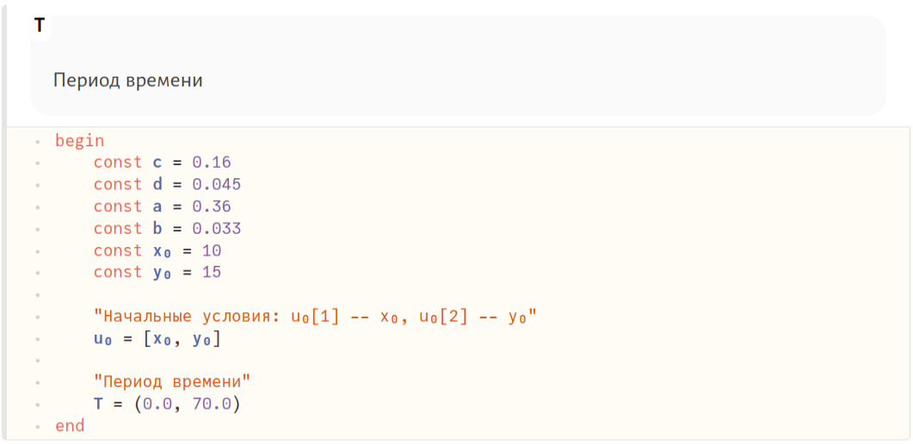{#fig:02 width=86%}

    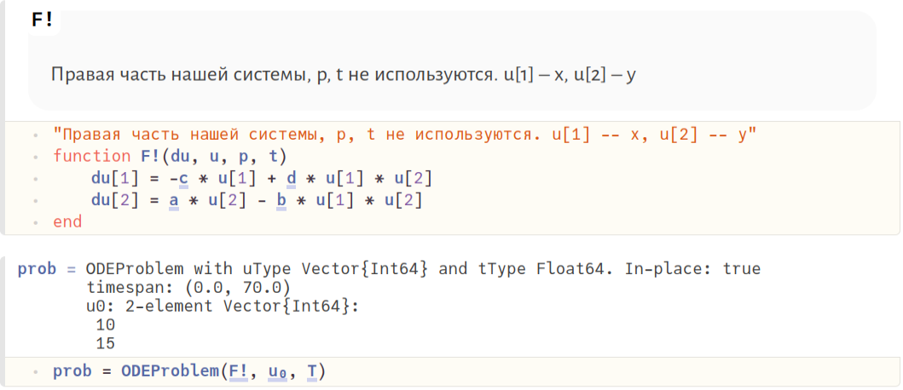{#fig:03 width=86%}

    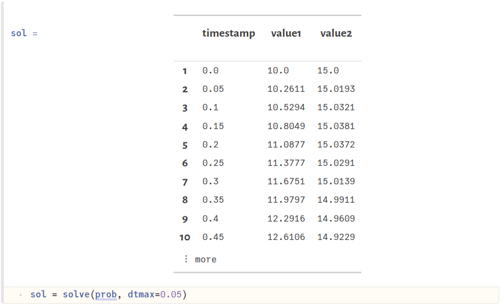{#fig:04 width=86%}

    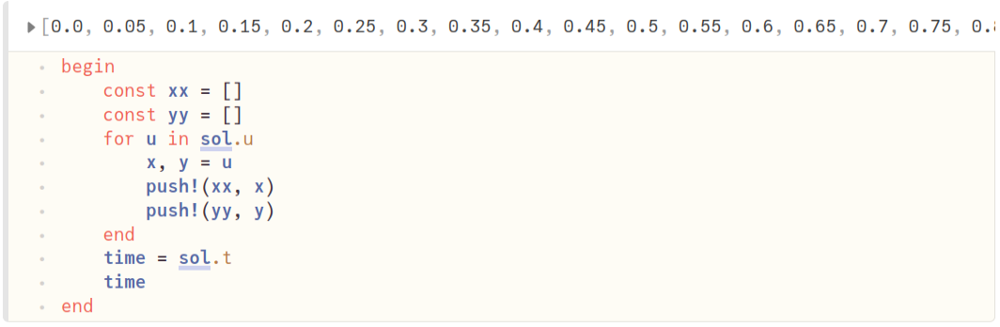{#fig:05 width=86%}

    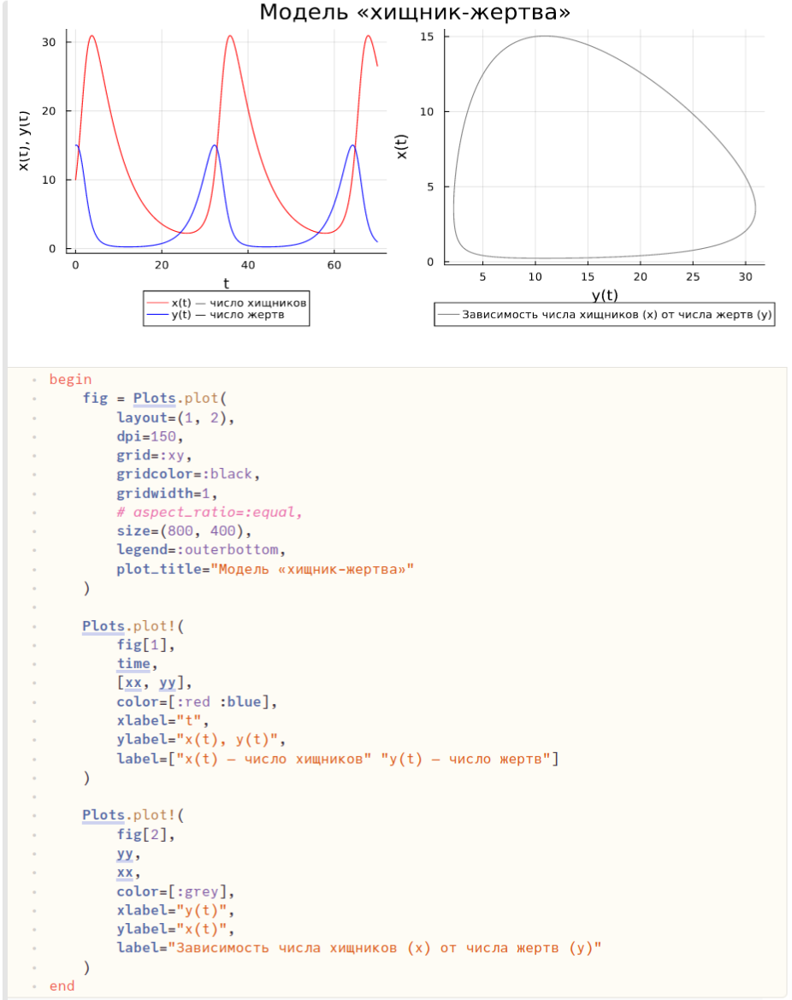{#fig:06 width=86%}


### Задание №2

1. Помимо коэффициентов $a$, $b$, $c$, $d$, определяем начальные условия для стационарной системы и выводим их в консоль. Остальные блоки кода оставляем без изменений. Любуемся результатом (рис. @fig:07, @fig:08).

    ```Julia
    begin
    	const c = 0.16
    	const d = 0.045
    	const a = 0.36
    	const b = 0.033
    	const x₀ = a / b
    	const y₀ = c / d

    	@show x₀
    	@show y₀

    	"Начальные условия: u₀[1] -- x₀, u₀[2] -- y₀"
    	u₀ = [x₀, y₀]

    	"Период времени"
    	T = (0.0, 70.0)
    end
    ```

    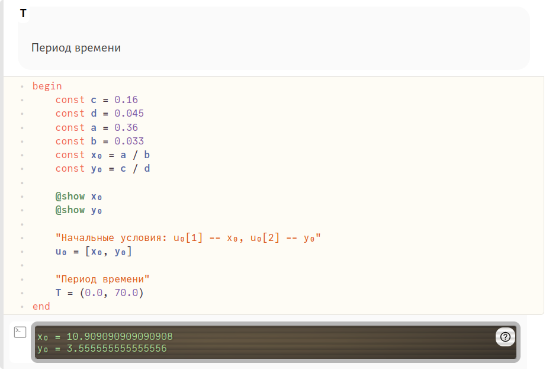{#fig:07 width=86%}

    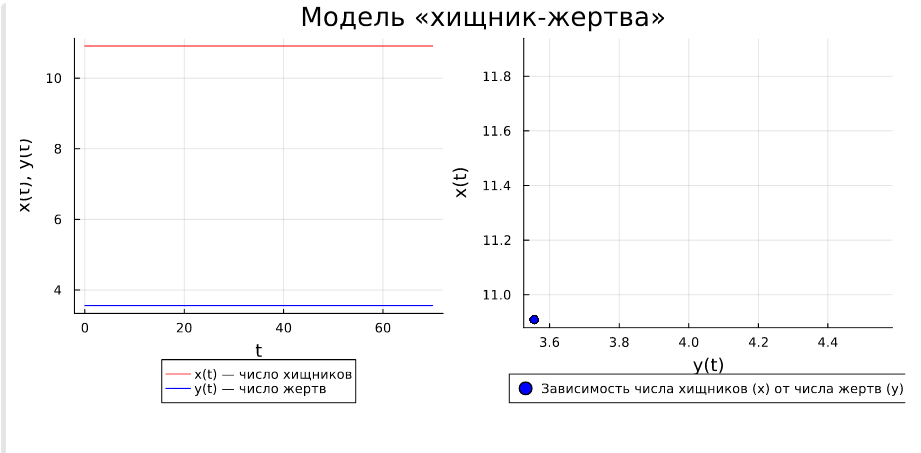{#fig:08 width=86%}


## Julia
### Задание №1

1. Код на Julia в файле аналогичен тому же, написанному с использованием Pluto (рис. @fig:09, @fig:001). Единственные различия: 
    - блоки перенесены в файл в виде построчного алгоритма без повторяющихся 'begin' и 'end';
    - измененный синтаксис подключения библиотек;
    - выгрузка графиков в виде изображений при помощи метода в последней строчке кода.

    ```Julia
    using DifferentialEquations
    using Plots

    const c = 0.16
    const d = 0.045
    const a = 0.36
    const b = 0.033
    const x₀ = 10
    const y₀ = 15

    "Начальные условия: u₀[1] -- x₀, u₀[2] -- y₀"
    u₀ = [x₀, y₀]

    "Период времени"
    T = (0.0, 70.0)

    "Правая часть нашей системы, p, t не используются. u[1] -- x, u[2] -- y"
    function F!(du, u, p, t)
    	du[1] = -c * u[1] + d * u[1] * u[2]
    	du[2] = a * u[2] - b * u[1] * u[2]
    end


    prob = ODEProblem(F!, u₀, T)
    sol = solve(prob, dtmax=0.05)

    const xx = []
    const yy = []
    for u in sol.u
        x, y = u
        push!(xx, x)
        push!(yy, y)
    end
    time = sol.t

    fig = Plots.plot(
    	layout=(1, 2),
    	dpi=150,
    	grid=:xy,
    	gridcolor=:black,
    	gridwidth=1,
    	# aspect_ratio=:equal,
    	size=(800, 400),
    	legend=:outerbottom,
    	plot_title="Модель «хищник-жертва»"
    )

    Plots.plot!(
    	fig[1],
    	time,
    	[xx, yy],
    	color=[:red :blue],
    	xlabel="t",
    	ylabel="x(t), y(t)",
    	label=["x(t) — число хищников" "y(t) — число жертв"]
    )

    Plots.plot!(
    	fig[2],
    	yy,
    	xx,
    	color=[:grey],
    	xlabel="y(t)",
    	ylabel="x(t)",
    	label="Зависимость числа хищников (x) от числа жертв (y)"
    )

    savefig(fig, "../lab5_1")
    ```


    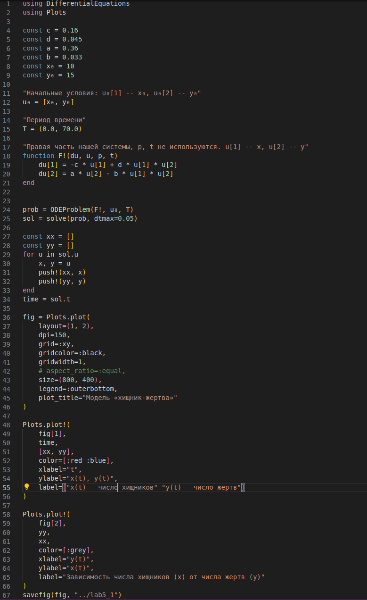{#fig:09 width=86%}

    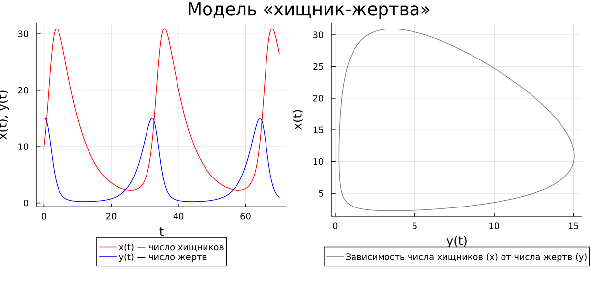{#fig:001 width=86%}


### Задание №2

1. Изменяем необходимые строчки и любуемся результатом (подробное объяснение давалось в предыдущей главе) (рис. @fig:10, @fig:002).

    ```Julia
    const c = 0.16
    const d = 0.045
    const a = 0.36
    const b = 0.033
    const x₀ = a / b
    const y₀ = c / d

    @show x₀
    @show y₀

    "Начальные условия: u₀[1] -- x₀, u₀[2] -- y₀"
    u₀ = [x₀, y₀]

    "Период времени"
    T = (0.0, 70.0)
    ```

    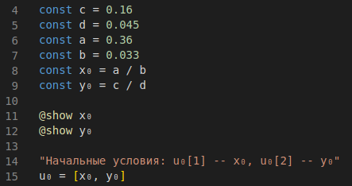{#fig:10 width=86%}

    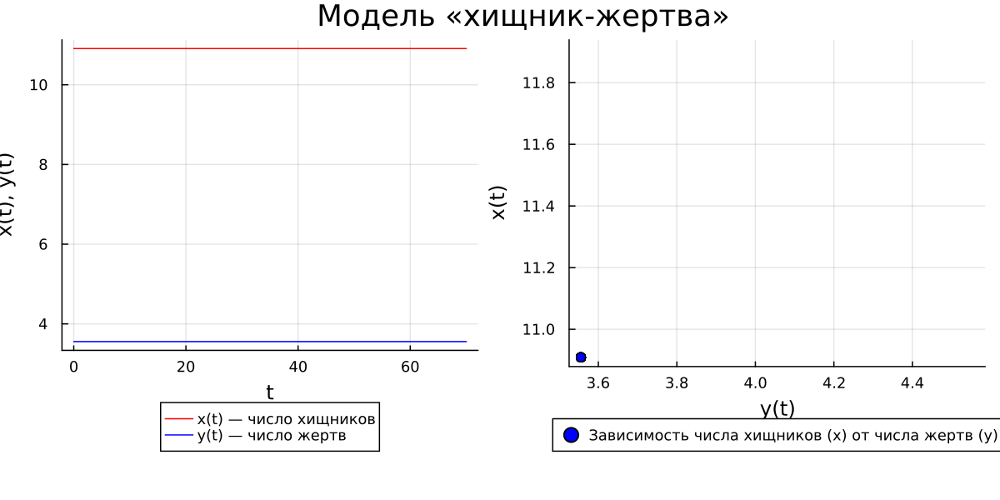{#fig:002 width=86%}


## Modelica
### Задание №1

1. По аналогии с Julia пишем программу, воспроизводящую модель Лотки-Вольтерры на языке моделирования Modelica с использованием ПО OpenModelica. Любуемся результатами (рис. @fig:11, @fig:12, @fig:13).
    
    ```
    model lab5_1
      constant Real c = 0.16;
      constant Real d = 0.045;
      constant Real a = 0.36;
      constant Real b = 0.033;
      Real t = time;
      Real x(t);
      Real y(t);
    initial equation
      x = 10;
      y = 15;
    equation
      der(x) = -c * x + d * x * y;
      der(y) = a * y - b * x * y;
      annotation(experiment(StartTime=0, StopTime=70, Interval = 0.05));
    end lab5_1;
    ```

    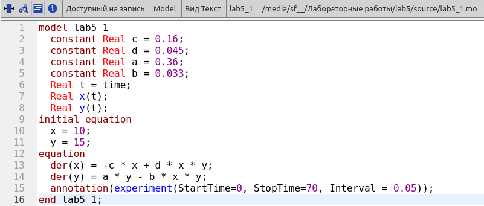{#fig:11 width=86%}

    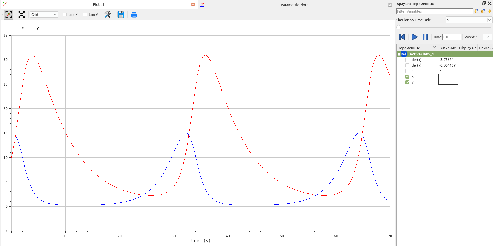{#fig:12 width=86%}

    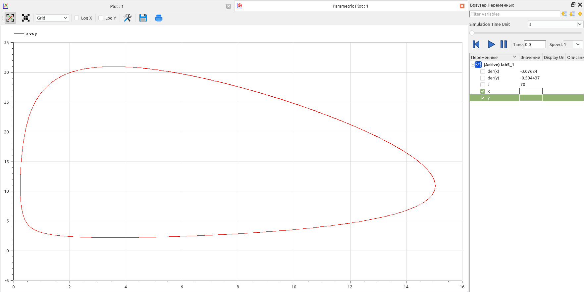{#fig:13 width=86%}


### Задание №2

1. По аналогии с Julia пишем программу для второго случая. Любуемся результатами (рис. @fig:14, @fig:15, @fig:16).

    ```
    model lab5_2
      constant Real c = 0.16;
      constant Real d = 0.045;
      constant Real a = 0.36;
      constant Real b = 0.033;
      Real t = time;
      Real x(t);
      Real y(t);
    initial equation
      x = a / b;
      y = c / d;
    equation
      der(x) = -c * x + d * x * y;
      der(y) = a * y - b * x * y;
      annotation(experiment(StartTime=0, StopTime=70, Interval = 0.05));
    end lab5_2;
    ```

    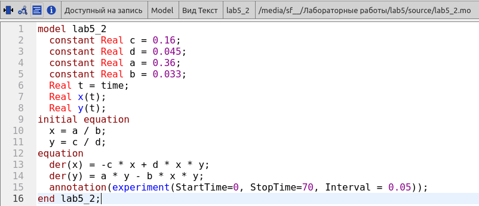{#fig:14 width=86%}

    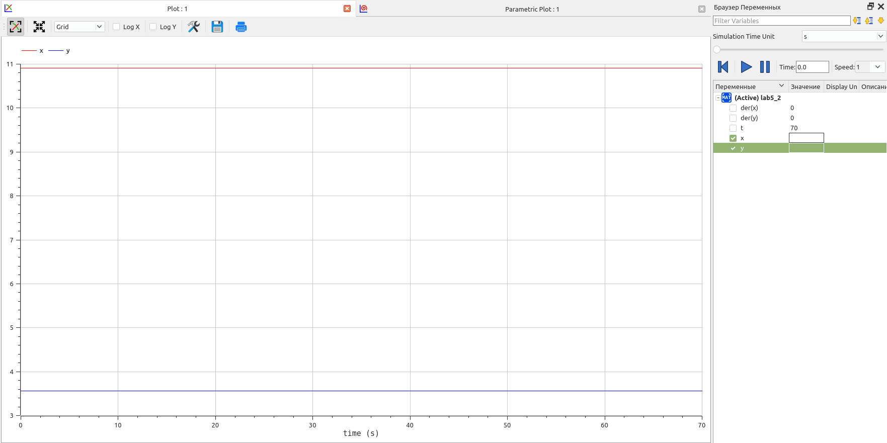{#fig:15 width=86%}

    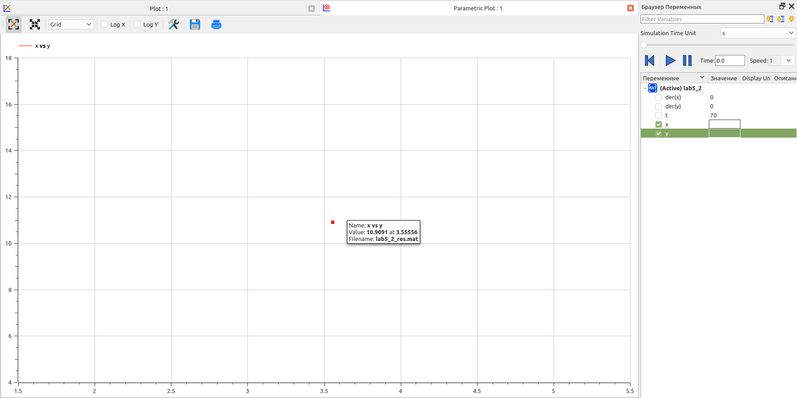{#fig:16 width=86%}


# Анализ результатов

На текущем примере построения математической модели гармонических колебаний мы можем продолжить сравнивать язык программирования Julia и язык моделирования Modelica. Говоря откровенно, по сравнению с анализом результатов при выполнении предыдущей лабораторной работы мало что изменилось: тенденция к сглаживанию негативных моментов при выполнении лабораторной работы на языке программирования Julia продолжается. Со временем и с новыми заданиями, решаемыми при помощи библиотеки DifferentialEquations, скорость написания программ на Julia почти сравнялась с таковой скоростью при использовании Modelica.

Однако, OpenModelica крайне неприятно удивила невозможностью быстрой настройки отрисовки данных на графиках: нет возможности при выполнении второго задания отрисовать жирную точку. Предлагаемое решение OpenModelica (точка, показывающая стационарное состояние системы) почти не видно. Возможно, в будущем я найду решение этой проблемы, однако быстрый поиск по документации пока что результатов не дал.


# Выводы

Продолжил знакомство с функционалом языка программирования Julia, дополнительных библиотек (DifferentialEquations, Plots), интерактивного блокнота Pluto, а также интерактивной командной строкой REPL. Продолжил ознакомление с языком моделирования Modelica и программным обеспечением OpenModelica. Используя эти средства, описал математическую модель Лотки-Вольтерры.


# Список литературы{.unnumbered}

::: {#refs}
:::
