---
## Front matter
title: "Отчет по лабораторной работе №6"
subtitle: "по дисциплине: Математическое моделирование"
author: "Ким Михаил Алексеевич"

## Generic otions
lang: ru-RU
toc-title: "Содержание"

## Bibliography
bibliography: bib/cite.bib
csl: pandoc/csl/gost-r-7-0-5-2008-numeric.csl

## Pdf output format
toc: true # Table of contents
toc-depth: 2
lof: true # List of figures
lot: false # List of tables
fontsize: 12pt
linestretch: 1.5
papersize: a4
documentclass: scrreprt
## I18n polyglossia
polyglossia-lang:
  name: russian
  options:
	- spelling=modern
	- babelshorthands=true
polyglossia-otherlangs:
  name: english
## I18n babel
babel-lang: russian
babel-otherlangs: english
## Fonts
mainfont: PT Serif
romanfont: PT Serif
sansfont: PT Sans
monofont: PT Mono
mainfontoptions: Ligatures=TeX
romanfontoptions: Ligatures=TeX
sansfontoptions: Ligatures=TeX,Scale=MatchLowercase
monofontoptions: Scale=MatchLowercase,Scale=0.9
## Biblatex
biblatex: true
biblio-style: "gost-numeric"
biblatexoptions:
  - parentracker=true
  - backend=biber
  - hyperref=auto
  - language=auto
  - autolang=other*
  - citestyle=gost-numeric
## Pandoc-crossref LaTeX customization
figureTitle: "Рис."
tableTitle: "Таблица"
listingTitle: "Листинг"
lofTitle: "Список иллюстраций"
lotTitle: "Список таблиц"
lolTitle: "Листинги"
## Misc options
indent: true
header-includes:
  - \usepackage{indentfirst}
  - \usepackage{float} # keep figures where there are in the text
  - \floatplacement{figure}{H} # keep figures where there are in the text
---

# Цель работы

Продолжить знакомство с функционалом языка программирования Julia, дополнительных библиотек (DifferentialEquations, Plots), интерактивного блокнота Pluto, а также интерактивной командной строкой REPL. Продолжить ознакомление с языком моделирования Modelica и программным обеспечением OpenModelica. Используя эти средства, описать задачу об эпидемии (используя измененную математическую модель SIR).

# Задание

На одном острове вспыхнула эпидемия. Известно, что из всех проживающих на острове ($N=11000$) в момент начала эпидемии ($t=0$) число заболевших людей (являющихся распространителями инфекции) $I(0)=111$, А число здоровых людей с иммунитетом к болезни $R(0)=11$. Таким образом, число людей восприимчивых к болезни, но пока здоровых, в начальный момент времени $S(0)=N-I(0)- R(0)$.

Постройте графики изменения числа особей в каждой из трех групп. Рассмотрите, как будет протекать эпидемия в случае:

1. Если $I(0) \le I^*$

2. Если $I(0) > I^*$

# Теоретическое введение

Задача текущей лабораторной работы сводится к построению математической модели, достаточно сильно похожей на модель SIR. Сначала будет дан материал о модели «Susceptible-Infectious-Recovered», а далее будут рассмотрены различия данной модели и модели, используемой при выполнении лабораторной работы.

## Модель SIR
__Модель SIR__ - это математическая модель, используемая для описания распространения инфекционных заболеваний в популяции. Аббревиатура SIR означает «Susceptible-Infectious-Recovered». Из расшифровки аббревиатуры следует, что модель разделяет популяцию на три группы: восприимчивые (susceptible), инфицированные (infectious) и выздоровевшие (recovered).

В модели SIR инфекционное заболевание передается от инфицированных к восприимчивым через непосредственный контакт. Когда восприимчивый контактирует с инфицированным, есть определенная вероятность заражения, которая зависит от свойств возбудителя и сопротивляемости организма. После того, как восприимчивый заразился, он становится инфицированным, и тем самым переходит в группу infectious.

Когда инфицированный выздоравливает, он переходит в группу recovered. В отличие от других моделей, таких как SEIR, модель SIR не учитывает длительности инкубационного периода или время восстановления, и считает, что инфицированные остаются в одном состоянии до тех пор, пока не выздоровеют [@bib_1].

Модель SIR представляется системой трех дифференциальных уравнений, которые описывают динамику численности каждой группы в зависимости от времени. Эти уравнения могут быть использованы для прогнозирования темпов распространения заболевания и оценки эффективности мер по его контролю.

1. Уравнение числа восприимчивых (S):

    $$ \frac{dS}{dt} = - \frac{\beta I S}{N}, $$

    где $\beta$ — коэффициент интенсивности контактов индивидов с последующим инфицированием; $S(t)$ —    численность восприимчивых индивидов в момент времени $t$; $I(t)$ — численность инфицированных индивидов в момент времени $t$; $N$ — объем популяции.

    Первое уравнение описывает изменение численности восприимчивых с течением времени. Уравнение показывает, что изменение числа здоровых (и при этом восприимчивых к заболеванию) индивидуумов уменьшается со временем пропорционально числу контактов с инфицированными. После контакта происходит заражение, восприимчивый переходит в состояние инфицированного.

2. Уравнение числа инфицированных (I):

    $$ \frac{dI}{dt} = \frac{\beta I S}{N} - \gamma I,$$

    где $\gamma$ — коэффициент интенсивности выздоровления инфицированных индивидов.

    Второе уравнение описывает изменение числа инфицированных с течением времени. Уравнение показывает, что скорость увеличения числа заразившихся растет пропорционально числу контактов здоровых и инфицированных и уменьшается по мере выздоровления последних.

3. Уравнение числа выздоровевших (R):

    $$ \frac{dR}{dt} = \gamma I$$

    где $R(t)$ — численность переболевших индивидов в момент времени $t$.

    Третье уравнение демонстрирует, что число выздоровевших в единицу времени пропорционально числу     инфицированных. Иначе говоря, каждый заболевший через некоторое время должен поправиться.

Стоит отметить, что сумма численностей трех групп всегда остается постоянной, т.е. $S + I + R = N$. Коэффициент $R_0 = \frac{\beta}{\gamma}$ называется __«базовым коэффициентом воспроизведения»__ [@bib_2]. Для каждой болезни есть собственный коэффициент $R_0$. К примеру, у COVID-19 он находится в пределах $2.4-2.9$ [@bib_3].

Модель SIR может быть использована для прогнозирования темпов распространения заболевания и оценки эффективности мер по его контролю, таких как вакцинация, карантин, социальная дистанцирование и т.д. Также, в зависимости от начальных условий, коэффициента инфицирования, коэффициента выздоровления и других коэффициентов, модель может быть использована для исследования различных вариантов эпидемических сценариев.

Хотя модель SIR довольно проста, она оказывается достаточно полезной для анализа динамики распространения заболевания в популяции и понимания того, какие меры контроля наиболее эффективны в определенных ситуациях [@bib_4].

## Задача об эпидемии

Отличия модели, предлагаемой для описания в лабораторной работы, от вышеуказанной модели SIR таковы:

1. Введен дополнительный параметр: $I^*$ — критическое значение $I(t)$, после превышения которого инфицированные способны заражать восприимчивых. До этого критического значения инфицированные не заражают восприимчивых.
2. Изменены стандартные символы, отождествляющие коэффициенты: $\beta\frac{I}{N} \rightarrow \alpha$ (коэффициент заболеваемости),  $\gamma \rightarrow \beta$ (коэффициент выздоровления).
3. В соответствии с предыдущими пунктами изменена система уравнений [@bib_5]:

$$
\frac{dS}{dt} = 
\left\{
\begin{array}{c}
-\alpha S, \ если \ I(t)> I^*
 \\
0, \ если \ I(t) \le I^*
\end{array}
\right.
$$

$$
\frac{dI}{dt} = 
\left\{
\begin{array}{c}
\alpha S - \beta I, \ если \ I(t)> I^*
 \\
- \beta I, \ если \ I(t) \le I^*
\end{array}
\right.
$$

$$ \frac{dR}{dt} = \beta I $$


# Выполнение лабораторной работы
## Pluto.jl
### Задание №1

1. Пишем программу, воспроизводящую модель на языке программирования Julia с использованием интерактивного блокнота Pluto (рис. @fig:01, @fig:02, @fig:03, @fig:04, @fig:05, @fig:06).

    ```Julia
    begin
    	import Pkg
    	Pkg.activate()
    	using DifferentialEquations
    	using LaTeXStrings
    	import Plots
    end
    ```

    ```Julia
    begin
    	const α = 0.75
    	const β = 0.25
    	@show α / β

    	const N = 11000
    	const I₀ = 111
    	const R₀ = 11
    	const S₀ = N - I₀ - R₀
    	const I⁺ = 200
    	@show S₀

    	"Начальные условия: u₀[1] - S₀, u₀[1] - I₀, u₀[1] - R₀"
    	u₀ = [S₀, I₀, R₀]

    	"Период времени"
    	T = (0.0, 30.0)
    end
    ```

    ```Julia
    "Правая часть нашей системы, p, t не используются. u[1] - S, u[2] - I, u[3] - R"
    function F!(du, u, p, t)
    	if u[2] > I⁺
    		println("I(t) > I⁺, I(t) = ", u[2])
    		du[1] = - α * u[1]
    		du[2] = α * u[1] - β * u[2]
    	else
    		println("I(t) ≤ I⁺, I(t) = ", u[2])
    		du[1] = 0
    		du[2] = - β * u[2]
    	end
    	du[3] = β * u[2]
    end
    ```

    ```Julia
    prob = ODEProblem(F!, u₀, T)
    ```

    ```Julia
    sol = solve(prob, saveat=0.2)
    ```

    ```Julia
    begin
    	const ss = []
    	const ii = []
    	const rr = []
    	for u in sol.u
    		s, i, r = u
    		push!(ss, s)
    		push!(ii, i)
    		push!(rr, r)
    	end
    	time = sol.t
    	time
    end
    ```

    ```Julia
    begin
    	fig = Plots.plot(
    		dpi=150,
    		grid=:xy,
    		gridcolor=:black,
    		gridwidth=1,
    		size=(800, 400),
    		legend=:outerbottom,
    		plot_title="Измененная модель SIR"
    	)

    	Plots.plot!(
    		fig[1],
    		time,
    		[ss, ii, rr],
    		color=[:blue :red :green],
    		xlabel="t",
    		ylabel="S(t), I(t), R(t)",
    		label=["S(t) — количество здоровых, но восприимчивых к болезни" "I(t) — количество    инфицированных" "R(t) — количество вылечившихся с иммунитетом"]
    	)
    end
    ```

    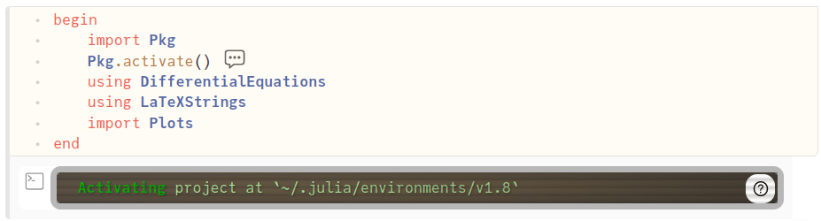{#fig:01 width=86%}

    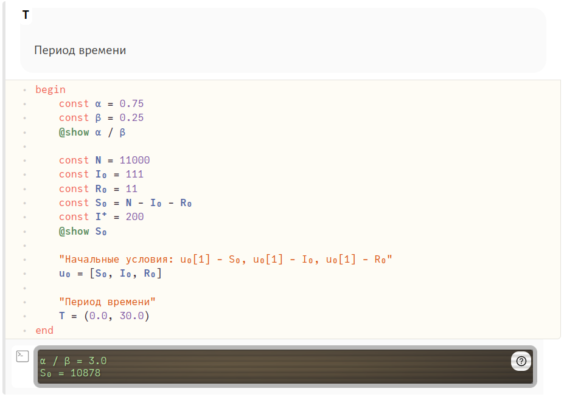{#fig:02 width=86%}

    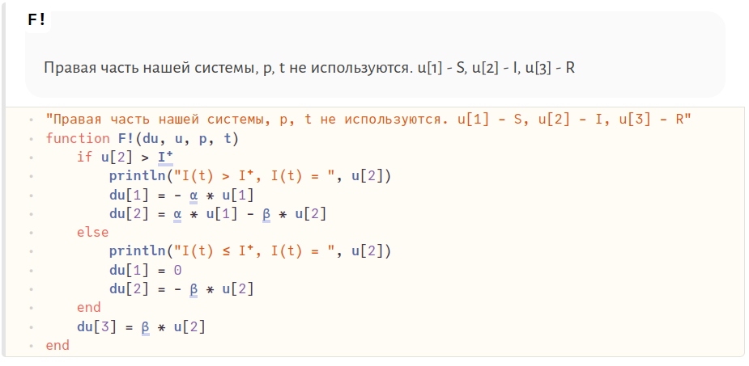{#fig:03 width=86%}

    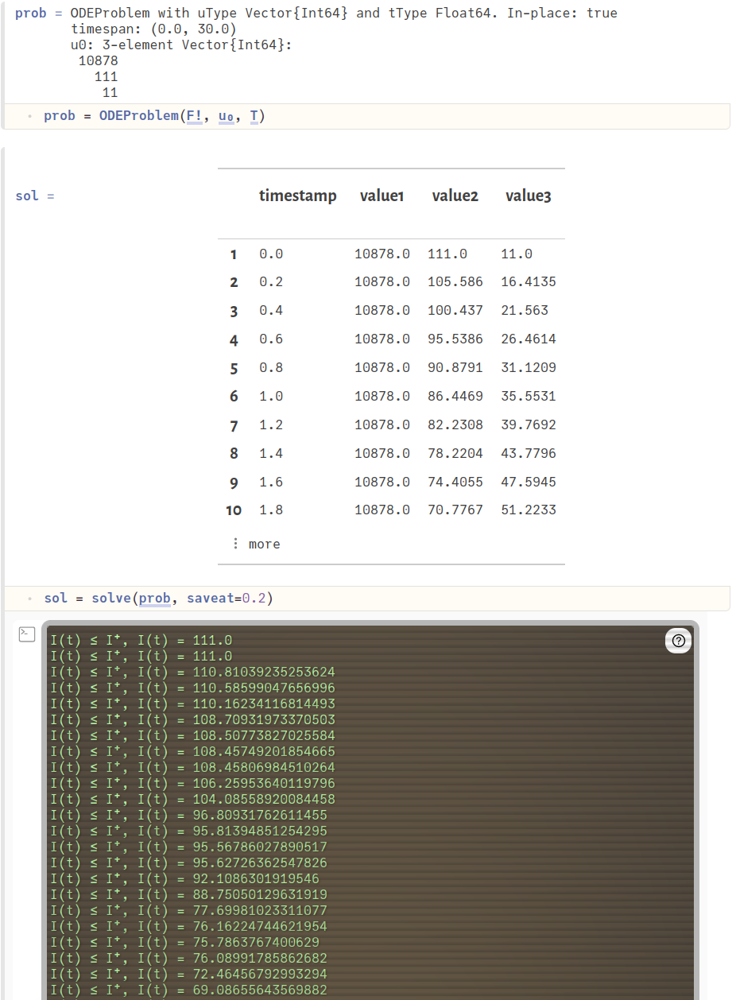{#fig:04 width=86%}

    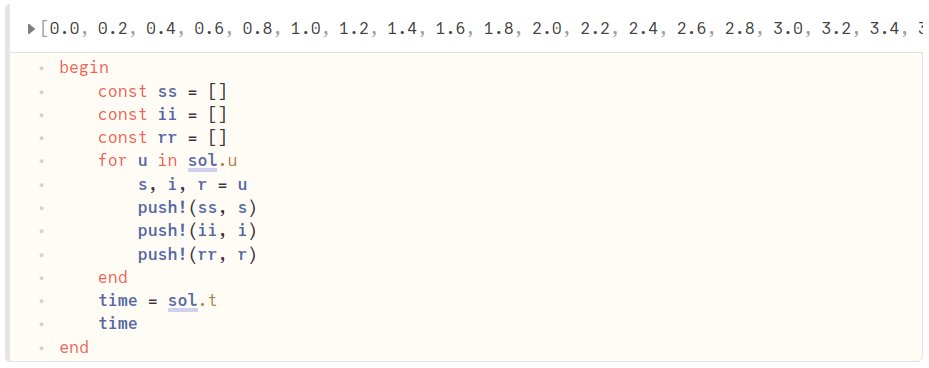{#fig:05 width=86%}

    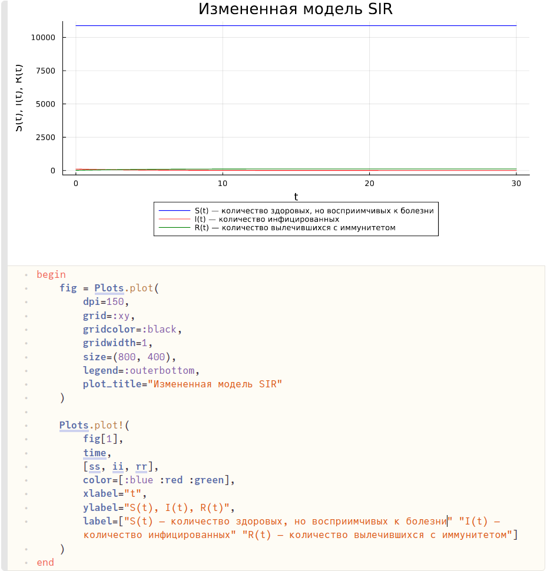{#fig:06 width=86%}


### Задание №2

1. Изменено значение $I^*$, которое теперь меньше $I(0)$. Остальные блоки кода оставляем без изменений. Любуемся результатом (рис. @fig:07, @fig:08).

    ```Julia
    begin
    	const α = 0.75
    	const β = 0.25
    	@show α / β

    	const N = 11000
    	const I₀ = 111
    	const R₀ = 11
    	const S₀ = N - I₀ - R₀
    	const I⁺ = 100
    	@show S₀

    	"Начальные условия: u₀[1] - S₀, u₀[1] - I₀, u₀[1] - R₀"
    	u₀ = [S₀, I₀, R₀]

    	"Период времени"
    	T = (0.0, 38.0)
    end
    ```

    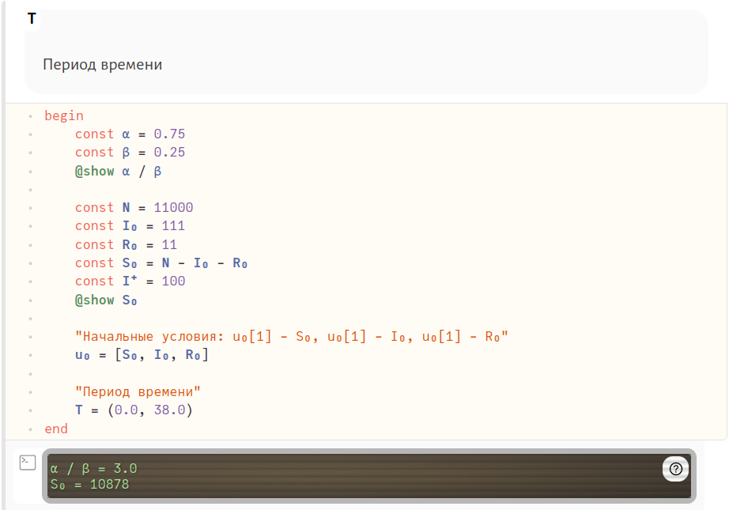{#fig:07 width=86%}

    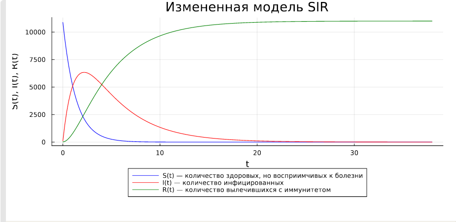{#fig:08 width=86%}


## Julia
### Задание №1

1. Код на Julia в файле аналогичен тому же, написанному с использованием Pluto (рис. @fig:09, @fig:001). Единственные различия: 
    - блоки перенесены в файл в виде построчного алгоритма без повторяющихся 'begin' и 'end';
    - измененный синтаксис подключения библиотек;
    - выгрузка графиков в виде изображений при помощи метода в последней строчке кода.

    ```Julia
    using DifferentialEquations
    using Plots


    const α = 0.75
    const β = 0.25
    @show α / β

    const N = 11000
    const I₀ = 111
    const R₀ = 11
    const S₀ = N - I₀ - R₀
    const I⁺ = 200
    @show S₀


    "Начальные условия: u₀[1] - S₀, u₀[1] - I₀, u₀[1] - R₀"
    u₀ = [S₀, I₀, R₀]

    "Период времени"
    T = (0.0, 30.0)

    "Правая часть нашей системы, p, t не используются. u[1] - S, u[2] - I, u[3] - R"
    function F!(du, u, p, t)
    	if u[2] > I⁺
    		println("I(t) > I⁺, I(t) = ", u[2])
    		du[1] = - α * u[1]
    		du[2] = α * u[1] - β * u[2]
    	else
    		println("I(t) ≤ I⁺, I(t) = ", u[2])
    		du[1] = 0
    		du[2] = - β * u[2]
    	end
    	du[3] = β * u[2]
    end

    prob = ODEProblem(F!, u₀, T)
    sol = solve(prob, saveat=0.2)


    const ss = []
    const ii = []
    const rr = []
    for u in sol.u
    	s, i, r = u
    	push!(ss, s)
    	push!(ii, i)
    	push!(rr, r)
    end
    time = sol.t

    fig = Plots.plot(
    	dpi=150,
    	grid=:xy,
    	gridcolor=:black,
    	gridwidth=1,
    	size=(800, 400),
    	legend=:outerbottom,
    	plot_title="Измененная модель SIR"
    )

    Plots.plot!(
    	fig[1],
    	time,
    	[ss, ii, rr],
    	color=[:blue :red :green],
    	xlabel="t",
    	ylabel="S(t), I(t), R(t)",
    	label=["S(t) — количество здоровых, но восприимчивых к болезни" "I(t) — количество     инфицированных" "R(t) — количество вылечившихся, получивших иммунитет"]
    )
    savefig(fig, "../lab6_1")
    ```


    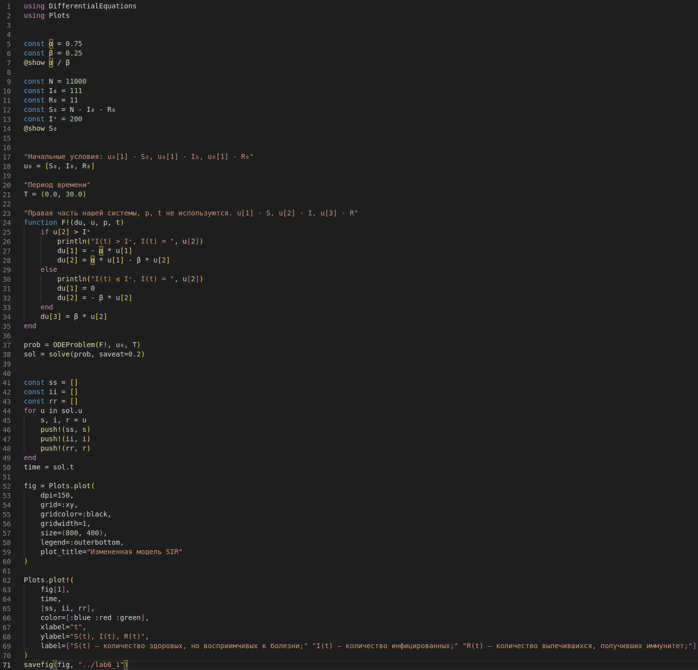{#fig:09 width=86%}

    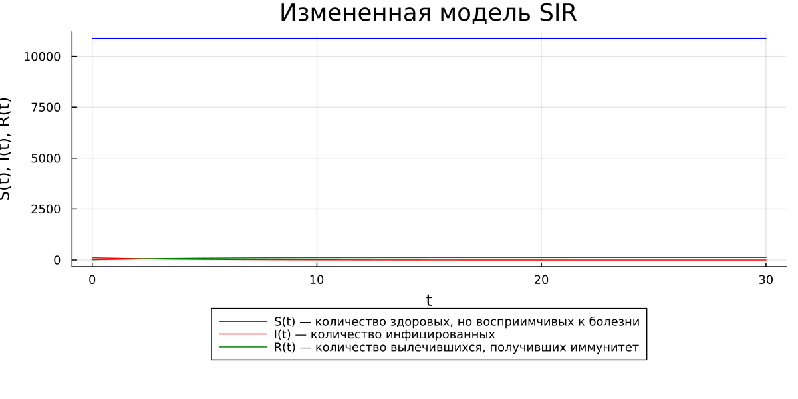{#fig:001 width=86%}


### Задание №2

1. Изменяем значение $I^*$, которое теперь меньше $I(0)$, и любуемся результатом (подробное объяснение давалось в предыдущей главе) (рис. @fig:10, @fig:002).

    ```Julia
    const N = 11000
    const I₀ = 111
    const R₀ = 11
    const S₀ = N - I₀ - R₀
    const I⁺ = 100
    @show S₀
    ```

    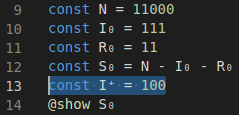{#fig:10 width=86%}

    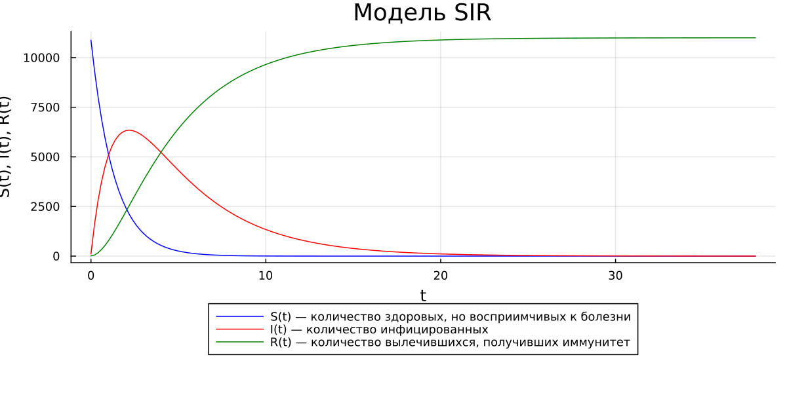{#fig:002 width=86%}


## Modelica
### Задание №1

1. По аналогии с Julia пишем программу, воспроизводящую измененную модель SIR на языке моделирования Modelica с использованием ПО OpenModelica. Любуемся результатами (рис. @fig:11, @fig:12, @fig:13).
    
    ```
    model lab6_1
      constant Real alpha = 0.75;
      constant Real beta = 0.25;
      constant Integer I_crit = 200;
      constant Integer N = 11000;
      Real t = time;
      Real S(t);
      Real I(t);
      Real R(t);
    initial equation
      S = N - I - R;
      I = 111;
      R = 11;
    equation
      if I > I_crit then
        der(S) = - alpha * S;
        der(I) = alpha * S - beta * I;
      else
        der(S) = 0;
        der(I) = - beta * I;
      end if;

      der(R) = beta * I;
      annotation(experiment(StartTime=0, StopTime=30, Interval = 0.5));
    end lab6_1;
    ```

    {#fig:11 width=86%}

    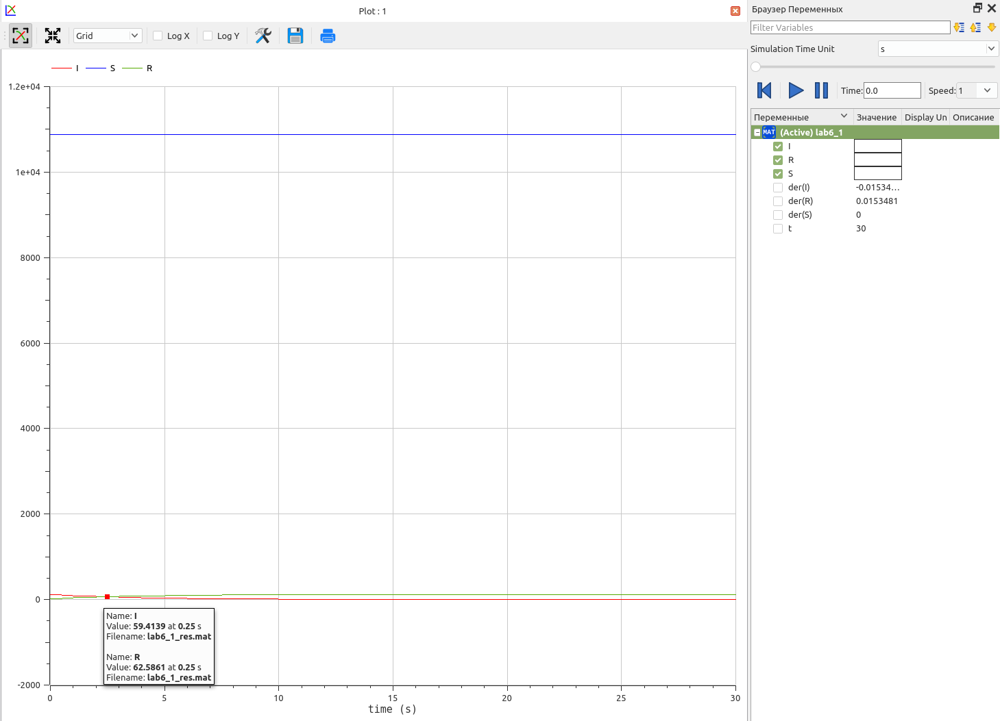{#fig:12 width=86%}


### Задание №2

1. По аналогии с Julia пишем программу для второго случая. Любуемся результатами (рис. @fig:13, @fig:14).

    ```
    model lab6_2
      constant Real alpha = 0.75;
      constant Real beta = 0.25;
      constant Integer I_crit = 100;
      constant Integer N = 11000;
      Real t = time;
      Real S(t);
      Real I(t);
      Real R(t);
    initial equation
      S = N - I - R;
      I = 111;
      R = 11;
    equation
      if I > I_crit then
        der(S) = - alpha * S;
        der(I) = alpha * S - beta * I;
      else
        der(S) = 0;
        der(I) = - beta * I;
      end if;

      der(R) = beta * I;
      annotation(experiment(StartTime=0, StopTime=30, Interval = 0.5));
    end lab6_2;
    ```

    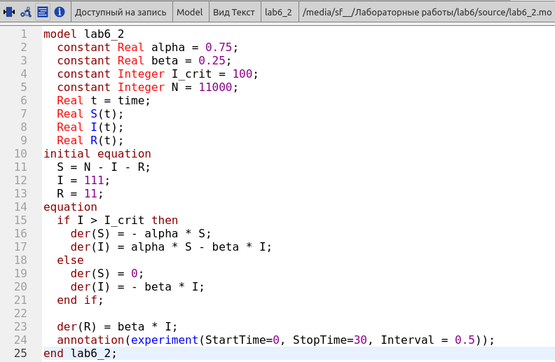{#fig:13 width=86%}

    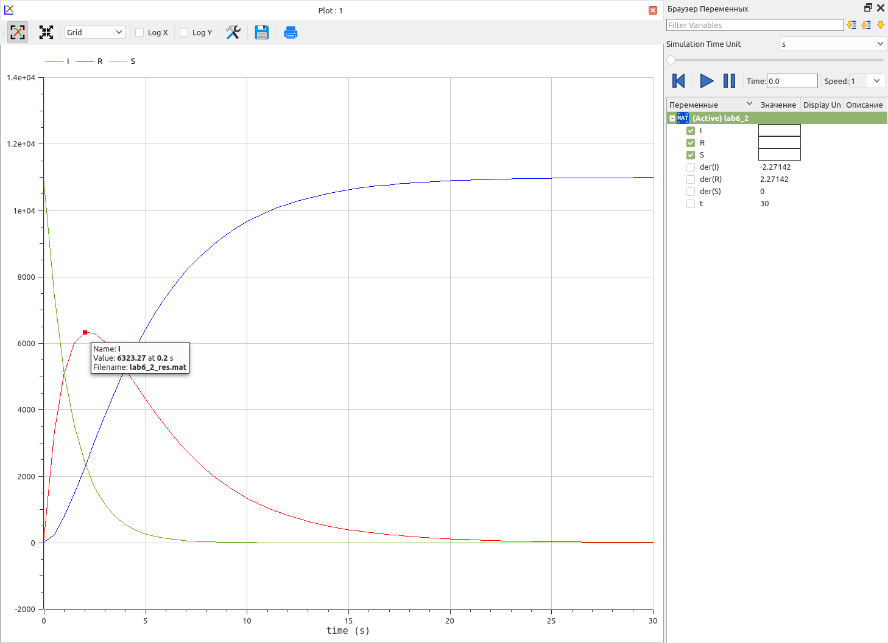{#fig:14 width=86%}


# Анализ результатов

На текущем примере построения математической модели, схожей с моделью SIR, мы можем продолжить сравнивать язык программирования Julia и язык моделирования Modelica. Говоря честно, по сравнению с анализом результатов при выполнении предыдущей лабораторной работы мало что изменилось: тенденция к сглаживанию негативных моментов при выполнении лабораторной работы на языке программирования Julia продолжается. Со временем и с новыми заданиями, решаемыми при помощи библиотеки DifferentialEquations, скорость написания программ на Julia почти сравнялась с таковой скоростью при использовании Modelica.

На обоих языках одинаково просто добавляются условия в уравнения, как в текущем случае. Однако, хочется заметить, что в Modelica в разы удобнее составлять уравнения, т.к. все переменные, зависящие от времени, подписываются заданными ранее символами в отличие от Julia, где каждой переменной соответствует элемент массива. Такая реализация может запутать, особенно при условии наличие трех и более переменных, зависящих от времени и используемых в системе. Это может привести к ошибкам, связанными с усидчивостью, при написании системы.

# Выводы

Продолжил знакомство с функционалом языка программирования Julia, дополнительных библиотек (DifferentialEquations, Plots), интерактивного блокнота Pluto, а также интерактивной командной строкой REPL. Продолжил ознакомление с языком моделирования Modelica и программным обеспечением OpenModelica. Используя эти средства, описал математическую модель, схожую с моделью SIR.


# Список литературы{.unnumbered}

::: {#refs}
:::
