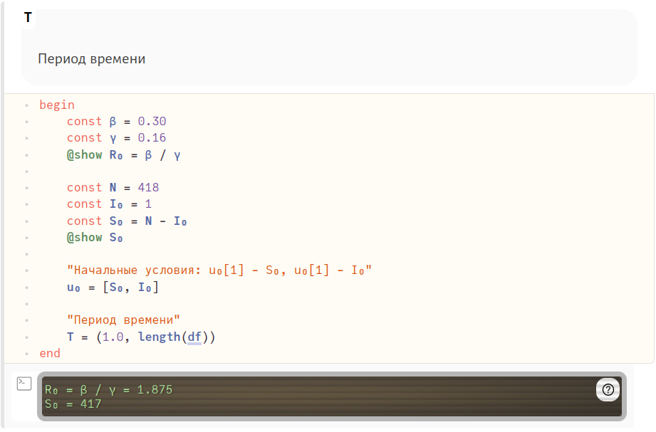
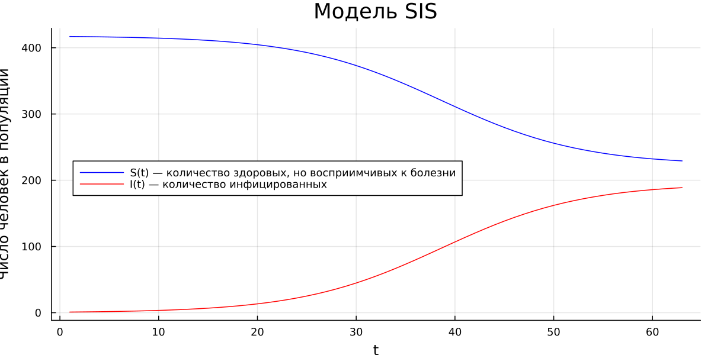
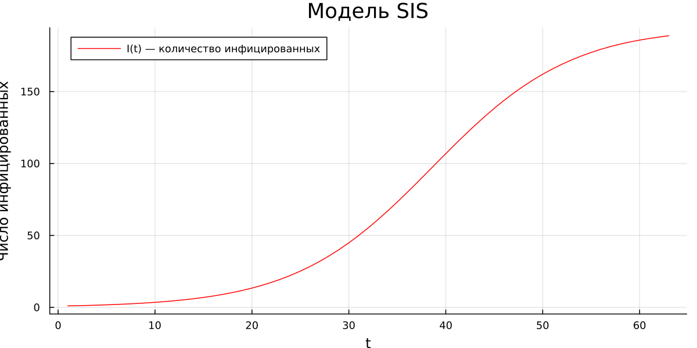
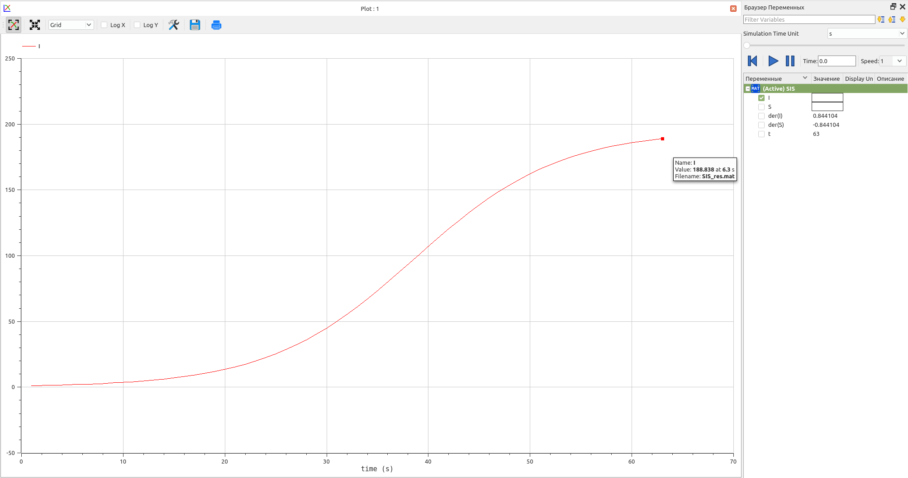
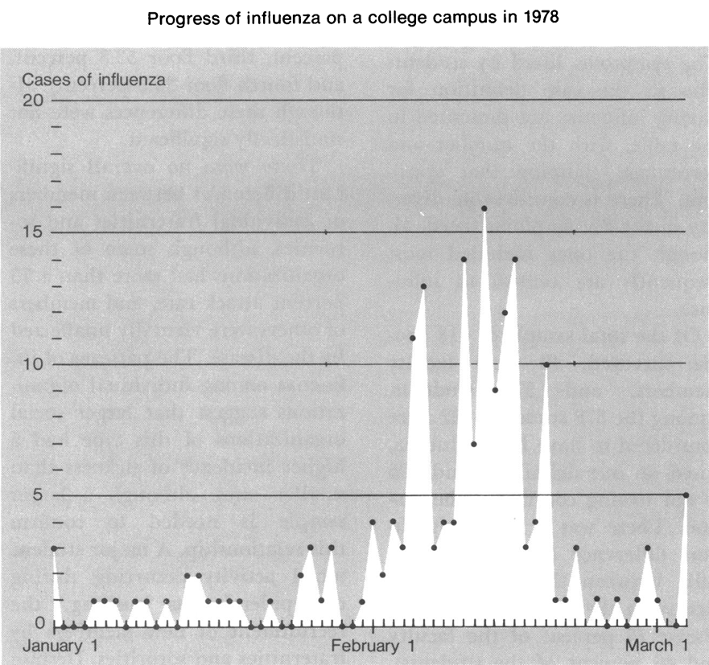
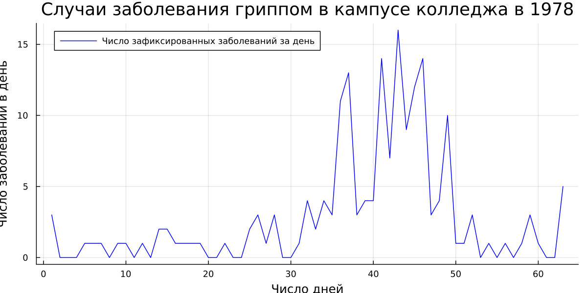
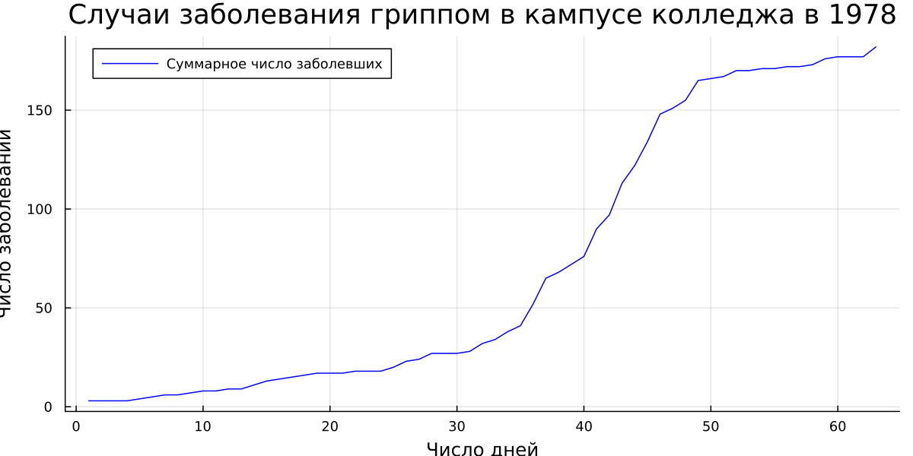
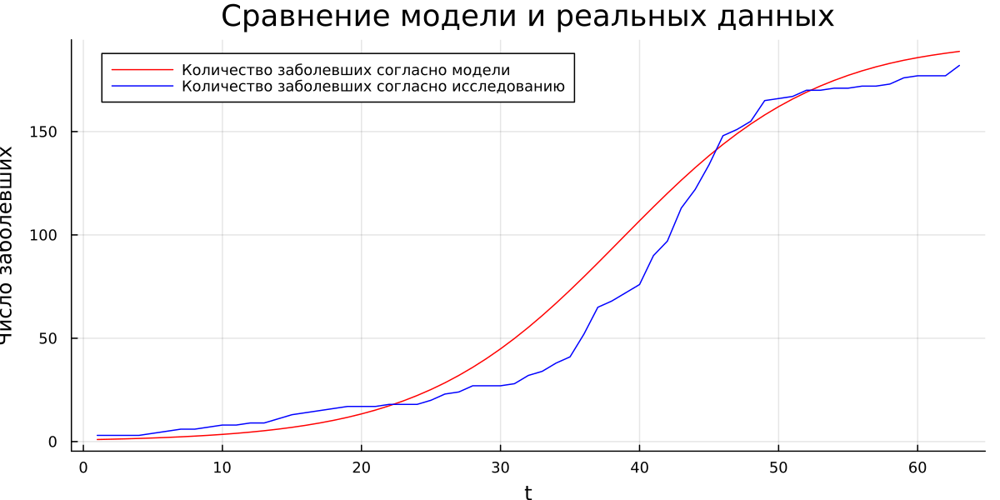

---
## Front matter
lang: ru-RU
title: Презентация к докладу
subtitle: Модель заражения SIS
author:
  - Ким М. А.
institute:
  - Российский университет дружбы народов, Москва, Россия
date: 10 марта 2023

## i18n babel
babel-lang: russian
babel-otherlangs: english

## Fonts
mainfont: PT Serif
romanfont: PT Serif
sansfont: PT Sans
monofont: PT Mono
mainfontoptions: Ligatures=TeX
romanfontoptions: Ligatures=TeX
sansfontoptions: Ligatures=TeX,Scale=MatchLowercase
monofontoptions: Scale=MatchLowercase,Scale=0.9

## Formatting pdf
toc: false
toc-title: Содержание
slide_level: 2
aspectratio: 169
section-titles: true
theme: metropolis
header-includes:
 - \metroset{progressbar=frametitle,sectionpage=progressbar,numbering=fraction}
 - '\makeatletter'
 - '\beamer@ignorenonframefalse'
 - '\makeatother'
---

# Информация

## Докладчик

:::::::::::::: {.columns align=center}
::: {.column width="70%"}

  * Ким Михаил Алексеевич
  * студент уч. группы НФИбд-01-20
  * Российский университет дружбы народов
  * [1032201664@pfur.ru](mailto:1032201664@pfur.ru)
  * <https://github.com/exmanka>

:::
::: {.column width="30%"}

:::
::::::::::::::

# Вводная часть

## Актуальность

- Необходимость навыков моделирования реальных математических задач, построение графиков.
- Необходимость изучения математических моделей заражения.
- Весомое значение модели SIS в области изучения распространения заболеваний.

## Объект и предмет исследования

- Язык программирования Julia
- Язык моделирования Modelica
- Математическая модель «Susceptible—Infected—Susceptible» — SIS

## Цели и задачи

- Изучить математическую модель заражения SIS.
- Используя функционал языка программирования Julia, языка моделирования Modelica, а также интерактивного блокнота Pluto и программного обеспечением OpenModelica, описать модель заражения SIS.
- Сравнить описанную математическую модель с реальными данными о заражении.

# Процесс выполнения работы

# Теоретическое введение
## Определение модели SIS

Модель SIS — математическая модель, описывающая динамику распространения определенной болезни в популяции.

SIS — «Susceptible—Infected—Susceptible» — «Восприимчивый—Инфицированный—Восприимчивый».

Восприимчивые — еще не инфицированные индивиды, которые, однако, могут быть подвержены заражению.

Инфицированные — заразившиеся болезнью индивиды.

## Математическое описание модели SIS

Модель описывается следующей системой уравнений:

$$
\frac{dS}{dt} = - \frac{\beta SI}{N} + \gamma I
$$

$$
\frac{dI}{dt} = \frac{\beta SI}{N} - \gamma I,
$$

где $S(t)$ — численность восприимчивых (susceptible) индивидов в момент времени $t$, $I(t)$ — численность инфицированных (infected) индивидов в момент времени $t$, $\beta$ — коэффициент интенсивности контактов индивидов с последующим инфицированием, $\gamma$ — коэффициент интенсивности выздоровления инфицированных индивидов, $N$ — число индивидов в популяции.

## Ограничения модели SIS

Для решения нам будут необходимы начальные условия:

$$S(0), \ I(0)$$

Важно также отметить справедливость следующих уравнений:

$$ \frac{dS}{dt} + \frac{dI}{dt} = 0 \ \Rightarrow \ S(t) + I(t) = N $$

## Базовый коэффициент воспроизведения

Величина

$$ R_0 = \frac{\beta}{\gamma} $$

называется «базовым коэффициентом воспроизведения» и имеет большую значимость при оценке возможности распространения болезни (чем он больше, тем более болезнь заразна). К примеру, у COVID-19 $R_0 = 2.4-3.4$, у гриппа $R_0 = 0.9-2.1$, у кори $R_0 = 12-18$.

# Описание модели и результирующие графики
# Pluto.jl
## Pluto.jl. Часть 1

:::::::::::::: {.columns align=center}
::: {.column width="45%"}

:::
::: {.column width="55%"}

:::
::::::::::::::

## Pluto.jl. Часть 2

# OpenModelica
## OpenModelica. Часть 1

:::::::::::::: {.columns align=center}
::: {.column width="45%"}

:::
::: {.column width="55%"}

:::
::::::::::::::

## OpenModelica. Часть 2

# Анализ реальных данных на основе исследования
## Исходный график датафрейма

:::::::::::::: {.columns align=center}
::: {.column width="40%"}

:::
::: {.column width="60%"}

:::
::::::::::::::

## Результирующий график датафрейма

## Сравнение графика модели и графика реальных данных

# Результаты

- Изучена математическую модель заражения SIS.
- Описать модель заражения SIS.
- Произведенено сравнение описанной математическую модель с реальными данными о заражении.

## Вывод

Математическая модель SIS, являясь одной из самых легковесных моделей распространения заболеваний и не сложной для описания, показала достаточную способность моделировать сценарий распространения гриппа в пределах небольшой популяции и небольшого периода времени. Несомненно, навыки, полученные при изучении и построении модели, пригодятся при работе с более сложными математическими моделями, такими как SIR, SEIR и MSEIR, способными моделировать более сложные сценарии протекания эпидемии.
