---
## Front matter
title: "Реферат по теме: «Модель заражения SIS»"
subtitle: "по дисциплине: Математическое моделирование"
author: "Ким Михаил Алексеевич"

## Generic otions
lang: ru-RU
toc-title: "Содержание"

## Bibliography
bibliography: bib/cite.bib
csl: pandoc/csl/gost-r-7-0-5-2008-numeric.csl

## Pdf output format
toc: true # Table of contents
toc-depth: 2
lof: true # List of figures
lot: false # List of tables
fontsize: 12pt
linestretch: 1.5
papersize: a4
documentclass: scrreprt
## I18n polyglossia
polyglossia-lang:
  name: russian
  options:
	- spelling=modern
	- babelshorthands=true
polyglossia-otherlangs:
  name: english
## I18n babel
babel-lang: russian
babel-otherlangs: english
## Fonts
mainfont: PT Serif
romanfont: PT Serif
sansfont: PT Sans
monofont: PT Mono
mainfontoptions: Ligatures=TeX
romanfontoptions: Ligatures=TeX
sansfontoptions: Ligatures=TeX,Scale=MatchLowercase
monofontoptions: Scale=MatchLowercase,Scale=0.9
## Biblatex
biblatex: true
biblio-style: "gost-numeric"
biblatexoptions:
  - parentracker=true
  - backend=biber
  - hyperref=auto
  - language=auto
  - autolang=other*
  - citestyle=gost-numeric
## Pandoc-crossref LaTeX customization
figureTitle: "Рис."
tableTitle: "Таблица"
listingTitle: "Листинг"
lofTitle: "Список иллюстраций"
lotTitle: "Список таблиц"
lolTitle: "Листинги"
## Misc options
indent: true
header-includes:
  - \usepackage{indentfirst}
  - \usepackage{float} # keep figures where there are in the text
  - \floatplacement{figure}{H} # keep figures where there are in the text
---

# Цель и задачи работы

Изучить математическую модель заражения SIS. Используя функционал языка программирования Julia вместе с дополнительными библиотеками (DifferentialEquations, Plots), языка моделирования Modelica, а также интерактивного блокнота Pluto и программного обеспечением OpenModelica, описать модель заражения SIS. Сравнить описанную математическую модель с реальными данными о заражении.

# Теоретическое введение

Эпидемии издавна являлись большой угрозой для человечества. В XXI веке мир уже успел столкнуться с эпидемией птичьего гриппа в Юго-Восточной Азии (в 2013 году), вспышкой заболеваний лихорадкой Эбола в Африке (2015), пандемией COVID-19, начавшейся в 2019 году и продолжающейся до сих пор. Но в истории человечества бывали и куда более масштабные эпидемии.

В конце XI нашей эры в Римской империи разразилась первая задокументированная пандемия чумы, в результате которой погибло около 100 миллионов человек. Спустя еще XII веков в Евразию и Северную Африку пришла Черная смерть — пандемия чумы, сразившая от трети до половины тогдашнего населения этих регионов.

В результате Первой мировой войны, вызвавшей перемещение большого количества людей, в 1918 году распространился испанский грипп, охвативший более 500 миллионов человек и погубивший каждого десятого заболевшего. Это далеко не все случаи возникновения эпидемий, погубивших в конечном счете бесчисленное количество невинных жизней.

Только в XX веке были разработаны эффектинвые средства борьбы с инфекциями. К числу этих средств принадлежат и системы дифференциальных уравнений — математика помогает моделировать распространение эпидемий и помогает понять, как следует с ними бороться. Изучение механизмов развития и распространения эпидемий является важным способом борьбы с заболеваниями наряду с поиском новых лекарств, вакцинацией и профилактическими мерами [@bib_1]. 

Наряду с моделью SIS при описании распространения инфекций используется целый ряд других моделей, к примеру, SIR, SEIR, MSEIR [@bib_2] и др. Более того, эпидимологическую модель SIS можно считать последующим развитием модели SIR. Но в рамках данного реферата мы остановимся конкретно на упомянутой ранее модели «Susceptible — Infected — Susceptible» — SIS.

Как следует из расшифровки аббревиатуры, модель SIS включает в себя две группы объектов: Susceptible (восприимчивые — еще не инфицированные организмы, которые, однако, могут быть подвержены заражению), Infected (инфицированные — заразившиеся организмы) [@bib_3].

Также, все еще благодаря расшифровке аббревиатуры, мы можем отследить последовательность перехода объектов из одной группы в другую: восприимчивые становятся инфицированными, и после выздоровления снова становятся восприимчивыми. Такая последовательность перехода и определяет множество инфекций, в которых применима модель: к примеру, грипп и ОРВИ (заболевания, к которым не вырабатывается иммунитет) [@bib_4].

Модель описывается следующей системой уравнений:

$$
\frac{dS}{dt} = - \frac{\beta SI}{N} + \gamma I
$$

$$
\frac{dI}{dt} = \frac{\beta SI}{N} - \gamma I,
$$

где $S(t)$ — численность восприимчивых (susceptible) индивидов в момент времени $t$, $I(t)$ — численность инфицированных (infected) индивидов в момент времени $t$, $\beta$ — коэффициент интенсивности контактов индивидов с последующим инфицированием, $\gamma$ — коэффициент интенсивности выздоровления инфицированных индивидов, $N$ — число объектов в популяции.

Первое уравнение описывает изменение числа восприимчивых в единицу времени, которое уменьшается на число зараженных (первое слагаемое) и увеличивается на число выздоровеших (второе слагаемое).

Рассмотрим первое слагаемое подробно. $\frac{\beta SI}{N}$ можно представить в виде:

$$\frac{1}{N} \cdot \beta S I = \frac{\beta}{N} \cdot S I = \frac{\beta S}{N} \cdot I = \frac{\beta SI}{N}$$

где $\frac{1}{N}$ — вероятность контакта между двумя индивидами (подразумевается, что в каждый момент времени каждый индивид контактирует с одним случайным индивидом в популяции), $\frac{\beta}{N}$ — вероятность контакта и заражения между двумя индивидами, $\frac{\beta S}{N}$ — суммарное число зараженных индивидов инфицированным, $\frac{\beta SI}{N}$ — суммарное число зараженных индивидом всеми инфицированными.

Рассмотрим второе слагаемое подробно: каждый инфицированный в определенный момент времени может выздороветь с вероятностью $\gamma$. Общее число выздоровевших инфицированных в определенный момент времени есть $\gamma \cdot I$.

Второе уравнение характеризует изменение числа заболевших в единицу времени, которое пропорционально числу заражений (числу контактов здоровых и инфицированных индивидуумов) за вычетом числа выздоровлений. Все слагаемые данного уравнения подробно описаны выше.

Величина $R_0 = \frac{\beta}{\gamma}$ является «базовым коэффициентом воспроизведения» и имеет большую значимость при оценке возможности распространения болезни (чем он больше, тем более болезнь заразна). К примеру, у COVID-19 $R_0 = 2.4-3.4$, у кори $R_0 = 12-18$, у гриппа $R_0 = 0.9-2.1$ [@bib_5] [@bib_6] [@bib_7].

Важно также отметить, что справедливы следующие уравнения:

$$ \frac{dS}{dt} + \frac{dI}{dt} = 0 \ \Rightarrow \ S(t) + I(t) = N $$

Из правого уравнения следует, что суммарное число восприимчивых и инфицированных всегда остается одинаковым и равным $N$. Соответственно, стандартная модель SIS предполагает, что в популяции отсутствует рождаемость и смертность от болезни [@bib_8].


# Построение модели
## Pluto.jl

Пишем программу, воспроизводящую модель на языке программирования Julia с использованием интерактивного блокнота Pluto.

1. Импорт необходимых библиотек (рис. @fig:01).

    ```Julia
    begin
    	import Pkg
    	Pkg.activate()
    	using DifferentialEquations
    	using LaTeXStrings
    	import Plots
    end
    ```

    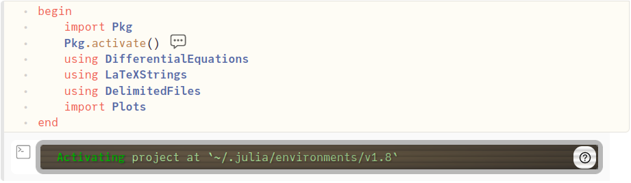{#fig:01 width=86%}

2. Формирование датасета и запись его в файл формата .csv (рис. @fig:02).
  
    ```Julia
    begin
    	const influenza = [3, 0, 0, 0, 1, 1, 1, 0, 1, 1, 0, 1, 0, 2, 2, 1, 1, 1, 1, 0, 0, 1, 0, 0, 2, 3, 1, 3, 0, 0, 1, 4, 2, 4, 3, 11, 13, 3, 4, 4, 14, 7, 16, 9, 12, 14, 3, 4, 10, 1, 1, 3, 0, 1, 0, 1, 0, 1, 3, 1, 0, 0, 5]

    	writedlm( "influenza_college_1978_dataset.csv", influenza, ',')
    end
    ```

    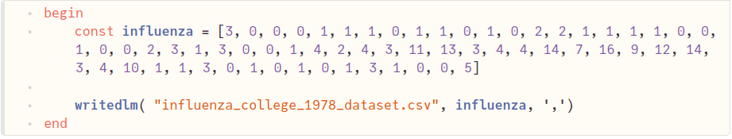{#fig:02 width=86%}

3. Импорт датасета из файла. Задание вектора времени (рис. @fig:03).
  
    ```Julia
    begin
    	df = readdlm("influenza_college_1978_dataset.csv", ',', Int64)
    	const days = [i for i in 1:length(df)]
    	@show df
    end
    ```

    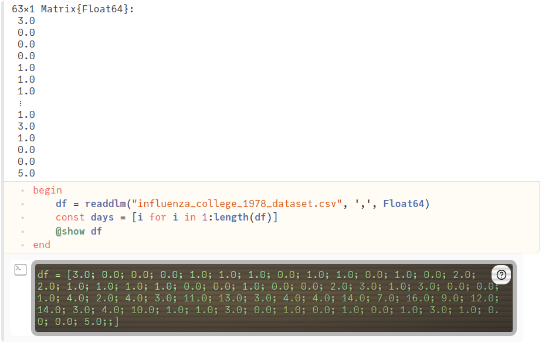{#fig:03 width=86%}

4. Преобразование датасета (рис. @fig:04).

    ```Julia
    begin
    	df_sis = zeros(Int64, size(df)[1])
    	df_sis[1] = df[1]
    	for i = 2:length(df)
    		df_sis[i] += df_sis[i-1] + df[i]
    	end
    	@show df_sis
    end
    ```

    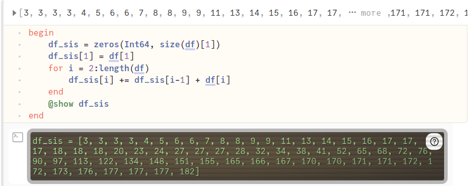{#fig:04 width=86%}

5. Сравнение графика источника (рис. @fig:05) с построенным графиком (рис. @fig:06). Построение графика по обработанному датасету (рис. @fig:07).

    ```Julia
    begin
    	fig1 = Plots.plot(
    		dpi=150,
    		grid=:xy,
    		gridcolor=:black,
    		gridwidth=1,
    		size=(800, 400),
    		legend=:topleft,
    		plot_title="Случаи заболевания гриппом в кампусе колледжа в 1978"
    	)

    	Plots.plot!(
    		fig1[1],
    		days,
    		df,
    		color=[:red],
    		xlabel="Число дней",
    		ylabel="Число заболеваний в день",
    		label="Число зафиксированных заболеваний за день"
    	)
    end
    ```

    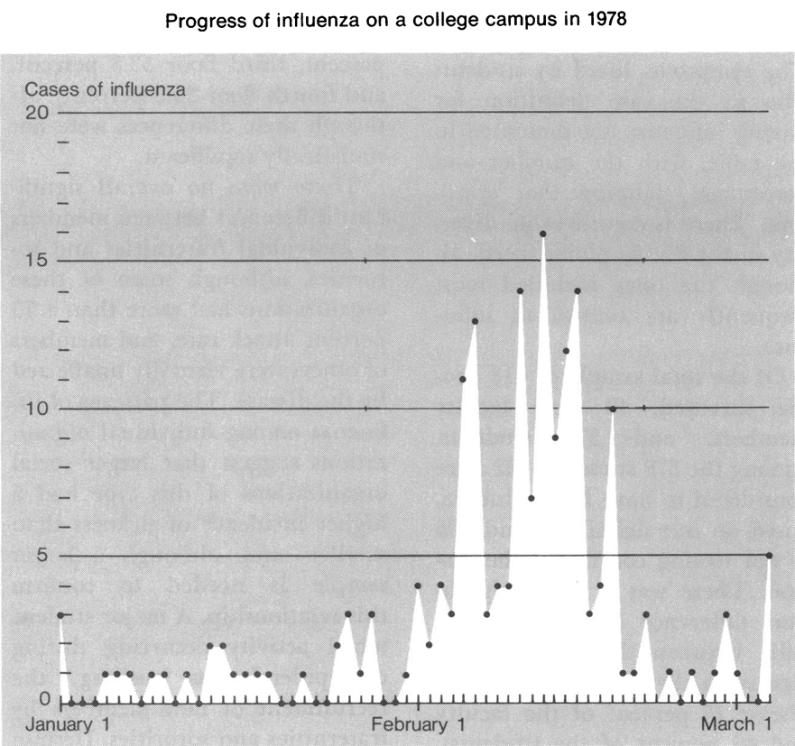{#fig:05 width=86%}

    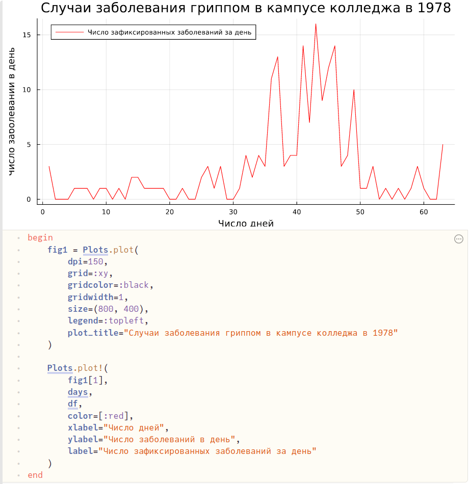{#fig:06 width=86%}

    ```Julia
    begin
    	fig2 = Plots.plot(
    		dpi=150,
    		grid=:xy,
    		gridcolor=:black,
    		gridwidth=1,
    		size=(800, 400),
    		legend=:topleft,
    		plot_title="Случаи заболевания гриппом в кампусе колледжа в 1978"
    	)

    	Plots.plot!(
    		fig2[1],
    		days,
    		df_sis,
    		color=[:red],
    		xlabel="Число дней",
    		ylabel="Число заболеваний",
    		label="Суммарное число заболевших"
    	)
    end
    ```

    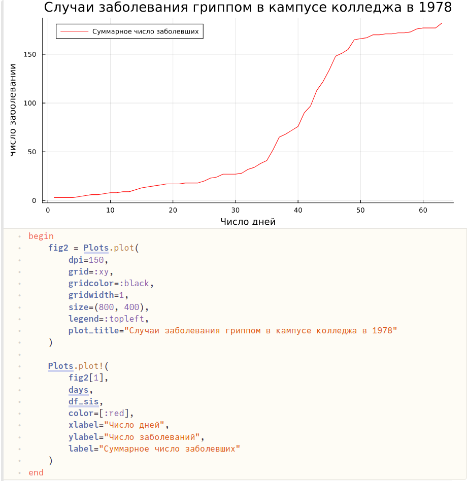{#fig:07 width=86%}

6. Описание модели SIS. Блок параметров. $R_0 = 1.875$ (рис. @fig:08).

    ```Julia
    begin
    	const β = 0.3
    	const γ = 0.16
    	@show R₀ = β / γ

    	const N = 418
    	const I₀ = 1
    	const S₀ = N - I₀
    	@show S₀

    	"Начальные условия: u₀[1] - S₀, u₀[1] - I₀"
    	u₀ = [S₀, I₀]

    	"Период времени"
    	T = (1.0, length(df))
    end
    ```

    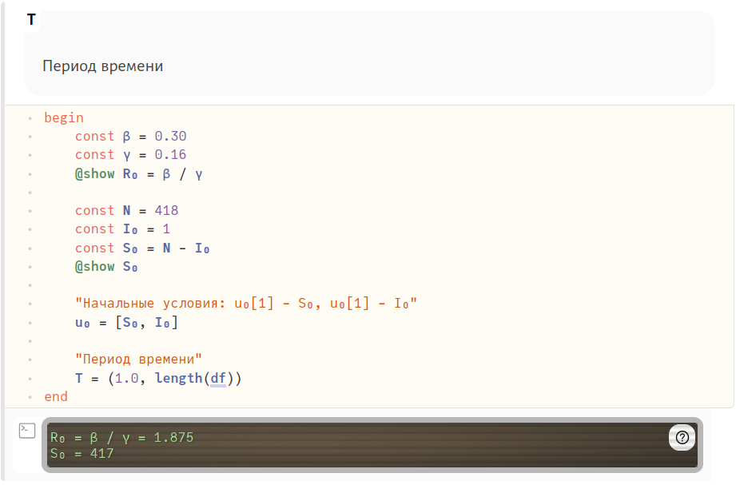{#fig:08 width=86%}

7. Описание модели SIS. Функция, задающая систему ОДУ (рис. @fig:09).

    ```Julia
    "Правая часть нашей системы, p, t не используются. u[1] - S, u[2] - I"
    function F!(du, u, p, t)
    	du[1] = - β * u[1] * u[2] / N + γ * u[2]
    	du[2] = β * u[1] * u[2] / N - γ * u[2]
    end
    ```

    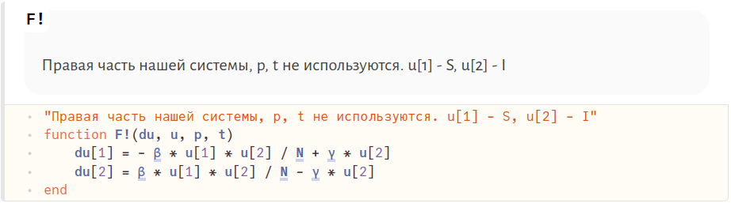{#fig:09 width=86%}

8. Описание модели SIS. Формирование проблемы (рис. @fig:10).

    ```Julia
    prob = ODEProblem(F!, u₀, T)
    ```

    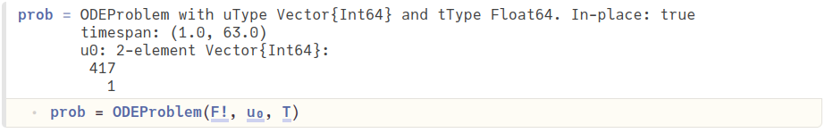{#fig:10 width=86%}

9. Описание модели SIS. Решение проблемы (рис. @fig:11).

    ```Julia
    sol = solve(prob, saveat=1)
    ```

    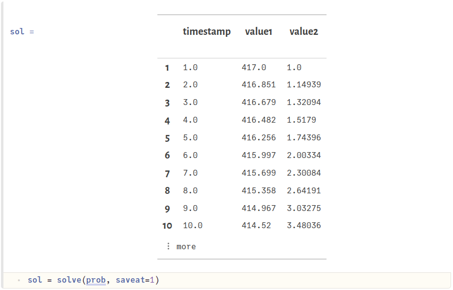{#fig:11 width=86%}

10. Формирование трех массивов: $S$, $I$, $time$ (рис. @fig:12).

    ```Julia
    begin
    	const ss = []
    	const ii = []
    	for u in sol.u
    		s, i = u
    		push!(ss, s)
    		push!(ii, i)
    	end
    	time = sol.t
    	time
    end
    ```

    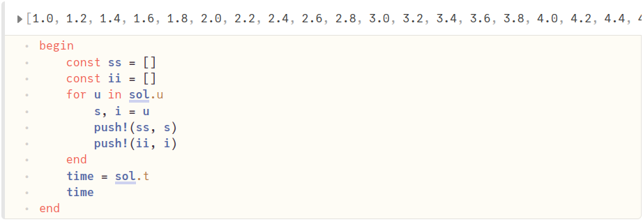{#fig:12 width=86%}

11. Отрисовка графика модели SIS (рис. @fig:13).

    ```Julia
    begin
    	fig3 = Plots.plot(
    		dpi=150,
    		grid=:xy,
    		gridcolor=:black,
    		gridwidth=1,
    		size=(800, 400),
    		legend=:left,
    		plot_title="Модель SIS"
    	)

    	Plots.plot!(
    		fig3[1],
    		time,
    		[ss, ii],
    		color=[:blue :red],
    		xlabel="t",
    		ylabel="Число человек в популяции",
    		label=["S(t) — количество здоровых, но восприимчивых к болезни" "I(t) — количество инфицированных"]
    	)
    end
    ```

    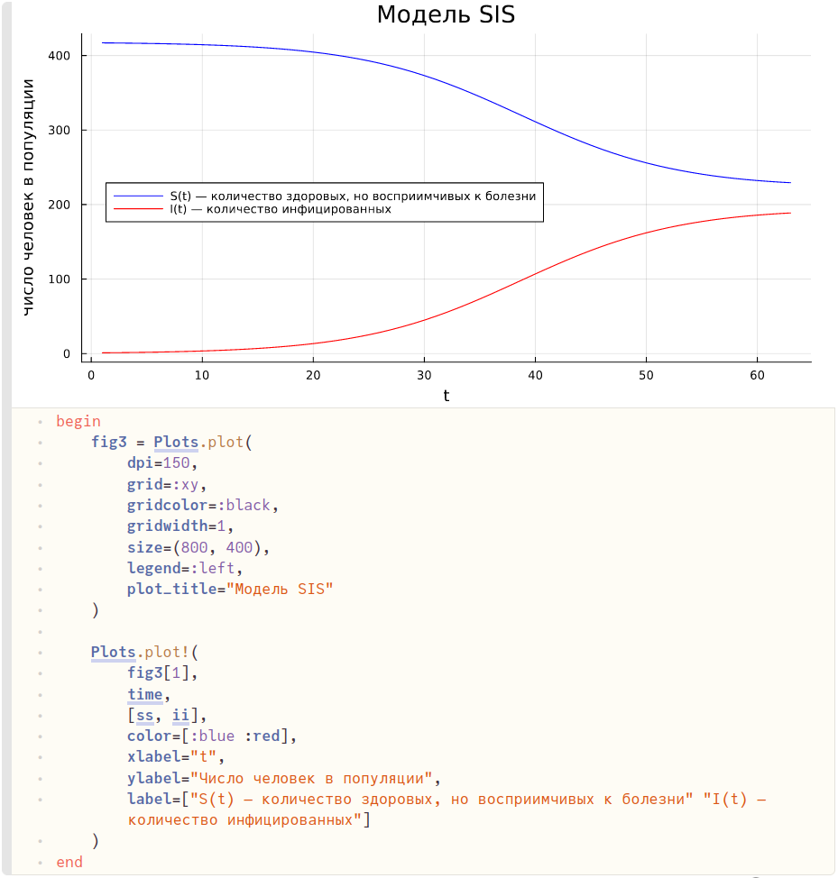{#fig:13 width=86%}

12. Отрисовка графика модели SIS без учета $S(t)$ (рис. @fig:14).

    ```Julia
    begin
    	fig4 = Plots.plot(
    		dpi=150,
    		grid=:xy,
    		gridcolor=:black,
    		gridwidth=1,
    		size=(800, 400),
    		legend=:topleft,
    		plot_title="Модель SIS"
    	)

    	Plots.plot!(
    		fig4[1],
    		time,
    		ii,
    		color=:red,
    		xlabel="t",
    		ylabel="Число инфицированных",
    		label="I(t) — количество инфицированных"
    	)
    end
    ```

    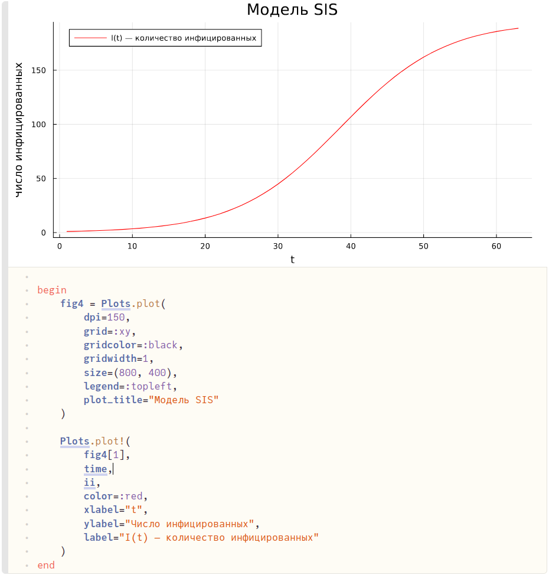{#fig:14 width=86%}

13. Отрисовка графика модели и графика реальных данных на одном графике. Как мы видим, результат моделирования крайне схож с найденными историческими данными из исследования распространения гриппа в одном из колледжей [@bib_9] (рис. @fig:15).

    ```Julia
    begin
    	fig5 = Plots.plot(
    		dpi=150,
    		grid=:xy,
    		gridcolor=:black,
    		gridwidth=1,
    		size=(800, 400),
    		legend=:topleft,
    		plot_title="Сравнение модели и реальных данных"
    	)

    	Plots.plot!(
    		fig5[1],
    		days,
    		[ii, df_sis],
    		color=[:red :blue],
    		xlabel="t",
    		ylabel="Число заболевших",
    		label=["Количество заболевших согласно модели" "Количество заболевших согласно исследованию"]
    	)
    end
    ```

    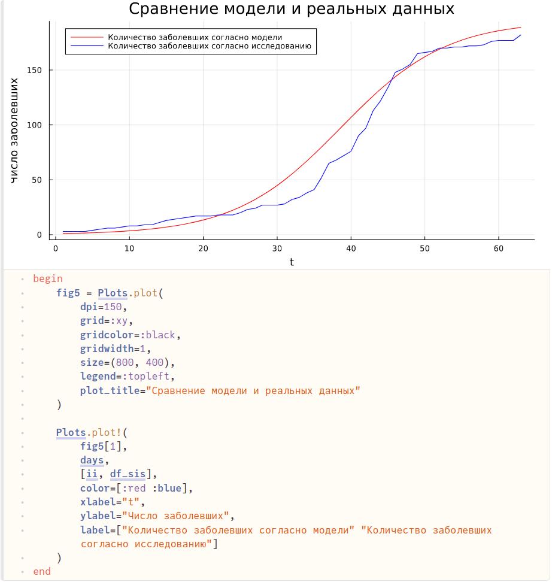{#fig:15 width=86%}

14. Экспорт всех графиков в изображения (рис. @fig:16).

    ```Julia
    begin
    	Plots.savefig(fig1, "../fig1")
    	Plots.savefig(fig2, "../fig2")
    	Plots.savefig(fig3, "../fig3")
    	Plots.savefig(fig4, "../fig4")
      Plots.savefig(fig5, "../fig5")
    end
    ```

    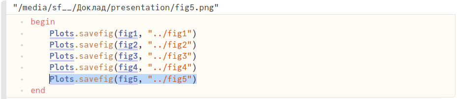{#fig:16 width=86%}


## Modelica

По аналогии с Pluto пишем программу, воспроизводящую измененную модель SIR на языке моделирования Modelica с использованием ПО OpenModelica.

1. Код на языке моделирования Modelica: задаем название модели; определяем коэффициенты $\beta$ и $\gamma$; численность популяции $N$; функции, зависящие от времени, $S(t)$ и $I(t)$; начальные условия; систему уравнений; начальное/конечное время и шаг симуляции (рис. @fig:17).
  
    ```
    model SIS
      constant Real beta = 0.3;
      constant Real gamma = 0.16;
      constant Integer N = 418;
      Real t = time;
      Real S(t);
      Real I(t);
    initial equation
      S = N - I;
      I = 1;
    equation
      der(S) = - beta * S * I / N + gamma * I;
      der(I) = beta * S * I / N - gamma * I;
      annotation(experiment(StartTime=1, StopTime=63, Interval = 1));
    end SIS;
    ```

    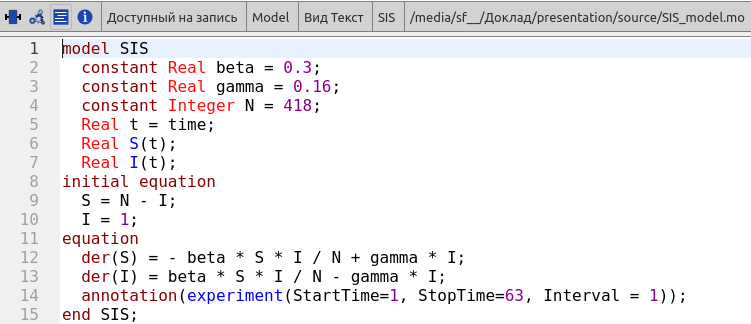{#fig:17 width=86%}

2. Лицезреем результат в виде двух графиков: зависимости $S$ и $I$ от времени и зависимости $I$ от времени (рис. @fig:18, @fig:19).

    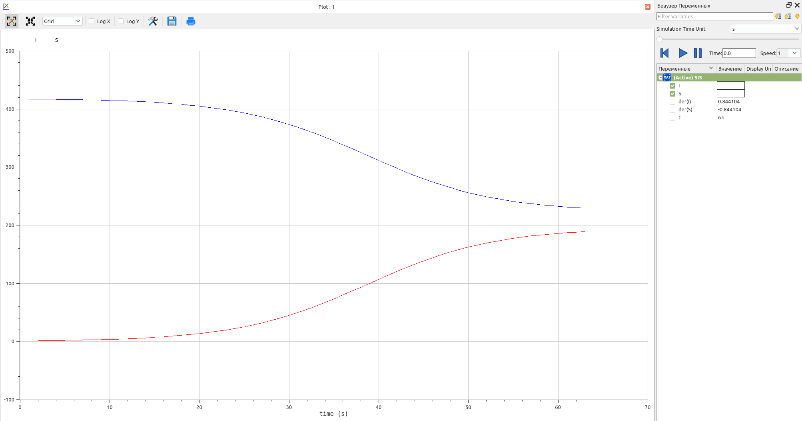{#fig:18 width=86%}

    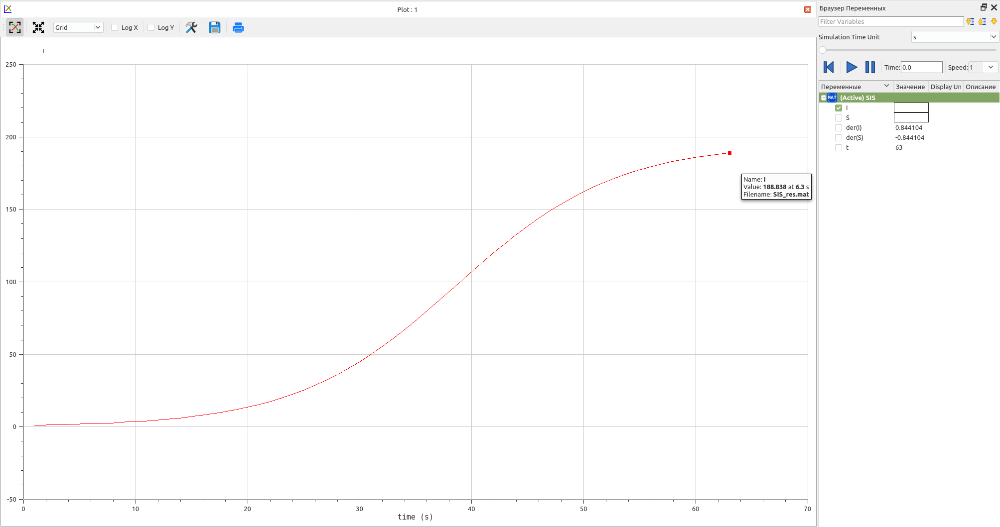{#fig:19 width=86%}


# Выводы

Изучил математическую модель заражения SIS. Используя функционал языка программирования Julia вместе с дополнительными библиотеками (DifferentialEquations, Plots), языка моделирования Modelica, а также интерактивного блокнота Pluto и программного обеспечением OpenModelica, описал модель заражения SIS. Сравнил описанную математическую модель с реальными данными о заражении.


# Список литературы{.unnumbered}

::: {#refs}
:::
